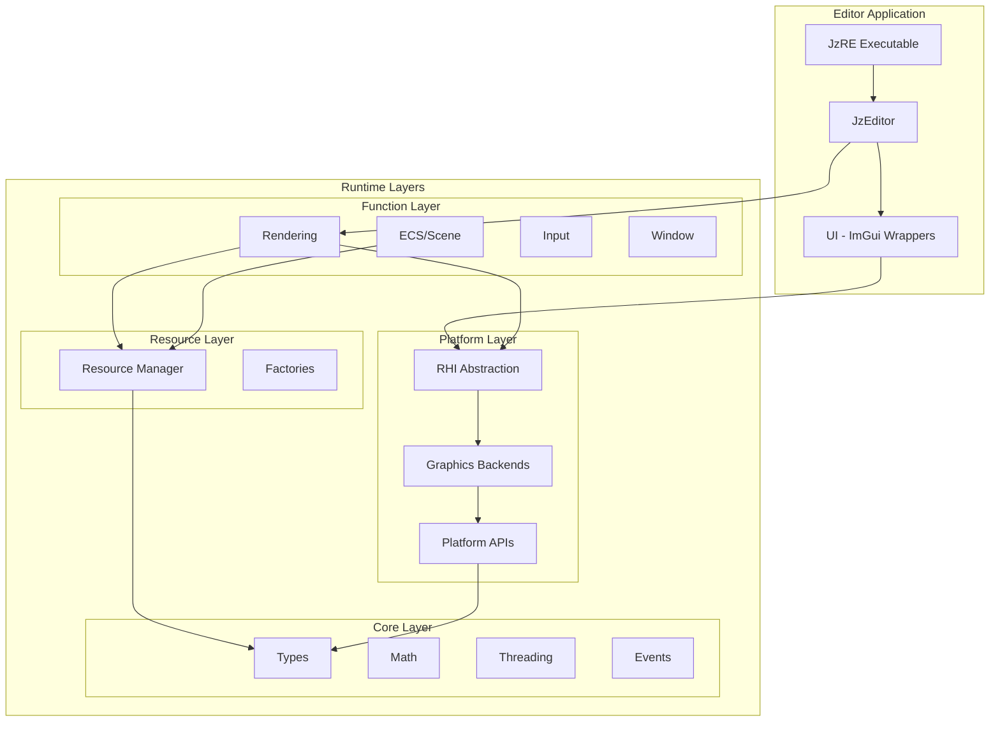

# JzRE Architecture Documentation

## Overview

JzRE is a cross-platform, multi-graphics-API game engine built with C++. The codebase is organized into a layered **Runtime + Editor** architecture.

---

## Architecture Diagram



---

## Runtime Layers (Bottom to Top)

### 1. Platform Layer (`src/Runtime/Platform/`)

Provides platform-agnostic services through abstraction:

| Component | Description |
|-----------|-------------|
| **RHI** | Rendering Hardware Interface - abstracts graphics APIs |
| **Graphics Backends** | OpenGL, Vulkan (planned) implementations |
| **Platform APIs** | File dialogs, message boxes per OS |

**Key Classes**: `JzDevice`, `JzRHICommandList`, `JzGPU*Object`, `JzFileDialog`

### 2. Core Layer (`src/Runtime/Core/`)

Engine foundation - no dependencies on other modules.

| Component | Files |
|-----------|-------|
| Types | `JzRETypes.h` |
| Math | `JzVector.h`, `JzMatrix.h` |
| Threading | `JzThreadPool.h`, `JzTaskQueue.h` |
| Events | `JzEvent.h` |
| Services | `JzServiceContainer.h` |
| Logging | `JzLogger.h` |

### 3. Resource Layer (`src/Runtime/Resource/`)

Asset loading, caching, and lifecycle management.

| Component | Description |
|-----------|-------------|
| `JzResourceManager` | Unified resource access |
| `Jz*Factory` | Type-specific resource creation |
| Resource Types | `JzTexture`, `JzMesh`, `JzModel`, `JzShader`, `JzMaterial`, `JzFont` |

### 4. Function Layer (`src/Runtime/Function/`)

High-level engine systems:

| Subsystem | Directory | Key Classes |
|-----------|-----------|-------------|
| Rendering | `Rendering/` | `JzRHIRenderer`, `JzDeviceFactory` |
| Scene | `Scene/` | `JzScene`, `JzActor`, `JzWorld` |
| ECS | `ECS/` | `JzEntityManager`, `Jz*System`, `Jz*Component` |
| Input | `Input/` | `JzInputManager` |
| Window | `Window/` | `JzWindow` |

---

## Editor Module (`src/Editor/`)

Development tools built on top of Runtime:

| Component | Description |
|-----------|-------------|
| `JzEditor` | Editor main loop |
| `JzPanelsManager` | Panel layout |
| `JzUIManager` | ImGui management |
| `UI/` | ImGui widget wrappers |
| Panels | `JzSceneView`, `JzHierarchy`, `JzAssetBrowser`, `JzConsole` |

---

## Module Dependencies


### Dependency Rules

1. **Upper layers depend on lower layers** - never reverse
2. **Same-layer isolation** - minimize direct dependencies
3. **Core is independent** - no dependencies
4. **Backends are replaceable** - through RHI abstraction

---

## Include Path Convention

```cpp
// Runtime modules
#include "JzRE/Runtime/Core/JzRETypes.h"
#include "JzRE/Runtime/Platform/JzDevice.h"
#include "JzRE/Runtime/Resource/JzResourceManager.h"
#include "JzRE/Runtime/Function/Scene/JzScene.h"
#include "JzRE/Runtime/Function/ECS/JzEntityManager.h"

// Editor modules
#include "JzRE/Editor/JzEditor.h"
#include "JzRE/Editor/UI/JzButton.h"
```

---

## Build Targets

| Target | Type | Description |
|--------|------|-------------|
| `JzRuntimeCore` | Static Library | Core utilities |
| `JzRuntimePlatform` | Static Library | RHI + Graphics + Platform |
| `JzRuntimeResource` | Static Library | Resource management |
| `JzRuntimeFunction` | Static Library | High-level systems |
| `JzRuntime` | Interface Library | Links all runtime layers |
| `JzEditor` | Static Library | Editor logic |
| `JzREApp` | Static Library | Application logic |
| `JzRE` | Executable | Main editor application |

---

## Design Principles

### Data-Oriented Design (DOD)
- Component pools with contiguous memory
- Systems separate from data
- Cache-friendly batch processing

### Dependency Injection
```cpp
JzServiceContainer::Provide<JzResourceManager>(manager);
auto& mgr = JzServiceContainer::Get<JzResourceManager>();
```

### Command Pattern
```cpp
auto cmdList = device->CreateCommandList();
cmdList->Begin();
cmdList->Clear(params);
cmdList->DrawIndexed(drawParams);
cmdList->End();
device->ExecuteCommandList(cmdList);
```

---

## Cross-Platform Support

| Aspect | Solution |
|--------|----------|
| File paths | `std::filesystem::path` |
| Dialogs | `JzFileDialog` (per-platform) |
| Windowing | GLFW |
| Graphics APIs | RHI abstraction |

---

## Related Documentation

- [Module Structure](module.md)
- [RHI Design](rhi.md)
- [Resource Layer](resource_layer_design.md)
- [Threading](threading_roadmap.md)