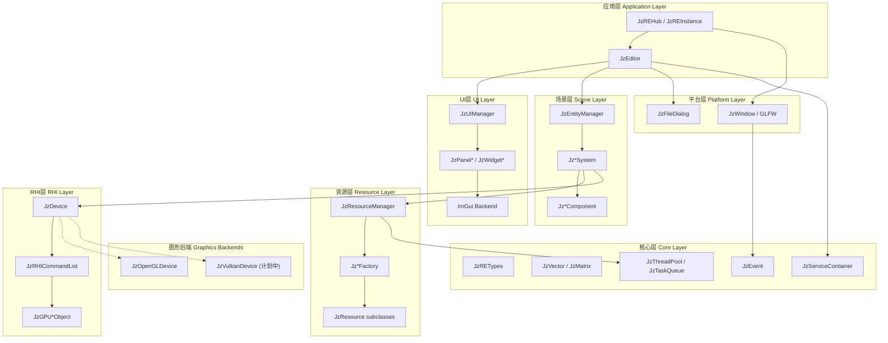
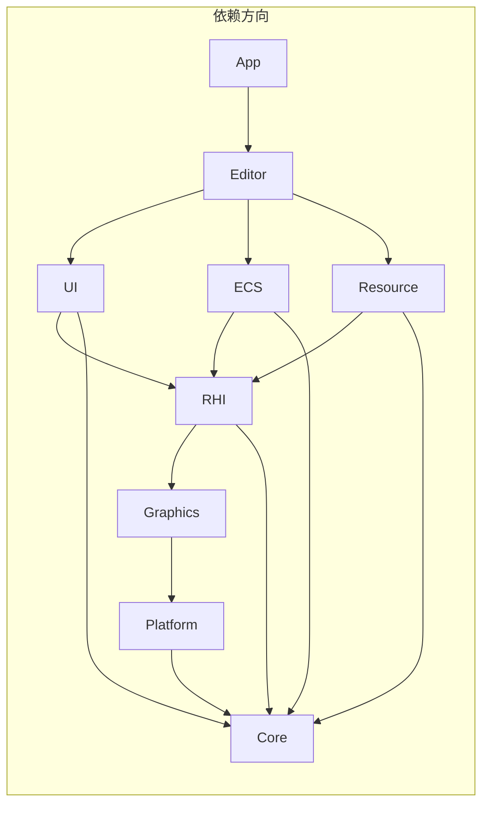

# JzRE 架构设计文档

## 概述

JzRE 是一个使用 C++ 开发的跨平台、多图形 API 游戏引擎。本文档描述了引擎的整体分层架构设计。

---

## 架构分层图



---

## 模块依赖关系



### 依赖规则

1. **上层依赖下层**：高层模块可以依赖低层模块，反之不行
2. **同层隔离**：同一层的模块之间应尽量避免直接依赖
3. **核心层独立**：Core 层不依赖任何其他模块
4. **后端可替换**：Graphics 后端通过 RHI 抽象层解耦

---

## 模块详细说明

### Core 层 (核心层)

提供引擎的基础设施，不依赖任何其他模块。

| 组件 | 文件 | 职责 |
|------|------|------|
| 类型定义 | `JzRETypes.h` | 基础类型别名 (U8, I32, F32, String 等) |
| 数学库 | `JzVector.h`, `JzMatrix.h` | 向量和矩阵运算 |
| 线程池 | `JzThreadPool.h` | 通用任务并行执行 |
| 任务队列 | `JzTaskQueue.h` | 优先级任务调度 |
| 服务容器 | `JzServiceContainer.h` | 依赖注入 / 服务定位器 |
| 事件系统 | `JzEvent.h` | 类型安全的事件发布/订阅 |
| 日志系统 | `JzLogger.h` | 分级日志输出 |

### Platform 层 (平台层)

封装操作系统特定 API，提供跨平台一致接口。

| 组件 | 平台支持 | 职责 |
|------|----------|------|
| `JzFileDialog` | Windows, macOS, Linux | 文件打开/保存对话框 |
| `JzMessageBox` | Windows, macOS, Linux | 消息提示框 |
| `JzWindow` | 跨平台 (GLFW) | 窗口管理、输入事件 |

### RHI 层 (渲染硬件接口)

抽象图形 API，支持多后端扩展。

| 组件 | 文件 | 职责 |
|------|------|------|
| 设备抽象 | `JzDevice.h` | 图形设备创建、资源管理 |
| 命令列表 | `JzRHICommandList.h` | 延迟渲染命令记录 |
| 命令 | `JzRHICommand.h` | 渲染命令基类 |
| GPU 对象 | `JzGPU*Object.h` | 缓冲、纹理、着色器抽象 |
| 管线 | `JzRHIPipeline.h` | 渲染管线状态 |

**当前实现**: OpenGL 3.3+
**计划实现**: Vulkan

### Graphics 层 (图形后端)

RHI 的具体实现。

| 后端 | 目录 | 状态 |
|------|------|------|
| OpenGL | `Graphics/OpenGL/` | ✅ 已实现 |
| Vulkan | `Graphics/Vulkan/` | 🚧 架构准备中 |

### Resource 层 (资源层)

管理游戏资产的加载、缓存和生命周期。

| 组件 | 文件 | 职责 |
|------|------|------|
| 资源管理器 | `JzResourceManager.h` | 统一资源访问入口 |
| 资源基类 | `JzResource.h` | 资源状态和加载接口 |
| 工厂 | `Jz*Factory.h` | 具体资源类型创建 |

**资源类型**:
- `JzTexture` - 纹理资源
- `JzMesh` - 网格资源
- `JzMaterial` - 材质资源
- `JzShader` - 着色器资源
- `JzModel` - 模型资源
- `JzFont` - 字体资源

### ECS 层 (实体组件系统)

数据导向的场景架构。

| 组件 | 文件 | 职责 |
|------|------|------|
| 实体管理 | `JzEntityManager.h` | 实体创建、销毁 |
| 组件池 | `JzComponentPool.h` | 连续内存组件存储 |
| 系统基类 | `JzSystem.h` | 系统更新接口 |

**核心组件**:
- `JzTransformComponent` - 变换 (位置/旋转/缩放)
- `JzMeshComponent` - 网格引用
- `JzMaterialComponent` - 材质引用
- `JzCameraComponent` - 相机属性
- `JzHierarchyComponent` - 父子层级

**核心系统**:
- `JzRenderSystem` - 渲染系统
- `JzMoveSystem` - 移动系统
- `JzSceneGraphSystem` - 场景图更新
- `JzVisibilitySystem` - 可见性剔除

### UI 层 (用户界面)

基于 ImGui 的有状态 UI 组件封装。

| 组件 | 文件 | 职责 |
|------|------|------|
| UI 管理器 | `JzUIManager.h` | ImGui 初始化和渲染 |
| 面板基类 | `JzPanel.h` | 面板抽象 |
| 面板窗口 | `JzPanelWindow.h` | 可停靠窗口面板 |
| 控件 | `JzWidget.h`, `JzButton.h` 等 | UI 控件封装 |

**设计理念**: 
- 将 ImGui 的立即模式 API 封装为有状态的对象模型
- 每个 UI 元素管理自己的状态和行为
- 支持事件驱动的交互模式

### Editor 层 (编辑器)

编辑器业务逻辑。

| 组件 | 文件 | 职责 |
|------|------|------|
| 编辑器 | `JzEditor.h` | 编辑器主循环 |
| 窗口 | `JzWindow.h` | 窗口管理 |
| 面板管理 | `JzPanelsManager.h` | 面板布局 |
| 画布 | `JzCanvas.h` | 编辑器画布 |

### App 层 (应用层)

应用程序入口。

| 组件 | 文件 | 职责 |
|------|------|------|
| Hub | `JzREHub.h` | 项目启动器 |
| Instance | `JzREInstance.h` | 项目实例 |

---

## 设计原则

### Data-Oriented Design (DOD)

引擎采用数据导向设计理念，特别体现在:

1. **组件池** (`JzComponentPool<T>`): 同类型组件在连续内存中存储
2. **系统分离**: System 只包含逻辑，数据存储在 Component 中
3. **缓存友好**: 批量处理同类型数据，提高 CPU 缓存命中率

### 依赖注入

使用 `JzServiceContainer` 实现服务定位器模式:

```cpp
// 注册服务
JzServiceContainer::Provide<JzResourceManager>(resourceManager);

// 获取服务
auto& resMgr = JzServiceContainer::Get<JzResourceManager>();
```

### 工厂模式

资源和 RHI 对象通过工厂创建:

```cpp
// 资源工厂
resourceManager.RegisterFactory<JzTexture>(std::make_unique<JzTextureFactory>());
auto texture = resourceManager.GetResource<JzTexture>("path/to/texture.png");

// RHI 设备工厂 (隐式)
auto device = std::make_unique<JzOpenGLDevice>();
```

### 命令模式

渲染命令通过 `JzRHICommand` 层级实现延迟执行:

```cpp
auto cmdList = device->CreateCommandList();
cmdList->Begin();
cmdList->Clear(clearParams);
cmdList->BindPipeline(pipeline);
cmdList->DrawIndexed(drawParams);
cmdList->End();
device->ExecuteCommandList(cmdList);
```

---

## 跨平台一致性

### 平台差异处理策略

| 差异类型 | 处理方式 |
|----------|----------|
| 文件路径 | 使用 `std::filesystem::path` |
| 对话框 | Platform 层封装 (`JzFileDialog`) |
| 窗口系统 | GLFW 抽象 |
| 图形 API | RHI 抽象层 |
| 字节序 | Core 层统一处理 |

### 条件编译

平台特定代码使用预处理器隔离:

```cpp
#ifdef _WIN32
    // Windows 实现
#elif __APPLE__
    // macOS 实现
#elif __linux__
    // Linux 实现
#endif
```

---

## 代码风格

### 命名规范

| 类型 | 规范 | 示例 |
|------|------|------|
| 类名 | `Jz` 前缀 + PascalCase | `JzResourceManager` |
| 枚举类型 | `JzE` 前缀 | `JzERHIType` |
| 成员变量 | `m_` 前缀 + camelCase | `m_resourceCache` |
| 静态变量 | `__` 前缀 + UPPER_CASE | `__SERVICES` |
| 方法名 | PascalCase | `GetResource()` |

### 代码组织

```
Module/
├── CMakeLists.txt
├── include/
│   └── JzRE/
│       └── Module/
│           └── JzClassName.h
└── src/
    └── JzClassName.cpp
```

---

## 演进规划

详见 [threading_roadmap.md](threading_roadmap.md) 了解多线程架构演进计划。

详见 [rhi.md](rhi.md) 了解 RHI 层设计和 Vulkan 扩展规划。