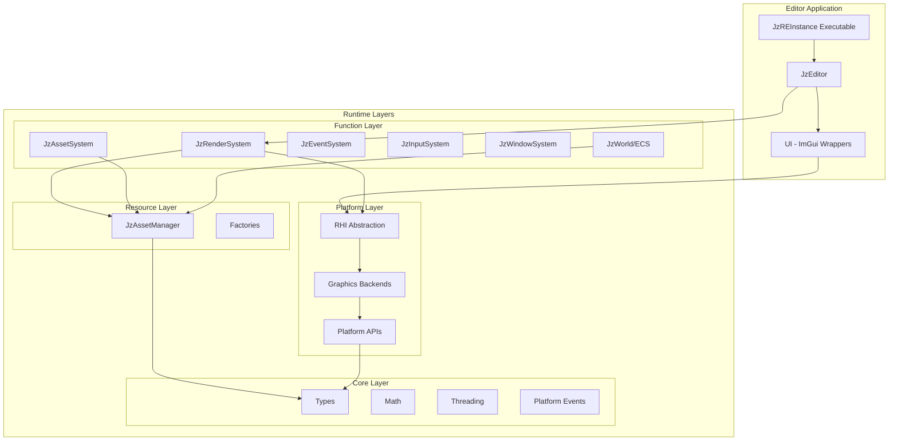

# JzRE Architecture Layers

## Overview

JzRE is a cross-platform, multi-graphics-API game engine built with C++20. The codebase is organized into a layered **Runtime + Editor** architecture.

---

## Architecture Diagram



---

## Runtime Layers (Bottom to Top)

### 1. Core Layer (`src/Runtime/Core/`)

Engine foundation - no dependencies on other modules.

| Component  | Files                                          |
| ---------- | ---------------------------------------------- |
| Types      | `JzRETypes.h`, `JzVertex.h`                    |
| Math       | `JzVector.h`, `JzMatrix.h`                     |
| Timing     | `JzClock.h`                                    |
| Threading  | `JzThreadPool.h`, `JzTaskQueue.h`              |
| Events     | `JzPlatformEvent.h`, `JzPlatformEventQueue.h`  |
| Services   | `JzServiceContainer.h`                         |
| Logging    | `JzLogger.h`, `JzLogSink.h`, `JzELog.h`        |
| Utilities  | `JzDelegate.h`, `JzFileSystemUtils.h`          |
| Reflection | `JzObject.h`, `JzReflectable.h`, `JzISerializable.h` |

### 2. Platform Layer (`src/Runtime/Platform/`)

Provides platform-agnostic services through abstraction:

| Component             | Description                                            |
| --------------------- | ------------------------------------------------------ |
| **RHI**               | Rendering Hardware Interface - abstracts graphics APIs |
| **Graphics Backends** | OpenGL, Vulkan (planned) implementations               |
| **Platform APIs**     | File dialogs, message boxes per OS                     |

**Directory Structure:**

```
Platform/
├── include/JzRE/Runtime/Platform/
│   ├── RHI/          # Device, GPU objects, Pipeline, RenderPass, Context, Stats
│   │   ├── JzDevice.h, JzDeviceFactory.h, JzGraphicsContext.h
│   │   ├── JzRHIPipeline.h, JzRHIRenderPass.h
│   │   ├── JzRHICapabilities.h, JzRHIStats.h
│   │   └── JzGPU*Object.h (Buffer, Texture, Shader, Framebuffer, VertexArray)
│   ├── Command/      # RHI command pattern (deferred execution)
│   │   ├── JzRHICommand.h, JzRHICommandList.h, JzRHICommandQueue.h
│   │   └── Jz*Command.h (Clear, Draw, Bind, SetViewport, RenderPass, etc.)
│   ├── Threading/    # Multi-threaded rendering infrastructure
│   │   ├── JzRenderThreadPool.h, JzRenderThreadContext.h
│   │   ├── JzRenderTask.h, JzCommandBufferTask.h
│   │   └── JzRHICommandManager.h
│   ├── Window/       # Window backend abstraction
│   │   ├── JzIWindowBackend.h, JzGLFWWindowBackend.h
│   │   ├── JzWindowConfig.h
│   │   └── JzPlatformInputEvents.h
│   ├── Dialog/       # Cross-platform file dialogs
│   ├── OpenGL/       # OpenGL backend implementation
│   └── Vulkan/       # Vulkan backend (planned)
└── src/
    ├── RHI/, Command/, Threading/, Window/
    ├── OpenGL/, Vulkan/
    └── Windows/, Linux/, macOS/  # Platform-specific code
```

**Key Classes**: `JzGraphicsContext`, `JzDevice`, `JzDeviceFactory`, `JzRHICommandList`, `JzGPU*Object`, `JzIWindowBackend`

### 3. Resource Layer (`src/Runtime/Resource/`)

Asset loading, caching, and lifecycle management.

| Component           | Description                                                          |
| ------------------- | -------------------------------------------------------------------- |
| `JzAssetManager`    | Central asset management with generation-based handles               |
| `JzAssetRegistry<T>`| Per-type asset storage with O(1) access                              |
| `JzAssetHandle<T>`  | Type-safe handle with generation validation                          |
| `JzLRUCache`        | LRU cache with memory budget management                              |
| `Jz*Factory`        | Type-specific resource creation                                      |
| Resource Types      | `JzTexture`, `JzMesh`, `JzModel`, `JzShaderAsset`, `JzMaterial`, `JzFont` |
| Shader System       | `JzShaderProgram`, `JzShaderVariant`, `JzShaderVariantManager`       |

### 4. Function Layer (`src/Runtime/Function/`)

High-level engine systems:

| Subsystem | Directory | Key Classes                                                    |
| --------- | --------- | -------------------------------------------------------------- |
| Scene     | `Scene/`  | `JzActor` (legacy)                                             |
| ECS       | `ECS/`    | `JzWorld`, `JzSystem`, `Jz*Component` (EnTT-based)             |
| Event     | `Event/`  | `JzEventSystem`, `JzEventQueue`, `JzECSEvent`, `JzPlatformEventAdapter` |
| Input     | `ECS/`    | `JzInputSystem`, `JzInputComponents`, `JzInputEvents`          |
| Window    | `ECS/`    | `JzWindowSystem`, `JzWindowComponents`, `JzWindowEvents`       |
| Asset     | `ECS/`    | `JzAssetSystem`, `JzAssetComponents` (hot reload, ECS integration) |
| Render    | `ECS/`    | `JzRenderSystem`, `JzCameraSystem`, `JzLightSystem`            |

### 5. Interface Layer (`src/Runtime/Interface/`)

High-level runtime entry point and graphics context coordination.

| Component          | Description                                           |
| ------------------ | ----------------------------------------------------- |
| `JzRERuntime`      | Runtime application lifecycle and system orchestration |

---

## Editor Module (`src/Editor/`)

Development tools built on top of Runtime:

| Component         | Description                                                          |
| ----------------- | -------------------------------------------------------------------- |
| Application/      | `JzEditor`, `JzREHub`, `JzREInstance`, `JzCanvas`, `JzUIManager`     |
| Core/             | `JzEvent` (editor-specific events)                                   |
| Panels/           | `JzView`, `JzPanelsManager`, `JzSceneView`, `JzGameView`             |
|                   | `JzHierarchy`, `JzAssetBrowser`, `JzAssetView`, `JzConsole`          |
|                   | `JzMaterialEditor`, `JzMenuBar`, and 30+ UI panel files              |
| UI/               | ImGui widget wrappers (`JzButton`, `JzContextMenu`, `JzDataWidget`)  |
|                   | `JzDragnDropSource/Target`, `JzColorPicker`, `JzSlider`, etc.        |

---

## Module Dependencies


### Dependency Rules

1. **Upper layers depend on lower layers** - never reverse
2. **Same-layer isolation** - minimize direct dependencies
3. **Core is independent** - no dependencies
4. **Backends are replaceable** - through RHI abstraction

---

## Design Principles

### Data-Oriented Design (DOD)

- Component pools with contiguous memory
- Systems separate from data
- Cache-friendly batch processing

### Dependency Injection

```cpp
JzServiceContainer::Provide<JzAssetManager>(assetManager);
auto& mgr = JzServiceContainer::Get<JzAssetManager>();
```

### Command Pattern

```cpp
auto cmdList = device->CreateCommandList();
cmdList->Begin();
cmdList->Clear(params);
cmdList->DrawIndexed(drawParams);
cmdList->End();
device->ExecuteCommandList(cmdList);
```

---

## Cross-Platform Support

| Aspect        | Solution                      |
| ------------- | ----------------------------- |
| File paths    | `std::filesystem::path`       |
| Dialogs       | `JzFileDialog` (per-platform) |
| Windowing     | GLFW                          |
| Graphics APIs | RHI abstraction               |
