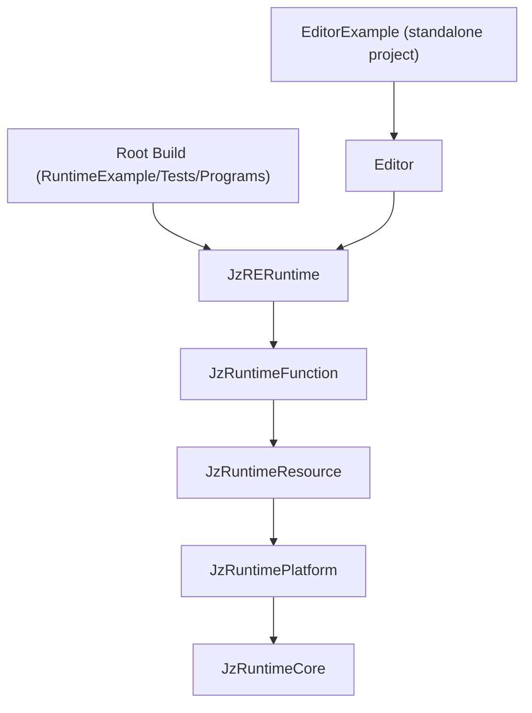

# JzRE Module Structure

## Overview

This document describes the modular directory structure and CMake build configuration for JzRE.

---

## Directory Structure

```
JzRE/
├── src/
│   ├── EngineContent/              # Engine default content source (authored assets)
│   │   └── ShaderSource/           # Engine shader source manifests and HLSL
│   ├── Runtime/                    # Game Engine Runtime
│   │   ├── CMakeLists.txt
│   │   ├── Interface/              # Runtime Application Interface
│   │   │   ├── include/JzRE/Runtime/
│   │   │   │   ├── JzRERuntime.h   # Main runtime class with OnStart/OnUpdate/OnStop hooks
│   │   │   └── src/
│   │   │
│   │   ├── Core/                   # Layer 1: Core Utilities (zero dependencies)
│   │   │   ├── include/JzRE/Runtime/Core/
│   │   │   │   ├── JzRETypes.h, JzVertex.h
│   │   │   │   ├── JzVector.h, JzMatrix.h
│   │   │   │   ├── JzClock.h
│   │   │   │   ├── JzThreadPool.h, JzTaskQueue.h
│   │   │   │   ├── JzPlatformEvent.h, JzPlatformEventQueue.h
│   │   │   │   ├── JzServiceContainer.h, JzDelegate.h
│   │   │   │   ├── JzLogger.h, JzLogSink.h, JzELog.h
│   │   │   │   └── JzFileSystemUtils.h
│   │   │   └── src/
│   │   │
│   │   ├── Platform/               # Layer 2: Platform Abstraction
│   │   │   ├── include/JzRE/Runtime/Platform/
│   │   │   │   ├── RHI/            # Device, GPU objects, Pipeline, RenderPass, Context
│   │   │   │   ├── Command/        # RHI command pattern
│   │   │   │   ├── Threading/      # Render thread pool, tasks
│   │   │   │   ├── Window/         # IWindowBackend, GLFWWindowBackend
│   │   │   │   ├── Dialog/         # File dialogs
│   │   │   │   ├── OpenGL/         # OpenGL backend
│   │   │   │   └── Vulkan/         # Vulkan backend implementation
│   │   │   └── src/
│   │   │       ├── OpenGL/, Vulkan/
│   │   │       └── Windows/, Linux/, macOS/
│   │   │
│   │   ├── Resource/               # Layer 3: Resource Management
│   │   │   ├── include/JzRE/Runtime/Resource/
│   │   │   │   ├── JzAssetId.h, JzAssetHandle.h
│   │   │   │   ├── JzAssetRegistry.h, JzAssetManager.h
│   │   │   │   ├── JzLRUCache.h, JzResource.h, JzResourceFactory.h
│   │   │   │   ├── JzTexture.h, JzMesh.h, JzModel.h
│   │   │   │   ├── JzMaterial.h, JzFont.h
│   │   │   │   ├── JzShader.h
│   │   │   │   ├── JzShaderVariantKey.h
│   │   │   │   └── Jz*Factory.h
│   │   │   └── src/
│   │   │
│   │   └── Function/               # Layer 4: Functional Systems
│   │       ├── include/JzRE/Runtime/Function/
│   │       │   ├── Scene/
│   │       │   │   └── JzActor.h   # Legacy scene graph
│   │       │   ├── ECS/
│   │       │   │   ├── JzEntity.h, JzWorld.h, JzSystem.h
│   │       │   │   ├── Jz*Components.h (Entity, Transform, Camera, Light, Render, etc.)
│   │       │   │   ├── JzCameraSystem.h, JzLightSystem.h, JzRenderSystem.h
│   │       │   │   ├── JzInputSystem.h, JzWindowSystem.h
│   │       │   │   ├── JzAssetSystem.h, JzMoveSystem.h
│   │       │   │   └── JzAssetComponents.h
│   │       │   ├── Rendering/
│   │       │   │   └── JzRenderGraph.h, JzRenderOutput.h, JzRenderPass.h, JzRenderTarget.h
│   │       │   ├── Asset/
│   │       │   │   └── JzAssetImporter.h, JzAssetExporter.h, JzShaderCookService.h
│   │       │   ├── Project/
│   │       │   │   └── JzProjectConfig.h, JzProjectManager.h
│   │       │   └── Event/
│   │       │       ├── JzEventSystem.h, JzEventQueue.h
│   │       │       ├── JzECSEvent.h, JzIEventHandler.h
│   │       │       ├── JzWindowEvents.h, JzInputEvents.h
│   │       │       └── JzPlatformEventAdapter.h
│   │       └── src/ECS/
│   │
├── tests/                          # GTest-based tests
├── examples/                       # Example applications
│   ├── RuntimeExample/             # Runtime-only sample built by root CMake
│   │   ├── Models/                 # Runtime sample asset source (models + model-linked textures)
│   │   └── Textures/               # Runtime sample texture asset source
│   └── EditorExample/              # Standalone editor sample project
│       ├── CMakeLists.txt          # Independent project entry
│       ├── vcpkg.json              # Editor-specific manifest (includes imgui)
│       ├── Application/            # JzEditorUI, JzREHub, JzREEditor, JzCanvas
│       ├── Core/                   # Editor-specific events
│       ├── Panels/                 # 30+ editor panels
│       ├── UI/                     # 40+ ImGui widget wrappers
│       └── resources/              # Editor-only assets (fonts/icons/layout)
│
├── cmake/                          # Shared CMake helper scripts
│   ├── modules/                    # Reusable include() modules
│   └── precompile/                 # Header-tool precompile pipeline scripts
│
├── docs/                           # Documentation
└── programs/                       # Tooling
    ├── JzREHeaderTool/             # Code generation tool (libclang)
    └── JzREShaderTool/             # Offline HLSL -> cooked shader pack tool
```

---

## Module Dependencies



---

## Runtime-Editor Boundary Rules (Mandatory)

### Dependency Direction

- `src/Runtime/**` must not include headers from `examples/EditorExample/**`.
- `examples/EditorExample/**` may include and link `src/Runtime/**`.

### Public API Naming

- Runtime public headers must use generic engine semantics.
- Editor-specific names in runtime public APIs are forbidden (`Editor`, `SceneView`, `GameView`, `AssetView`, etc.).

### Tooling Boundary

- Runtime code must not directly depend on editor UI/tooling libraries (for example, `imgui`).
- Editor-side rendering and input behavior should be implemented as consumers of runtime extension points.

### Recommended Review Checks

Run these checks when reviewing runtime changes:

```bash
rg -n '#include\\s+\"JzRE/Editor/' src/Runtime
rg -n 'imgui' src/Runtime
rg -n 'SceneView|GameView|AssetView|EditorOnly|PreviewOnly|JzRenderView|JzEditorOnlyTag|JzPreviewOnlyTag|JzEditorCameraInputOverrideTag|JzProjectEditorSettings|JzGizmoComponent|ImGuiRender|JzRHIImGuiRenderCommand' src/Runtime -g '*.h'
```

Any hit in runtime public headers should be treated as a boundary violation
unless it is explicitly documented legacy scheduled for removal.

---

## CMake Configuration

### src/CMakeLists.txt

```cmake
# Runtime module (contains Platform, Core, Resource, Function layers)
add_subdirectory(Runtime)
```

### src/Runtime/CMakeLists.txt

```cmake
add_subdirectory(Core)
add_subdirectory(Platform)
add_subdirectory(Resource)
add_subdirectory(Function)

add_library(JzRERuntime INTERFACE)
target_link_libraries(JzRERuntime INTERFACE
    JzRuntimeCore
    JzRuntimePlatform
    JzRuntimeResource
    JzRuntimeFunction
)
```

### examples/EditorExample/CMakeLists.txt (Standalone)

```cmake
project(EditorExample LANGUAGES CXX C)

set(JzRE_REPOSITORY_ROOT "${CMAKE_CURRENT_SOURCE_DIR}/../..")
file(COPY "${CMAKE_CURRENT_SOURCE_DIR}/resources/" DESTINATION ${JzRE_OUTPUT_DIR}/)
add_subdirectory("${JzRE_REPOSITORY_ROOT}/programs/JzREShaderTool" "${CMAKE_CURRENT_BINARY_DIR}/JzREShaderTool")
add_subdirectory("${JzRE_REPOSITORY_ROOT}/src/Runtime" "${CMAKE_CURRENT_BINARY_DIR}/Runtime")

jzre_add_shader_cook_target(
    TARGET_NAME JzRECookEngineShaders
    SOURCE_DIR "${JzRE_REPOSITORY_ROOT}/src/EngineContent/ShaderSource"
    OUTPUT_DIR "${JzRE_OUTPUT_DIR}/EngineContent/Shaders"
    TOOL_TARGET JzREShaderTool
)

add_subdirectory(Core)
add_subdirectory(UI)
add_subdirectory(Panels)
add_subdirectory(Application)

add_executable(EditorExample main.cpp)
target_link_libraries(EditorExample PUBLIC JzEditor)
```

### Root CMakeLists.txt (Runtime asset sync)

```cmake
add_custom_target(JzRESyncEngineAssets ALL
    COMMAND ${CMAKE_COMMAND} -E copy_directory
            "${CMAKE_SOURCE_DIR}/examples/RuntimeExample/Models"
            "${JzRE_OUTPUT_DIR}/EngineContent/Models"
    COMMAND ${CMAKE_COMMAND} -E copy_directory
            "${CMAKE_SOURCE_DIR}/examples/RuntimeExample/Textures"
            "${JzRE_OUTPUT_DIR}/EngineContent/Textures"
)
```

---

## Header Include Convention

```cpp
// Cross-module: use full path
#include "JzRE/Runtime/Core/JzRETypes.h"
#include "JzRE/Runtime/Core/JzLogger.h"
#include "JzRE/Runtime/Platform/RHI/JzDevice.h"
#include "JzRE/Runtime/Platform/Command/JzRHICommandList.h"
#include "JzRE/Runtime/Platform/Window/IWindowBackend.h"
#include "JzRE/Runtime/Platform/RHI/JzGraphicsContext.h"
#include "JzRE/Runtime/Resource/JzAssetManager.h"
#include "JzRE/Runtime/Function/ECS/JzWorld.h"
#include "JzRE/Runtime/Function/ECS/JzAssetSystem.h"
#include "JzRE/Runtime/Function/Event/JzEventSystem.h"
#include "JzRE/Runtime/JzRERuntime.h"
#include "JzRE/Editor/JzEditorUI.h"

// Within module: relative path allowed
#include "JzInternalHelper.h"
```

---

## Build Commands

### Configure

```bash
# macOS
cmake --preset macos-clang-static

# Windows
cmake --preset windows-msvc-static
```

### Build

```bash
cmake --build build
```

### Run

```bash
cd build/JzRE
./RuntimeExample --input ./EngineContent/Models/crate.obj
```

### Test

```bash
cd build && ctest --output-on-failure
```

### Standalone EditorExample

```bash
cmake -S examples/EditorExample -B examples/EditorExample/build
cmake --build examples/EditorExample/build
./examples/EditorExample/build/EditorExample/EditorExample
```

---

## Build Targets Summary

| Target              | Type       | Dependencies                                              |
| ------------------- | ---------- | --------------------------------------------------------- |
| `JzRuntimeCore`     | Static     | spdlog, fmt                                               |
| `JzRuntimePlatform` | Static     | JzRuntimeCore, glad, glfw, vulkan, spirv-reflect          |
| `JzRuntimeResource` | Static     | JzRuntimeCore, JzRuntimePlatform, assimp, stb, freetype   |
| `JzRuntimeFunction` | Static     | JzRuntimeCore, JzRuntimePlatform, JzRuntimeResource, entt |
| `JzRERuntime`       | Interface  | All runtime layers                                        |
| `JzREShaderTool`    | Executable | nlohmann-json, external tools (`dxc`, `spirv-cross`)      |
| `TESTJzRECore`      | Executable | JzRuntimeCore, GTest::gtest_main                          |
| `TESTJzREPlatform`  | Executable | JzRuntimePlatform, GTest::gtest_main                      |

Standalone `examples/EditorExample` targets:

| Target           | Type       | Dependencies                |
| ---------------- | ---------- | --------------------------- |
| `JzEditorCore`   | Interface  | JzRERuntime                 |
| `JzEditorUI`     | Static     | JzEditorCore, imgui, vulkan |
| `JzEditorPanels` | Static     | JzEditorUI                  |
| `JzEditor`       | Static     | JzEditorPanels              |
| `EditorExample`  | Executable | JzEditor                    |
