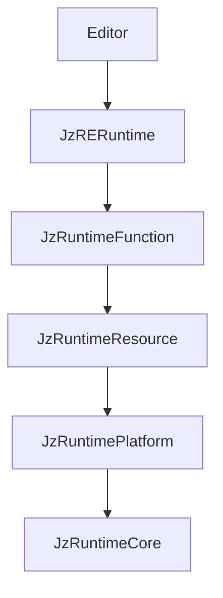

# JzRE Module Structure

## Overview

This document describes the modular directory structure and CMake build configuration for JzRE.

---

## Directory Structure

```
JzRE/
├── src/
│   ├── Runtime/                    # Game Engine Runtime
│   │   ├── CMakeLists.txt
│   │   ├── Interface/              # Runtime Application Interface
│   │   │   ├── include/JzRE/Runtime/
│   │   │   │   ├── JzRERuntime.h   # Main runtime class with OnStart/OnUpdate/OnStop hooks
│   │   │   └── src/
│   │   │
│   │   ├── Core/                   # Layer 1: Core Utilities (zero dependencies)
│   │   │   ├── include/JzRE/Runtime/Core/
│   │   │   │   ├── JzRETypes.h, JzVertex.h
│   │   │   │   ├── JzVector.h, JzMatrix.h
│   │   │   │   ├── JzClock.h
│   │   │   │   ├── JzThreadPool.h, JzTaskQueue.h
│   │   │   │   ├── JzPlatformEvent.h, JzPlatformEventQueue.h
│   │   │   │   ├── JzServiceContainer.h, JzDelegate.h
│   │   │   │   ├── JzLogger.h, JzLogSink.h, JzELog.h
│   │   │   │   └── JzFileSystemUtils.h
│   │   │   └── src/
│   │   │
│   │   ├── Platform/               # Layer 2: Platform Abstraction
│   │   │   ├── include/JzRE/Runtime/Platform/
│   │   │   │   ├── RHI/            # Device, GPU objects, Pipeline, RenderPass, Context
│   │   │   │   ├── Command/        # RHI command pattern
│   │   │   │   ├── Threading/      # Render thread pool, tasks
│   │   │   │   ├── Window/         # IWindowBackend, GLFWWindowBackend
│   │   │   │   ├── Dialog/         # File dialogs
│   │   │   │   ├── OpenGL/         # OpenGL backend
│   │   │   │   └── Vulkan/         # Vulkan backend (planned)
│   │   │   └── src/
│   │   │       ├── OpenGL/, Vulkan/
│   │   │       └── Windows/, Linux/, macOS/
│   │   │
│   │   ├── Resource/               # Layer 3: Resource Management
│   │   │   ├── include/JzRE/Runtime/Resource/
│   │   │   │   ├── JzAssetId.h, JzAssetHandle.h
│   │   │   │   ├── JzAssetRegistry.h, JzAssetManager.h
│   │   │   │   ├── JzLRUCache.h, JzResource.h, JzResourceFactory.h
│   │   │   │   ├── JzTexture.h, JzMesh.h, JzModel.h
│   │   │   │   ├── JzMaterial.h, JzFont.h
│   │   │   │   ├── JzShaderAsset.h, JzShaderProgram.h
│   │   │   │   ├── JzShaderVariant.h, JzShaderVariantManager.h
│   │   │   │   └── Jz*Factory.h
│   │   │   └── src/
│   │   │
│   │   └── Function/               # Layer 4: Functional Systems
│   │       ├── include/JzRE/Runtime/Function/
│   │       │   ├── Scene/
│   │       │   │   └── JzActor.h   # Legacy scene graph
│   │       │   ├── ECS/
│   │       │   │   ├── JzEntity.h, JzWorld.h, JzSystem.h
│   │       │   │   ├── Jz*Components.h (Entity, Transform, Camera, Light, Render, etc.)
│   │       │   │   ├── JzCameraSystem.h, JzLightSystem.h, JzRenderSystem.h
│   │       │   │   ├── JzInputSystem.h, JzWindowSystem.h
│   │       │   │   ├── JzAssetSystem.h, JzMoveSystem.h
│   │       │   │   └── JzAssetComponents.h
│   │       │   ├── Rendering/
│   │       │   │   └── JzRenderGraph.h, JzRenderOutput.h, JzRenderPass.h, JzRenderTarget.h
│   │       │   ├── Asset/
│   │       │   │   └── JzAssetImporter.h, JzAssetExporter.h
│   │       │   ├── Project/
│   │       │   │   └── JzProjectConfig.h, JzProjectManager.h
│   │       │   └── Event/
│   │       │       ├── JzEventSystem.h, JzEventQueue.h
│   │       │       ├── JzECSEvent.h, JzIEventHandler.h
│   │       │       ├── JzWindowEvents.h, JzInputEvents.h
│   │       │       └── JzPlatformEventAdapter.h
│   │       └── src/ECS/
│   │
│   ├── Editor/                     # Editor Application
│   │   ├── Application/            # JzEditorUI, JzREHub, JzREEditor, JzCanvas
│   │   ├── Core/                   # Editor-specific events
│   │   ├── Panels/                 # 30+ editor panels
│   │   └── UI/                     # 40+ ImGui widget wrappers
│
├── tests/                          # GTest-based tests
├── examples/                       # Example applications
├── docs/                           # Documentation
├── resources/                      # Engine resources (shaders, textures)
└── programs/JzREHeaderTool/        # Code generation tool (libclang)
```

---

## Module Dependencies



---

## Runtime-Editor Boundary Rules (Mandatory)

### Dependency Direction

- `src/Runtime/**` must not include headers from `src/Editor/**`.
- `src/Editor/**` may include and link `src/Runtime/**`.

### Public API Naming

- Runtime public headers must use generic engine semantics.
- Editor-specific names in runtime public APIs are forbidden (`Editor`, `SceneView`, `GameView`, `AssetView`, etc.).

### Tooling Boundary

- Runtime code must not directly depend on editor UI/tooling libraries (for example, `imgui`).
- Editor-side rendering and input behavior should be implemented as consumers of runtime extension points.

### Recommended Review Checks

Run these checks when reviewing runtime changes:

```bash
rg -n '#include\\s+\"JzRE/Editor/' src/Runtime
rg -n 'imgui' src/Runtime
rg -n 'SceneView|GameView|AssetView|EditorOnly|PreviewOnly|JzRenderView|JzEditorOnlyTag|JzPreviewOnlyTag|JzEditorCameraInputOverrideTag|JzProjectEditorSettings|JzGizmoComponent|ImGuiRender|JzRHIImGuiRenderCommand' src/Runtime -g '*.h'
```

Any hit in runtime public headers should be treated as a boundary violation
unless it is explicitly documented legacy scheduled for removal.

---

## CMake Configuration

### src/CMakeLists.txt

```cmake
# Runtime module (contains Platform, Core, Resource, Function layers)
add_subdirectory(Runtime)

# Editor module (depends on Runtime)
add_subdirectory(Editor)
```

### src/Runtime/CMakeLists.txt

```cmake
add_subdirectory(Core)
add_subdirectory(Platform)
add_subdirectory(Resource)
add_subdirectory(Function)

add_library(JzRERuntime INTERFACE)
target_link_libraries(JzRERuntime INTERFACE
    JzRuntimeCore
    JzRuntimePlatform
    JzRuntimeResource
    JzRuntimeFunction
)
```

---

## Header Include Convention

```cpp
// Cross-module: use full path
#include "JzRE/Runtime/Core/JzRETypes.h"
#include "JzRE/Runtime/Core/JzLogger.h"
#include "JzRE/Runtime/Platform/RHI/JzDevice.h"
#include "JzRE/Runtime/Platform/Command/JzRHICommandList.h"
#include "JzRE/Runtime/Platform/Window/IWindowBackend.h"
#include "JzRE/Runtime/Platform/RHI/JzGraphicsContext.h"
#include "JzRE/Runtime/Resource/JzAssetManager.h"
#include "JzRE/Runtime/Function/ECS/JzWorld.h"
#include "JzRE/Runtime/Function/ECS/JzAssetSystem.h"
#include "JzRE/Runtime/Function/Event/JzEventSystem.h"
#include "JzRE/Runtime/JzRERuntime.h"
#include "JzRE/Editor/JzEditorUI.h"

// Within module: relative path allowed
#include "JzInternalHelper.h"
```

---

## Build Commands

### Configure

```bash
# macOS
cmake --preset macos-clang-static

# Windows
cmake --preset windows-msvc-static
```

### Build

```bash
cmake --build build
```

### Run

```bash
./build/JzRE/JzRE
```

### Test

```bash
cd build && ctest --output-on-failure
```

---

## Build Targets Summary

| Target              | Type       | Dependencies                                              |
| ------------------- | ---------- | --------------------------------------------------------- |
| `JzRuntimeCore`     | Static     | spdlog, fmt                                               |
| `JzRuntimePlatform` | Static     | JzRuntimeCore, glad, glfw                                 |
| `JzRuntimeResource` | Static     | JzRuntimeCore, JzRuntimePlatform, assimp, stb, freetype   |
| `JzRuntimeFunction` | Static     | JzRuntimeCore, JzRuntimePlatform, JzRuntimeResource, entt |
| `JzRERuntime`       | Interface  | All runtime layers                                        |
| `JzEditor`          | Static     | JzRERuntime, imgui (docking)                              |
| `JzREEditor`        | Executable | JzRERuntime, JzEditor                                     |
| `TESTJzRECore`      | Executable | JzRuntimeCore, GTest::gtest_main                          |
