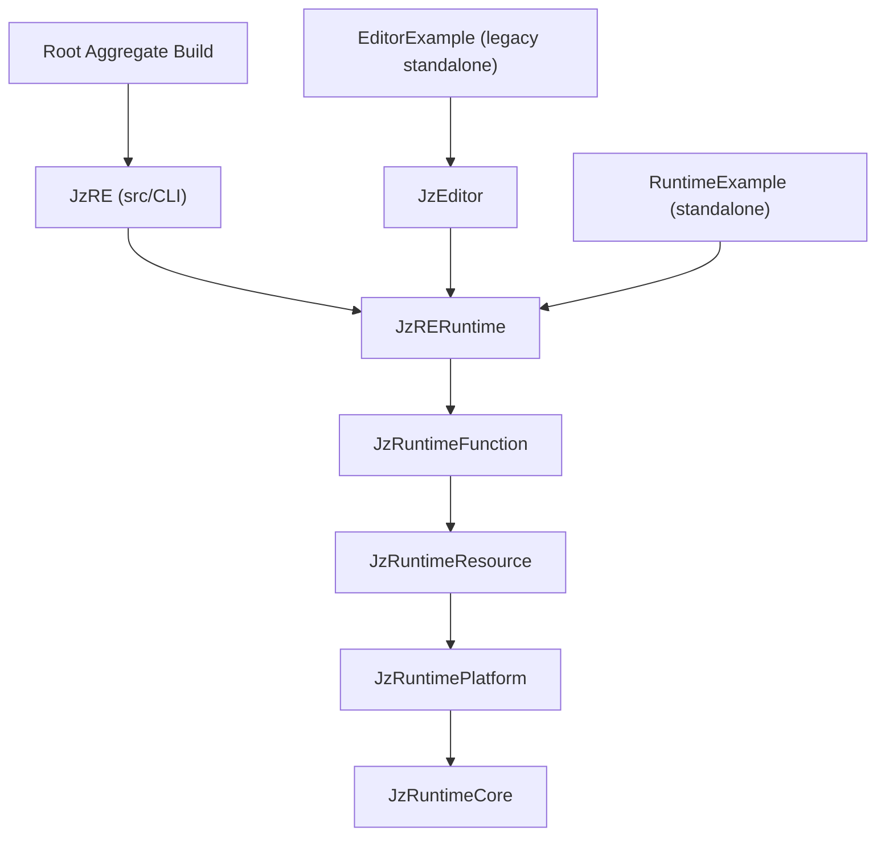

# JzRE Module Structure

## Overview

This document describes the current module layout and CMake topology after introducing the `src/CLI` module under `src/CMakeLists.txt` and independent example builds.

## Directory Structure

```text
JzRE/
├── src/
│   ├── EngineContent/
│   │   └── ShaderSource/                 # Runtime engine shader sources
│   ├── Runtime/                          # Runtime layers (Core/Platform/Resource/Function/Interface)
│   └── CLI/                              # CLI source module (wired by src/CMakeLists.txt)
│       ├── CMakeLists.txt
│       ├── include/JzRE/CLI/
│       │   ├── JzCliTypes.h
│       │   ├── JzCliArgParser.h
│       │   ├── JzCliContext.h
│       │   ├── JzCliCommandRegistry.h
│       │   └── commands/
│       ├── src/
│       │   ├── main.cpp
│       │   └── commands/
├── tests/
│   ├── CLI/                              # CLI tests merged under root test tree
│   │   ├── CMakeLists.txt
│   │   └── TestJzCli*.cpp
├── programs/
│   ├── JzREHeaderTool/
│   └── JzREShaderTool/
├── examples/
│   ├── RuntimeExample/                   # Independent runtime sample build
│   │   ├── CMakeLists.txt
│   │   ├── Models/
│   │   └── Textures/
│   └── EditorExample/                    # Legacy independent editor sample build
│       ├── CMakeLists.txt
│       ├── EditorContent/
│       │   └── ShaderSource/             # Legacy editor-only shader sources
│       ├── Application/
│       ├── Core/
│       ├── Panels/
│       ├── UI/
│       └── resources/
├── cmake/
└── docs/
```

## Module Dependencies



## CMake Topology

### Root Aggregate (`/CMakeLists.txt`)

- Root acts as an aggregate entry only.
- Runtime layers are added via `add_subdirectory(src)`.
- CLI is controlled by `JzRE_BUILD_CLI` and delegated to `src/CMakeLists.txt`.
- Root does not include `examples/RuntimeExample` or `examples/EditorExample`.

### Source Modules (`/src/CMakeLists.txt`)

- Always adds runtime layers through `add_subdirectory(Runtime)`.
- Adds `add_subdirectory(CLI)` when `JzRE_BUILD_CLI=ON`.
- `src/CLI/CMakeLists.txt` defines `JzCLI` as an object library and `JzRE` as the executable output (`JzRE`).
- `tests/CLI/CMakeLists.txt` defines optional `TESTJzRECLI` (controlled by `JzRE_CLI_BUILD_TESTS`).

### Standalone RuntimeExample (`examples/RuntimeExample/CMakeLists.txt`)

- Can run as independent top-level project (`-S examples/RuntimeExample`).
- In standalone mode, it adds:
  - runtime (`src/Runtime`)
  - shader tool (`programs/JzREShaderTool`)
  - local shader cook + EngineContent sync targets.
- EngineContent model/texture sync is controlled locally by `JzRE_RUNTIME_EXAMPLE_SYNC_ENGINE_ASSETS`.

### Standalone EditorExample (Legacy) (`examples/EditorExample/CMakeLists.txt`)

- Explicitly marked legacy (`JzRE_EDITOR_EXAMPLE_LEGACY`).
- Stays independent from root build graph.
- Shader cooking is split into:
  - runtime engine shader source: `src/EngineContent/ShaderSource`
  - legacy editor-only shader source: `examples/EditorExample/EditorContent/ShaderSource`

## CLI Domain Set

The `JzRE` executable provides fixed v1 domains:

- `project`
- `asset`
- `shader`
- `scene`
- `run`

Detailed command syntax and exit codes are documented in [cli.md](cli.md).

## Build Commands

### Root Aggregate

```bash
cmake --preset macos-clang-static
cmake --build build
```

### CLI (Root Target)

```bash
cmake --preset macos-clang-static
cmake --build build --target JzRE
```

### Standalone RuntimeExample

```bash
cmake -S examples/RuntimeExample -B examples/RuntimeExample/build
cmake --build examples/RuntimeExample/build
```

### Standalone EditorExample (Legacy)

```bash
cmake -S examples/EditorExample -B examples/EditorExample/build
cmake --build examples/EditorExample/build
```

## Build Targets Summary

| Target | Type | Dependencies |
| --- | --- | --- |
| `JzRuntimeCore` | Object | spdlog, fmt |
| `JzRuntimePlatform` | Object | JzRuntimeCore, glad, glfw, vulkan, spirv-reflect |
| `JzRuntimeResource` | Object | JzRuntimeCore, JzRuntimePlatform, assimp, stb, freetype |
| `JzRuntimeFunction` | Object | JzRuntimeCore, JzRuntimePlatform, JzRuntimeResource, entt |
| `JzRERuntime` | Object | Runtime layers |
| `JzREShaderTool` | Executable | nlohmann-json, dxc/spirv-cross toolchain |
| `JzCLI` | Object | JzRERuntime, nlohmann-json |
| `JzRE` | Executable | JzCLI + runtime object targets |
| `RuntimeExample` | Executable | JzRERuntime |
| `EditorExample` | Executable | JzEditor (legacy standalone only) |
