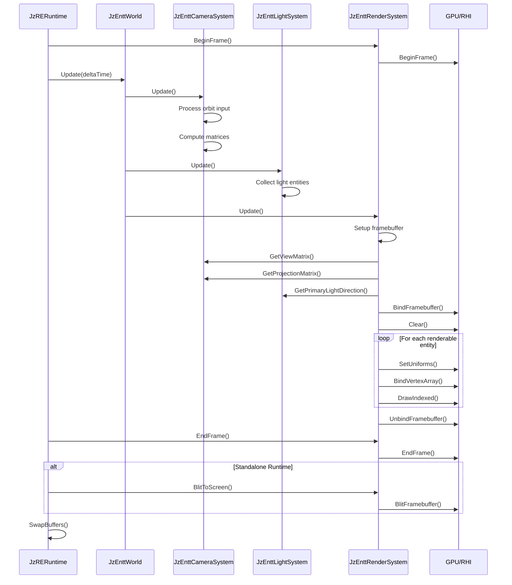

# JzRE Rendering Pipeline

## Overview

This document describes the ECS-based rendering pipeline in JzRE. The rendering is handled by three cooperating systems within `JzEnttWorld`.

---

## Architecture

```
JzRERuntime
  └── JzEnttWorld
        ├── JzEnttCameraSystem (1st) - Camera matrices, orbit control
        ├── JzEnttLightSystem  (2nd) - Light data collection
        └── JzEnttRenderSystem (3rd) - Framebuffer, pipeline, rendering
```

### System Responsibilities

| System | Responsibilities |
|--------|------------------|
| **JzEnttCameraSystem** | Process orbit controller input, compute view/projection matrices |
| **JzEnttLightSystem** | Collect light entities, provide primary light direction/color |
| **JzEnttRenderSystem** | Manage framebuffer/textures, create pipeline, render entities |

---

## Rendering Data Flow

```
[Main Loop - JzRERuntime::Run()]
   |
   v
[m_renderSystem->BeginFrame()] -> GPU frame begin
   |
   v
[m_world->Update(deltaTime)]
   |
   +---> [JzEnttCameraSystem::Update]
   |        |
   |        +---> Process orbit controller (mouse input)
   |        +---> Update camera position/rotation
   |        +---> Compute view matrix (LookAt)
   |        +---> Compute projection matrix (Perspective)
   |        +---> Cache main camera data
   |
   +---> [JzEnttLightSystem::Update]
   |        |
   |        +---> Query DirectionalLight entities
   |        +---> Query PointLight entities
   |        +---> Query SpotLight entities
   |        +---> Cache primary light direction/color
   |
   +---> [JzEnttRenderSystem::Update]
            |
            +---> Create/resize framebuffer if needed
            +---> Bind framebuffer
            +---> Set viewport
            +---> Clear (color from camera)
            +---> Get camera matrices from CameraSystem
            +---> Get light data from LightSystem
            +---> Set common uniforms (view, projection, camera pos, light)
            +---> Query entities with Transform + Mesh + Material
            +---> For each entity:
            |       +---> Compute model matrix
            |       +---> Set material uniforms
            |       +---> Bind vertex array
            |       +---> DrawIndexed
            +---> Unbind framebuffer
   |
   v
[m_renderSystem->EndFrame()] -> GPU frame end
   |
   v
[m_renderSystem->BlitToScreen()] -> Copy framebuffer to screen (if standalone)
   |
   v
[OnRender()] -> Additional rendering (ImGui UI)
   |
   v
[SwapBuffers()]
```

---

## Key Components

### Camera Components

```cpp
// Full camera state
struct JzEnttCameraComponent {
    JzVec3 position;
    JzVec4 rotation;        // pitch, yaw, roll, unused
    F32    fov, nearPlane, farPlane, aspect;
    JzVec3 clearColor;
    Bool   isMainCamera;
    JzMat4 viewMatrix;       // Computed by CameraSystem
    JzMat4 projectionMatrix; // Computed by CameraSystem
};

// Orbit controller for camera
struct JzEnttOrbitControllerComponent {
    JzVec3 target;
    F32    yaw, pitch, distance;
    F32    orbitSensitivity, panSensitivity, zoomSensitivity;
    F32    minDistance, maxDistance;
    // Mouse tracking state...
};
```

### Light Components

```cpp
struct JzEnttDirectionalLightComponent {
    JzVec3 direction;
    JzVec3 color;
    F32    intensity;
};

struct JzEnttPointLightComponent {
    JzVec3 color;
    F32    intensity, range;
    F32    constant, linear, quadratic;  // Attenuation
};

struct JzEnttSpotLightComponent {
    JzVec3 direction, color;
    F32    intensity, range;
    F32    innerCutoff, outerCutoff;  // Cone angles
};
```

### Renderable Entity

An entity is rendered if it has these components:

| Component | Purpose |
|-----------|---------|
| `JzTransformComponent` | Position, rotation, scale |
| `JzMeshComponent` | Reference to `JzMesh` resource |
| `JzMaterialComponent` | Reference to `JzMaterial` resource |

---

## Code Example

### Rendering Flow in JzEnttRenderSystem

```cpp
void JzEnttRenderSystem::Update(JzEnttWorld &world, F32 delta) {
    // Create/recreate framebuffer if size changed
    if (m_frameSizeChanged) {
        CreateFramebuffer();
    }

    // Setup viewport and clear
    SetupViewportAndClear();

    // Get camera data from CameraSystem
    JzMat4 viewMatrix = m_cameraSystem->GetViewMatrix();
    JzMat4 projMatrix = m_cameraSystem->GetProjectionMatrix();
    JzVec3 cameraPos = m_cameraSystem->GetCameraPosition();

    // Get light data from LightSystem
    JzVec3 lightDir = m_lightSystem->GetPrimaryLightDirection();
    JzVec3 lightColor = m_lightSystem->GetPrimaryLightColor();

    // Set common uniforms
    m_pipeline->SetUniform("view", viewMatrix);
    m_pipeline->SetUniform("projection", projMatrix);
    m_pipeline->SetUniform("uCameraPos", cameraPos);
    m_pipeline->SetUniform("uLightDir", lightDir);
    m_pipeline->SetUniform("uLightColor", lightColor);

    // Render all entities with Transform + Mesh + Material
    auto view = world.View<JzTransformComponent, JzMeshComponent, JzMaterialComponent>();

    for (auto entity : view) {
        auto &transform = world.GetComponent<JzTransformComponent>(entity);
        auto &meshComp = world.GetComponent<JzMeshComponent>(entity);
        auto &matComp = world.GetComponent<JzMaterialComponent>(entity);

        auto mesh = std::static_pointer_cast<JzMesh>(meshComp.mesh);
        auto material = std::static_pointer_cast<JzMaterial>(matComp.material);

        if (!mesh || mesh->GetState() != JzEResourceState::Loaded) continue;

        // Set model matrix
        JzMat4 modelMatrix = ComputeModelMatrix(transform);
        m_pipeline->SetUniform("model", modelMatrix);

        // Set material uniforms
        if (material && material->GetState() == JzEResourceState::Loaded) {
            const auto &props = material->GetProperties();
            m_pipeline->SetUniform("uAmbientColor", props.ambientColor);
            m_pipeline->SetUniform("uDiffuseColor", props.diffuseColor);
            m_pipeline->SetUniform("uSpecularColor", props.specularColor);
            m_pipeline->SetUniform("uShininess", props.shininess);
        }

        // Draw
        m_device->BindVertexArray(mesh->GetVertexArray());
        m_device->DrawIndexed(drawParams);
    }

    // Unbind framebuffer
    m_device->BindFramebuffer(nullptr);
}
```

---

## Model Spawning

Use `JzEnttModelSpawner` to create entities from model files:

```cpp
// Load model
auto model = std::make_shared<JzModel>("models/scene.obj");
model->Load();

// Spawn entities (one per mesh)
auto entities = JzEnttModelSpawner::SpawnModel(world, model);

// Each entity has:
// - JzTransformComponent
// - JzMeshComponent
// - JzMaterialComponent
// - JzRenderableTag
```

---

## Editor Integration

The Editor accesses the rendered frame via `JzEnttRenderSystem`:

```cpp
// In Editor: get rendered texture
auto colorTexture = runtime.GetRenderSystem()->GetColorTexture();

// Display in ImGui
ImGui::Image(
    (ImTextureID)(intptr_t)colorTexture->GetHandle(),
    ImVec2(viewportWidth, viewportHeight)
);
```

The Editor overrides `ShouldBlitToScreen()` to return `false`, preventing automatic screen blit.

---

## Sequence Diagram



---

## Key Type Relationships

| Component | Resource | RHI Objects |
|-----------|----------|-------------|
| `JzMeshComponent` | `JzMesh` | `JzGPUVertexArrayObject`, `JzGPUBufferObject` |
| `JzMaterialComponent` | `JzMaterial` | `JzRHIPipeline`, `JzGPUTextureObject` |
| `JzEnttCameraComponent` | - | Uniform data |
| `JzEntt*LightComponent` | - | Uniform data |

---

## Default Shaders

The `JzEnttRenderSystem` creates a default pipeline with Blinn-Phong shading:

**Vertex Shader:**
- MVP transformation
- Pass normal and world position to fragment

**Fragment Shader:**
- Ambient + Diffuse + Specular lighting
- Material colors: `uAmbientColor`, `uDiffuseColor`, `uSpecularColor`, `uShininess`
- Light: `uLightDir`, `uLightColor`
- Camera: `uCameraPos`
