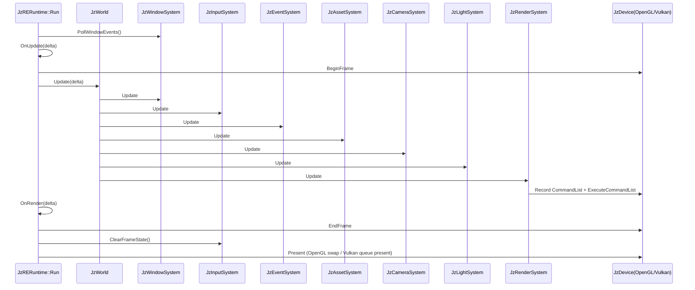

# JzRE Rendering Pipeline

## Overview

This document describes the **current runtime rendering flow in code**.

The rendering path is ECS-driven:

- `JzRERuntime::Run()` drives the frame loop.
- `JzWorld::Update()` executes registered systems in order.
- `JzRenderSystem` builds and executes a per-frame `JzRenderGraph`.
- RHI command lists are recorded and executed through `JzDevice` (OpenGL/Vulkan backend selected at runtime).

## Runtime Frame Entry

`JzRERuntime::RegisterSystems()` registers systems in this order:

1. `JzWindowSystem`
2. `JzInputSystem`
3. `JzEventSystem`
4. `JzAssetSystem`
5. `JzCameraSystem`
6. `JzLightSystem`
7. `JzRenderSystem`

`JzWorld::Update(delta)` then executes systems **strictly in this registration order**.

## Actual Frame Loop (`JzRERuntime::Run`)

```cpp
while (IsRunning()) {
    const auto deltaTime = clock.GetDeltaTime();

    m_windowSystem->PollWindowEvents();

    OnFrameBegin();
    OnUpdate(deltaTime);

    if (m_graphicsContext) {
        m_graphicsContext->BeginFrame();
    }

    m_world->Update(deltaTime);

    OnRender(deltaTime);

    if (m_graphicsContext) {
        m_graphicsContext->EndFrame();
    }
    OnFrameEnd();

    if (m_inputSystem) {
        m_inputSystem->ClearFrameState(*m_world);
    }

    if (m_graphicsContext) {
        m_graphicsContext->Present();
    }

    clock.Update();
}
```

## ECS-to-Render Flow

### 1. Window/Input/Event

- `JzWindowSystem::Update()` polls backend events, syncs `JzWindowStateComponent` and `JzInputStateComponent`, and emits window ECS events.
- `JzInputSystem::Update()` syncs legacy input components, updates actions/camera input, and emits input ECS events.
- `JzEventSystem::Update()` dispatches queued events.

Implementation note:

- `Run()` calls `m_windowSystem->PollWindowEvents()`.
- `JzWindowSystem::Update()` also polls backend events internally.

### 2. Asset/Camera/Light

- `JzAssetSystem::Update()` advances asset state and ECS asset tags.
- `JzCameraSystem::Update()` computes view/projection data on camera components.
- `JzLightSystem::Update()` collects light data.

### 3. Render (`JzRenderSystem::Update`)

`JzRenderSystem::Update()` does the following each frame:

1. Reads `JzWindowStateComponent`.
2. Tracks framebuffer size changes and window visibility.
3. Resolves geometry pipeline from `shaders/standard` for the current frame.
4. Configures `JzRenderGraph` allocator and transition callbacks.
5. Resets graph and records passes for all render targets (default + registered) in a unified loop.
6. Compiles and executes graph.
7. Blits default target framebuffer to screen only when window is visible.

Backend note:

- OpenGL executes the recorded framebuffer blit.
- Vulkan currently renders to swapchain in the runtime path, uses swapchain color+depth attachments for depth-tested 3D passes, and treats `BlitFramebufferToScreen(...)` as a no-op compatibility command.

## Default Render Target

A **default render target** (`DefaultScene`) is created at `JzRenderSystem` construction time:

- `visibility = MainScene`, `features = None`, `camera = INVALID_ENTITY` (falls back to main camera).
- `getDesiredSize` returns `m_frameSize` (window framebuffer size).
- The handle is stored as `m_defaultRenderTargetHandle` and cannot be unregistered.
- GPU resources (textures/framebuffer) are allocated on first `Update()` via `EnsureSize()` when the window size becomes available.

The default target replaces the former `m_mainOutput` dedicated path. Runtime examples work without explicit `RegisterRenderTarget` calls.

## RenderGraph Recording in `JzRenderSystem`

### Unified render target loop

All targets (default and registered) are processed in a single loop:

For each render target:

1. Resolve target size (`getDesiredSize` callback) and `EnsureSize()`.
2. Skip if output is not valid.
3. Bind output color/depth textures into graph.
4. Determine contribution scope: default target uses `MainScene`, registered targets use `RegisteredTarget`.
5. Add one **geometry pass** via `ExecuteGeometryStage()`.
6. For each registered `JzRenderGraphContribution`, add one contribution pass filtered by scope.

### Geometry stage (`ExecuteGeometryStage`)

The built-in geometry stage executes directly (not through `ExecuteContribution`):

1. `ResolveCameraFrameData(...)`: resolve camera matrices and clear color.
2. `BeginRenderTargetPass(...)`: record framebuffer/pipeline/viewport/clear commands.
3. `DrawVisibleEntities(...)`: record ECS draw commands filtered by `JzRenderVisibility`.

This separation ensures the geometry stage does not go through contribution dispatch logic.

### Contribution model

Runtime supports `JzRenderGraphContribution` registration:

- `RegisterGraphContribution(...)` registers/updates contributions by name.
- each contribution declares `requiredFeature` for target feature gating.
- each contribution declares `scope` (`MainScene`, `RegisteredTarget`, or `All`) for placement.
  - `MainScene` = default target only.
  - `RegisteredTarget` = non-default targets only.
  - `All` = both.
- `enabledExecute` can add dynamic run conditions.
- `execute(context)` performs actual draw logic via `BeginContributionTargetPass`.

Compatibility note:

- New integrations should register `JzRenderGraphContribution` directly.

### Editor Migration Guide

When migrating editor overlays from `JzRenderPass` to `JzRenderGraphContribution`:

- Map `pass.feature` to `contribution.requiredFeature`.
- Move `setupPass(...)` logic into `contribution.execute(context)`.
- Bind pipeline/VAO and issue draw calls inside `execute(context)`.
- Replace `ClearRenderPasses()` with `ClearGraphContributions()`.

## Entity Selection and Draw Conditions

Renderable entities are selected by:

- `JzTransformComponent`
- `JzMeshAssetComponent`
- `JzMaterialAssetComponent`
- `JzAssetReadyTag`

Visibility filtering uses tag/mask rules:

- `JzOverlayRenderTag` against `Overlay`
- `JzIsolatedRenderTag` against `Isolated`
- untagged entities against `MainScene`

Per draw call:

- model/view/projection and material uniforms are set.
- diffuse texture is bound when material has one.
- pipeline vertex layout is built from vertex shader input declarations and attached to `JzPipelineDesc`.
- `commandList.DrawIndexed(...)` is recorded with mesh index count.

## RenderGraph Compile/Execute Behavior

`JzRenderGraph::Compile()` currently:

1. Runs pass `setup` callbacks.
2. Builds dependencies from resource write/read tracking.
3. Topologically computes execution order.
4. Builds per-pass transition list.
5. Allocates/binds texture and buffer resources.

`JzRenderGraph::Execute(device)`:

- Executes passes in computed order.
- Creates one `JzRHICommandList` per pass.
- Applies transition callback before pass execute.
- Resolves framebuffer from pass render-target bindings (`BindRenderTarget`) or internal cache.
- Records framebuffer/viewport commands and builds a `JzRGPassContext` for pass execution.
- Ends and submits pass command list via `device.ExecuteCommandList(...)`.
- Skips passes when `enabledExecute` returns false.

OpenGL backend currently treats `ResourceBarrier(...)` as no-op (implicit transitions).
Vulkan backend consumes barrier transitions and applies layout changes before pass execution.
Vulkan backend also resolves shader parameters through descriptor-backed uniform/sampler binding at draw time.

## EditorExample Integration Path

Editor panels are runtime consumers via render targets:

- `JzView` registers a logical target at construction time through `JzRenderSystem::RegisterRenderTarget`.
- Initially-closed panels also register at construction; `shouldRender` controls pass execution.
- Panel fetches `JzRenderOutput` by handle and shows texture in ImGui.
- `JzSceneView` updates camera binding and feature mask each frame.

`JzREEditor::OnStart()` builds contribution resources and registers:

- `EditorSkyboxContribution`
- `EditorAxisContribution`
- `EditorGridContribution`

These contributions are registered through `RegisterGraphContribution(...)` and
executed only when target feature masks request them.

## Sequence Diagram



## Source References

- `src/Runtime/Interface/src/JzRERuntime.cpp`
- `src/Runtime/Function/src/ECS/JzWorld.cpp`
- `src/Runtime/Function/src/ECS/JzRenderSystem.cpp`
- `src/Runtime/Function/src/Rendering/JzRenderGraph.cpp`
- `examples/EditorExample/Panels/src/JzView.cpp`
- `examples/EditorExample/Panels/src/JzSceneView.cpp`
- `examples/EditorExample/Application/src/JzREEditor.cpp`

## Runtime Shutdown Sequence

To keep GPU object lifetimes valid across backends, runtime teardown follows:

1. `JzWorld::ShutdownSystems()` (reverse order `OnShutdown`).
2. Reset ECS system handles (`JzRenderSystem`, `JzAssetSystem`, etc.).
3. Shutdown `JzGraphicsContext` / `JzDevice`.
4. Release window backend and world.

This ordering ensures resource-owning systems release Vulkan/OpenGL objects before device teardown.
