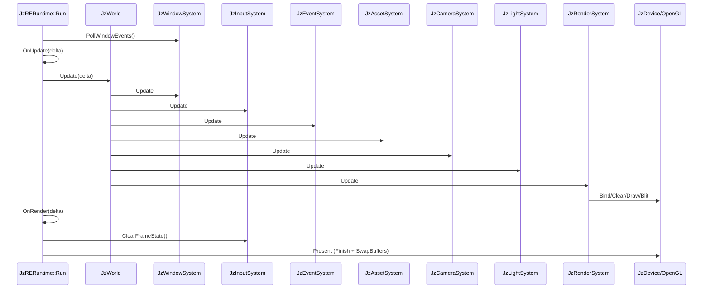

# JzRE Rendering Pipeline

## Overview

This document describes the **current runtime rendering flow in code**.

The rendering path is ECS-driven:

- `JzRERuntime::Run()` drives the frame loop.
- `JzWorld::Update()` executes registered systems in order.
- `JzRenderSystem` builds and executes a per-frame `JzRenderGraph`.
- RHI calls are issued through `JzDevice` (OpenGL backend currently).

## Runtime Frame Entry

`JzRERuntime::RegisterSystems()` registers systems in this order:

1. `JzWindowSystem`
2. `JzInputSystem`
3. `JzEventSystem`
4. `JzAssetSystem`
5. `JzCameraSystem`
6. `JzLightSystem`
7. `JzRenderSystem`

`JzWorld::Update(delta)` then executes systems **strictly in this registration order**.

## Actual Frame Loop (`JzRERuntime::Run`)

```cpp
while (IsRunning()) {
    const auto deltaTime = clock.GetDeltaTime();

    m_windowSystem->PollWindowEvents();

    OnFrameBegin();
    OnUpdate(deltaTime);

    m_world->Update(deltaTime);

    OnRender(deltaTime);
    OnFrameEnd();

    if (m_inputSystem) {
        m_inputSystem->ClearFrameState(*m_world);
    }

    if (m_graphicsContext) {
        m_graphicsContext->Present();
    }

    clock.Update();
}
```

## ECS-to-Render Flow

### 1. Window/Input/Event

- `JzWindowSystem::Update()` polls backend events, syncs `JzWindowStateComponent` and `JzInputStateComponent`, and emits window ECS events.
- `JzInputSystem::Update()` syncs legacy input components, updates actions/camera input, and emits input ECS events.
- `JzEventSystem::Update()` dispatches queued events.

Implementation note:

- `Run()` calls `m_windowSystem->PollWindowEvents()`.
- `JzWindowSystem::Update()` also polls backend events internally.

### 2. Asset/Camera/Light

- `JzAssetSystem::Update()` advances asset state and ECS asset tags.
- `JzCameraSystem::Update()` computes view/projection data on camera components.
- `JzLightSystem::Update()` collects light data.

### 3. Render (`JzRenderSystem::Update`)

`JzRenderSystem::Update()` does the following each frame:

1. Reads `JzWindowStateComponent`.
2. Tracks framebuffer size changes and window visibility.
3. Ensures the main `JzRenderOutput` matches frame size.
4. Resolves geometry pipeline from `shaders/standard` for the current frame.
5. Configures `JzRenderGraph` allocator and transition callbacks.
6. Resets graph and records passes.
7. Compiles and executes graph.
8. Blits main output framebuffer to screen only when window is visible.

## RenderGraph Recording in `JzRenderSystem`

### Main scene pass

The system creates two graph textures and binds them to main output resources:

- `MainScene_Color` -> `m_mainOutput->GetColorTexture()`
- `MainScene_Depth` -> `m_mainOutput->GetDepthTexture()`

Then it records `MainScenePass`:

- Setup: declare color/depth writes, render target, viewport.
- Execute: run built-in geometry contribution through
  `ExecuteContribution(world, passContext, ..., geometryPipeline, geometryContribution)`.

Main scene pass renders with visibility mask `MainScene`.

### Per render-target passes

For each registered logical target (`RegisterRenderTarget`):

- Resolve target size (`getDesiredSize` callback).
- Ensure `JzRenderOutput` size/resources are valid.
- Bind output color/depth textures into graph.
- Add one geometry pass with optional `shouldRender` predicate.
- Geometry pass executes built-in geometry contribution (clear + entity draw).
- For each registered `JzRenderGraphContribution`, add one contribution pass on the same target textures.

### Unified geometry stage

Built-in geometry contribution executes through `ExecuteContribution(...)` with `clearTarget=true`:

1. `ResolveCameraFrameData(...)`: resolve camera matrices and clear color.
2. `BeginRenderTargetPass(...)`: use `JzRGPassContext` framebuffer/viewport, bind geometry pipeline, clear.
3. `DrawVisibleEntities(...)`: draw ECS entities filtered by `JzRenderVisibility`.

Feature behavior is now appended through target-scoped contribution passes in `JzRenderGraph`.

### Contribution model

Runtime supports `JzRenderGraphContribution` registration:

- `RegisterGraphContribution(...)` registers/updates contributions by name.
- each contribution declares `requiredFeature` for target feature gating.
- each contribution declares `scope` (`MainScene`, `RegisteredTarget`, or `All`) for placement.
- `clearTarget` controls whether contribution starts with a clear+geometry-pipeline setup.
- `enabledExecute` can add dynamic run conditions.
- `execute(context)` performs actual draw logic.

Compatibility note:

- New integrations should register `JzRenderGraphContribution` directly.

### Editor Migration Guide

When migrating editor overlays from `JzRenderPass` to `JzRenderGraphContribution`:

- Map `pass.feature` to `contribution.requiredFeature`.
- Move `setupPass(...)` logic into `contribution.execute(context)`.
- Bind pipeline/VAO and issue draw calls inside `execute(context)`.
- Replace `ClearRenderPasses()` with `ClearGraphContributions()`.

## Entity Selection and Draw Conditions

Renderable entities are selected by:

- `JzTransformComponent`
- `JzMeshAssetComponent`
- `JzMaterialAssetComponent`
- `JzAssetReadyTag`

Visibility filtering uses tag/mask rules:

- `JzOverlayRenderTag` against `Overlay`
- `JzIsolatedRenderTag` against `Isolated`
- untagged entities against `MainScene`

Per draw call:

- model/view/projection and material uniforms are set.
- diffuse texture is bound when material has one.
- `device.DrawIndexed(...)` is issued with mesh index count.

## RenderGraph Compile/Execute Behavior

`JzRenderGraph::Compile()` currently:

1. Runs pass `setup` callbacks.
2. Builds dependencies from resource write/read tracking.
3. Topologically computes execution order.
4. Builds per-pass transition list.
5. Allocates/binds texture and buffer resources.

`JzRenderGraph::Execute(device)`:

- Executes passes in computed order.
- Applies transition callback before pass execute.
- Resolves framebuffer from pass render-target bindings (`BindRenderTarget`) or internal cache.
- Binds framebuffer/viewport and builds a `JzRGPassContext` for pass execution.
- Skips passes when `enabledExecute` returns false.

OpenGL backend currently treats `ResourceBarrier(...)` as no-op (implicit transitions).

## Editor Integration Path

Editor panels are runtime consumers via render targets:

- `JzView` registers a logical target through `JzRenderSystem::RegisterRenderTarget`.
- Panel fetches `JzRenderOutput` by handle and shows texture in ImGui.
- `JzSceneView` updates camera binding and feature mask each frame.

`JzREEditor::OnStart()` builds contribution resources and registers:

- `EditorSkyboxContribution`
- `EditorAxisContribution`
- `EditorGridContribution`

These contributions are registered through `RegisterGraphContribution(...)` and
executed only when target feature masks request them.

## Sequence Diagram



## Source References

- `src/Runtime/Interface/src/JzRERuntime.cpp`
- `src/Runtime/Function/src/ECS/JzWorld.cpp`
- `src/Runtime/Function/src/ECS/JzRenderSystem.cpp`
- `src/Runtime/Function/src/Rendering/JzRenderGraph.cpp`
- `src/Editor/Panels/src/JzView.cpp`
- `src/Editor/Panels/src/JzSceneView.cpp`
- `src/Editor/Application/src/JzREEditor.cpp`
