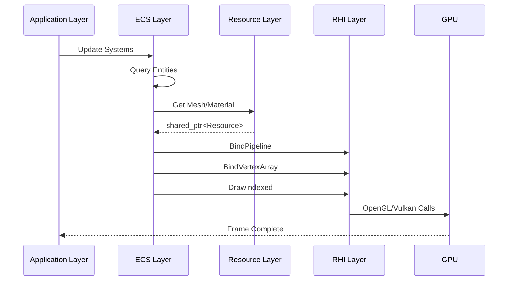

# JzRE Rendering Pipeline Integration

## Overview

This document describes the rendering data flow between layers in the JzRE engine, showing the complete path from ECS to GPU.

---

## Rendering Data Flow

```
[Main Loop]
   |
   v
[RenderSystem::Update] -> Iterate Entities
   |
   +---> [EntityManager] -> Get Components
           |
           +---> [MeshComponent] -----> holds std::shared_ptr<JzMesh>
           |
           +---> [MaterialComponent] -> holds std::shared_ptr<JzMaterial>
           |
           +---> [TransformComponent] -> (position, rotation, scale)
   |
   v
[JzMesh Resource] (CPU side)
   |
   +---> Vertex/Index data (CPU memory)
   |
   +---> holds std::shared_ptr<JzGPUBufferObject> (vertex buffer)
   |
   +---> holds std::shared_ptr<JzGPUBufferObject> (index buffer)
   |
   v
[JzDevice] (RHI/GPU abstraction layer)
   |
   +---> BindPipeline(material->GetPipeline())
   |
   +---> BindVertexArray(mesh->GetVertexArray())
   |
   +---> DrawIndexed(...)
   |
   v
[GPU] -> Renders image
```

---

## Code Examples

### Render System Update

```cpp
void JzRenderSystem::Update(JzEntityManager& manager, F32 delta) {
    // Get all renderable entities
    auto entities = manager.View<JzMeshComponent, JzMaterialComponent, JzTransformComponent>();

    for (auto entity : entities) {
        auto& meshComp = manager.GetComponent<JzMeshComponent>(entity);
        auto& matComp = manager.GetComponent<JzMaterialComponent>(entity);
        auto& transform = manager.GetComponent<JzTransformComponent>(entity);

        auto mesh = std::static_pointer_cast<JzMesh>(meshComp.mesh);
        auto material = std::static_pointer_cast<JzMaterial>(matComp.material);

        if (mesh && material && mesh->GetState() == JzEResourceState::Loaded) {
            // Set transform matrix
            JzMat4 modelMatrix = CalculateModelMatrix(transform);
            material->SetUniform("u_Model", modelMatrix);

            // Bind and draw
            m_device->BindPipeline(material->GetPipeline());
            m_device->BindVertexArray(mesh->GetVertexArray());

            JzDrawIndexedParams params;
            params.indexCount = mesh->GetIndexCount();
            params.primitiveType = JzEPrimitiveType::Triangles;
            m_device->DrawIndexed(params);
        }
    }
}
```

### Using Resources in UI

```cpp
// 1. Get resource manager
auto& resourceManager = JzServiceContainer::Get<JzResourceManager>();

// 2. Load texture resource
auto iconTexture = resourceManager.GetResource<JzTexture>("path/to/icon.png");

// 3. Create image button
if (iconTexture && iconTexture->GetState() == JzEResourceState::Loaded) {
    auto myImageButton = std::make_unique<JzImageButton>(
        iconTexture->GetRHITexture(),
        JzVec2{24.0f, 24.0f}
    );

    // 4. Subscribe to click event
    myImageButton->ClickedEvent.AddListener([]() {
        // Handle button click...
    });
}
```

---

## Layer Interaction Diagram



---

## Key Type Relationships

| Component | Held Resource | RHI Objects Used |
|-----------|---------------|------------------|
| `JzMeshComponent` | `JzMesh` | `JzGPUBufferObject`, `JzGPUVertexArrayObject` |
| `JzMaterialComponent` | `JzMaterial` | `JzRHIPipeline`, `JzGPUTextureObject` |
| `JzCameraComponent` | - | Uniform data |
