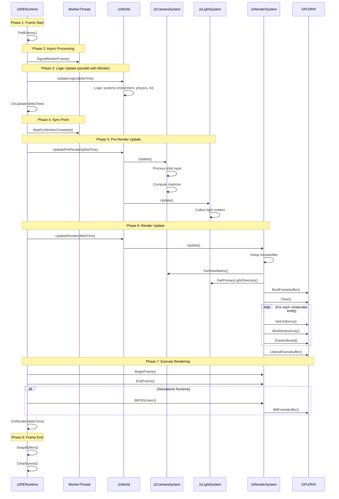

# JzRE Rendering Pipeline

## Overview

This document describes the ECS-based rendering pipeline in JzRE. The rendering is handled by three cooperating systems within `JzWorld`, organized into distinct execution phases for proper synchronization between logic and rendering.

---

## Architecture

```
JzRERuntime
  └── JzWorld
        ├── Input Systems        (JzSystemPhase::Input)
        │     ├── JzWindowSystem - Window polling, input state sync
        │     └── JzInputSystem  - Input processing, event emission
        ├── Logic Systems        (JzSystemPhase::Logic)
        │     ├── JzAssetSystem  - Asset loading, hot reload
        │     └── User logic systems (movement, physics, AI, animations)
        ├── PreRender Systems    (JzSystemPhase::PreRender)
        │     ├── JzCameraSystem - Camera matrices, orbit control
        │     └── JzLightSystem  - Light data collection
        └── Render Systems       (JzSystemPhase::Render)
              └── JzRenderSystem - Framebuffer, pipeline, rendering
```

### System Phases

Systems execute in 8 phases grouped into 3 categories:

| Group         | Phase      | Purpose                                    | Example Systems                           |
| ------------- | ---------- | ------------------------------------------ | ----------------------------------------- |
| **Logic**     | Input      | Input processing, event handling           | JzWindowSystem, JzInputSystem             |
|               | Physics    | Physics simulation, collision detection    | PhysicsSystem (user-defined)              |
|               | Animation  | Skeletal animation, blend trees            | AnimationSystem (user-defined)            |
|               | Logic      | General game logic, AI, scripts            | JzAssetSystem, JzMoveSystem, user systems |
| **PreRender** | PreRender  | Camera matrices, light collection          | JzCameraSystem, JzLightSystem             |
|               | Culling    | Frustum culling, occlusion, LOD selection  | CullingSystem (user-defined)              |
| **Render**    | RenderPrep | Batch building, instance data preparation  | BatchBuildingSystem (user-defined)        |
|               | Render     | Actual GPU draw calls                      | JzRenderSystem                            |

### System Responsibilities

| System                 | Phase     | Responsibilities                                                 |
| ---------------------- | --------- | ---------------------------------------------------------------- |
| **JzCameraSystem** | PreRender | Process orbit controller input, compute view/projection matrices |
| **JzLightSystem**  | PreRender | Collect light entities, provide primary light direction/color    |
| **JzRenderSystem** | Render    | Manage framebuffer/textures, build RenderGraph, render entities and view targets |

---

## Frame Execution Flow

The main loop in `JzRERuntime::Run()` executes in 8 distinct phases:

```
[Phase 1: Frame Start - Input and Window Events]
   m_window->PollEvents()
   |
   v
[Phase 2: Async Processing - Start Background Tasks]
   _SignalWorkerFrame(frameData)
   |
   v
[Phase 3: ECS Logic Update (can run parallel with GPU)]
   _UpdateECSLogic(frameData)
     └── m_world->UpdateLogic(deltaTime)
         └── All systems with JzSystemPhase::Logic
   |
   v
[User Logic Hook]
   OnUpdate(deltaTime)
   |
   v
[Phase 4: Sync Point - Wait for Background Tasks]
   _WaitForWorkerComplete()
   |
   v
[Phase 5: ECS Pre-Render Update]
   _UpdateECSPreRender(frameData)
     ├── Update aspect ratio
     ├── Update frame size
     └── m_world->UpdatePreRender(deltaTime)
         ├── JzCameraSystem::Update
         │     ├── Process orbit controller (mouse input)
         │     ├── Update camera position/rotation
         │     ├── Compute view matrix (LookAt)
         │     ├── Compute projection matrix (Perspective)
         │     └── Cache main camera data
         └── JzLightSystem::Update
               ├── Query DirectionalLight entities
               ├── Query PointLight entities
               ├── Query SpotLight entities
               └── Cache primary light direction/color
   |
   v
[Phase 6: ECS Render Update]
   _UpdateECSRender(frameData)
     └── m_world->UpdateRender(deltaTime)
         └── JzRenderSystem::Update
               ├── Create/resize framebuffer if needed
               ├── Build RenderGraph (phase 2: main pass + view passes)
               │     ├── Bind framebuffer
               │     ├── Set viewport
               │     ├── Clear (color from camera)
               │     ├── Get camera matrices from CameraSystem
               │     ├── Get light data from LightSystem
               │     ├── Set common uniforms
               │     ├── Query entities with Transform + Mesh + Material
               │     ├── For each entity:
               │     │     ├── Compute model matrix
               │     │     ├── Set material uniforms
               │     │     ├── Bind vertex array
               │     │     └── DrawIndexed
               │     └── Unbind framebuffer
               │
               │     ├── For each registered view target:
               │     │     ├── Ensure target size
                │     │     ├── Bind target framebuffer
                │     │     ├── Set viewport and clear
               │     │     ├── Render filtered entities (editor/preview tag rules)
                │     │     └── Unbind framebuffer
               └── Execute RenderGraph passes
   |
   v
[Phase 7: Execute Rendering]
   _ExecuteRendering(frameData)
     ├── m_renderSystem->BeginFrame()
     ├── m_renderSystem->EndFrame()
     ├── m_renderSystem->BlitToScreen() (if standalone)
     └── OnRender(deltaTime) (ImGui UI)
   |
   v
[Phase 8: Frame End]
   _FinishFrame(frameData)
     ├── m_window->SwapBuffers()
     └── m_inputManager->ClearEvents()
```

---

## Phase Separation Benefits

1. **Parallel Execution**: Logic systems can run in parallel with GPU work from previous frame
2. **Clear Synchronization**: Explicit sync point ensures background tasks complete before rendering
3. **Data Isolation**: PreRender phase prepares render data after logic updates are complete
4. **Extensibility**: Easy to add new systems by specifying their phase

---

## Key Components

### Camera Components

```cpp
// Full camera state
struct JzCameraComponent {
    JzVec3 position;
    JzVec4 rotation;        // pitch, yaw, roll, unused
    F32    fov, nearPlane, farPlane, aspect;
    JzVec3 clearColor;
    Bool   isMainCamera;
    JzMat4 viewMatrix;       // Computed by CameraSystem
    JzMat4 projectionMatrix; // Computed by CameraSystem
};

// Orbit controller for camera
struct JzOrbitControllerComponent {
    JzVec3 target;
    F32    yaw, pitch, distance;
    F32    orbitSensitivity, panSensitivity, zoomSensitivity;
    F32    minDistance, maxDistance;
    // Mouse tracking state...
};
```

### Light Components

```cpp
struct JzDirectionalLightComponent {
    JzVec3 direction;
    JzVec3 color;
    F32    intensity;
};

struct JzPointLightComponent {
    JzVec3 color;
    F32    intensity, range;
    F32    constant, linear, quadratic;  // Attenuation
};

struct JzSpotLightComponent {
    JzVec3 direction, color;
    F32    intensity, range;
    F32    innerCutoff, outerCutoff;  // Cone angles
};
```

### Renderable Entity

An entity is rendered if it has these components:

| Component              | Purpose                            |
| ---------------------- | ---------------------------------- |
| `JzTransformComponent` | Position, rotation, scale          |
| `JzMeshComponent`      | Reference to `JzMesh` resource     |
| `JzMaterialComponent`  | Reference to `JzMaterial` resource |

---

## Code Example

### Rendering Flow in JzRenderSystem

```cpp
void JzRenderSystem::Update(JzWorld &world, F32 delta) {
    // Create/recreate framebuffer if size changed
    if (m_frameSizeChanged) {
        CreateFramebuffer();
    }

    // Setup viewport and clear
    SetupViewportAndClear();

    // Get camera data from CameraSystem
    JzMat4 viewMatrix = m_cameraSystem->GetViewMatrix();
    JzMat4 projMatrix = m_cameraSystem->GetProjectionMatrix();
    JzVec3 cameraPos = m_cameraSystem->GetCameraPosition();

    // Get light data from LightSystem
    JzVec3 lightDir = m_lightSystem->GetPrimaryLightDirection();
    JzVec3 lightColor = m_lightSystem->GetPrimaryLightColor();

    // Set common uniforms
    m_pipeline->SetUniform("view", viewMatrix);
    m_pipeline->SetUniform("projection", projMatrix);
    m_pipeline->SetUniform("uCameraPos", cameraPos);
    m_pipeline->SetUniform("uLightDir", lightDir);
    m_pipeline->SetUniform("uLightColor", lightColor);

    // Render all entities with Transform + Mesh + Material
    auto view = world.View<JzTransformComponent, JzMeshComponent, JzMaterialComponent>();

    for (auto entity : view) {
        auto &transform = world.GetComponent<JzTransformComponent>(entity);
        auto &meshComp = world.GetComponent<JzMeshComponent>(entity);
        auto &matComp = world.GetComponent<JzMaterialComponent>(entity);

        auto mesh = std::static_pointer_cast<JzMesh>(meshComp.mesh);
        auto material = std::static_pointer_cast<JzMaterial>(matComp.material);

        if (!mesh || mesh->GetState() != JzEResourceState::Loaded) continue;

        // Set model matrix
        JzMat4 modelMatrix = ComputeModelMatrix(transform);
        m_pipeline->SetUniform("model", modelMatrix);

        // Set material uniforms
        if (material && material->GetState() == JzEResourceState::Loaded) {
            const auto &props = material->GetProperties();
            m_pipeline->SetUniform("uAmbientColor", props.ambientColor);
            m_pipeline->SetUniform("uDiffuseColor", props.diffuseColor);
            m_pipeline->SetUniform("uSpecularColor", props.specularColor);
            m_pipeline->SetUniform("uShininess", props.shininess);
        }

        // Draw
        m_device->BindVertexArray(mesh->GetVertexArray());
        m_device->DrawIndexed(drawParams);
    }

    // Unbind framebuffer
    m_device->BindFramebuffer(nullptr);
}
```

---

## Model Spawning

Use `JzModelSpawner` to create entities from model files:

```cpp
// Load model
auto model = std::make_shared<JzModel>("models/scene.obj");
model->Load();

// Spawn entities (one per mesh)
auto entities = JzModelSpawner::SpawnModel(world, model);

// Each entity has:
// - JzTransformComponent
// - JzMeshComponent
// - JzMaterialComponent
// - JzRenderableTag
```

---

## Editor Integration

Editor views register a render view and retrieve the output via `JzRenderSystem`:

```cpp
// In JzView: after registration
auto *output = renderSystem.GetRenderOutput(GetOutputName());
if (output && output->IsValid()) {
    ImGui::Image(output->GetTextureID(), ImVec2(viewportWidth, viewportHeight));
}
```

The Editor overrides `ShouldBlitToScreen()` to return `false`, preventing automatic screen blit.

---

## Sequence Diagram



---

## Key Type Relationships

| Component               | Resource     | RHI Objects                                   |
| ----------------------- | ------------ | --------------------------------------------- |
| `JzMeshComponent`       | `JzMesh`     | `JzGPUVertexArrayObject`, `JzGPUBufferObject` |
| `JzMaterialComponent`   | `JzMaterial` | `JzRHIPipeline`, `JzGPUTextureObject`         |
| `JzCameraComponent` | -            | Uniform data                                  |
| `Jz*LightComponent` | -            | Uniform data                                  |

---

## Default Shaders

The `JzRenderSystem` creates a default pipeline with Blinn-Phong shading:

**Vertex Shader:**

- MVP transformation
- Pass normal and world position to fragment

**Fragment Shader:**

- Ambient + Diffuse + Specular lighting
- Material colors: `uAmbientColor`, `uDiffuseColor`, `uSpecularColor`, `uShininess`
- Light: `uLightDir`, `uLightColor`
- Camera: `uCameraPos`
