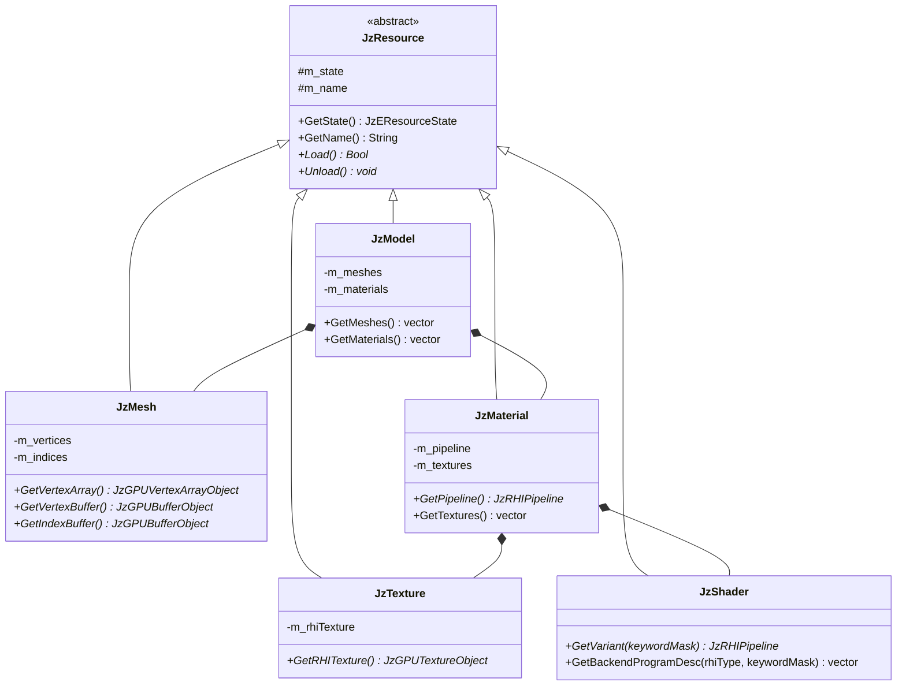
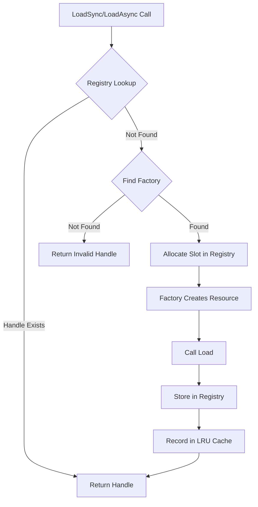

# JzRE Resource Layer Design

## Overview

The Resource Layer is a core component of the JzRE engine, responsible for managing the lifecycle of all game assets (textures, models, materials, shaders, etc.). The design is based on three core concepts: `JzResource`, `JzResourceFactory`, and `JzAssetManager`.

---

## Design Goals

- **Automation**: Automatic resource loading, unloading, and caching
- **Extensibility**: Easy support for new resource types without modifying core code
- **Efficiency**: Reference-counted memory management
- **Decoupling**: Resource management logic isolated from other engine parts

---

## Core Components

### JzResource (Resource Base Class)

Abstract base class for all resource types.

```cpp
enum class JzEResourceState {
    Unloaded,  // Not loaded
    Loading,   // Loading (reserved)
    Loaded,    // Loaded
    Error      // Error
};

class JzResource {
public:
    virtual ~JzResource() = default;

    JzEResourceState GetState() const { return m_state; }
    const String& GetName() const { return m_name; }

    virtual Bool Load() = 0;    // Load resource
    virtual void Unload() = 0;  // Unload resource

protected:
    JzEResourceState m_state = JzEResourceState::Unloaded;
    String m_name;
};
```

### JzResourceFactory (Resource Factory)

Abstract factory interface for creating concrete resource type instances.

```cpp
class JzResourceFactory {
public:
    virtual ~JzResourceFactory() = default;
    virtual JzResource* Create(const String& name) = 0;
};
```

### JzAssetManager (Asset Manager)

Central coordinator for asset management with generation-based handles.

```cpp
class JzAssetManager {
public:
    // Sync loading (blocking)
    template<typename T>
    JzAssetHandle<T> LoadSync(const String& path);

    // Async loading (non-blocking)
    template<typename T>
    JzAssetHandle<T> LoadAsync(const String& path,
                               JzAssetLoadCallback<T> callback,
                               I32 priority);

    // Access loaded asset
    template<typename T>
    T* Get(JzAssetHandle<T> handle);

    // Register resource factory
    template <typename T>
    void RegisterFactory(std::unique_ptr<JzResourceFactory> factory);

    // Search path management
    void AddSearchPath(const String& path);
    String FindFullPath(const String& relativePath);

    // Per-frame update (LRU eviction, async completion)
    void Update();
};
```

---

## Resource Types

### Implemented Resource Types

| Resource Type | Class Name   | Factory Class       | Purpose            |
| ------------- | ------------ | ------------------- | ------------------ |
| Texture       | `JzTexture`  | `JzTextureFactory`  | Image resources    |
| Mesh          | `JzMesh`     | `JzMeshFactory`     | Geometry data      |
| Material      | `JzMaterial` | `JzMaterialFactory` | Render materials   |
| Shader        | `JzShader` | `JzShaderFactory` | Cooked shader package (`.jzshader` + `.jzsblob`) |
| Model         | `JzModel`    | `JzModelFactory`    | Complete 3D models |
| Font          | `JzFont`     | `JzFontFactory`     | Text rendering     |

### Resource Class Relationships



### Shader Resource Workflow (Cooked Assets)

Shader loading is now offline-first:

1. Author HLSL + source manifest (`*.jzshader.src.json`).
2. `JzREShaderTool` generates runtime artifacts:
   - `*.jzshader` (manifest: variants, targets, layouts)
   - `*.jzsblob` (binary/text chunk storage)
3. `JzShaderFactory` resolves `.jzshader` paths only.
4. `JzShader` loads manifest/blob and creates pipeline variants by `keywordMask`.

---

## Workflow

### 1. Asset Registration (Automatic via JzAssetSystem)

Factory registration is handled automatically by `JzAssetSystem::Initialize()`:

```cpp
// JzAssetSystem registers all factories with JzAssetManager
assetManager->RegisterFactory<JzModel>(std::make_unique<JzModelFactory>());
assetManager->RegisterFactory<JzMesh>(std::make_unique<JzMeshFactory>());
assetManager->RegisterFactory<JzTexture>(std::make_unique<JzTextureFactory>());
assetManager->RegisterFactory<JzMaterial>(std::make_unique<JzMaterialFactory>());
assetManager->RegisterFactory<JzShader>(std::make_unique<JzShaderFactory>());
assetManager->RegisterFactory<JzFont>(std::make_unique<JzFontFactory>());

// Search paths are also added
assetManager->AddSearchPath(enginePath.string());
assetManager->AddSearchPath((enginePath / "resources").string());
assetManager->AddSearchPath((enginePath / "resources" / "models").string());
assetManager->AddSearchPath((enginePath / "resources" / "textures").string());
assetManager->AddSearchPath((enginePath / "resources" / "shaders").string());
```

### 2. Asset Loading

```cpp
// Sync loading (blocking)
auto textureHandle = assetManager.LoadSync<JzTexture>("textures/player.png");
auto* texture = assetManager.Get(textureHandle);

if (texture && texture->GetState() == JzEResourceState::Loaded) {
    // Use texture
    auto rhiTexture = texture->GetRHITexture();
}

// Async loading (non-blocking)
assetManager.LoadAsync<JzTexture>("textures/enemy.png",
    [](JzTextureHandle handle, Bool success) {
        if (success) {
            // Texture ready to use
        }
    });
```

### 3. Internal Loading Process



### 4. Asset Lifecycle

Assets are managed through generation-based handles and LRU eviction:

```cpp
// Load asset
auto textureHandle = assetManager.LoadSync<JzTexture>("textures/enemy.png");

// Use asset
auto* texture = assetManager.Get(textureHandle);

// Assets are automatically evicted when:
// 1. Memory budget is exceeded
// 2. Asset hasn't been accessed recently (LRU)
// 3. No active references exist
```

---

## Implementation Details

### LoadSync Template Implementation

```cpp
template <typename T>
JzAssetHandle<T> JzAssetManager::LoadSync(const String& path) {
    // 1. Check if already loaded
    auto& registry = GetRegistry<T>();
    if (auto existingHandle = registry.FindByPath(path)) {
        return existingHandle;
    }

    // 2. Find factory
    auto* factory = GetFactory<T>();
    if (!factory) {
        return JzAssetHandle<T>::Invalid();
    }

    // 3. Allocate slot and create resource
    auto handle = registry.Allocate(path);
    auto* resource = factory->Create(path);

    // 4. Load and store
    resource->Load();
    registry.Set(handle, resource);
    registry.SetLoadState(handle, JzEAssetLoadState::Loaded);

    // 5. Record in LRU cache
    m_lruCache.RecordAccess(handle.GetId(), resource->GetMemorySize());

    return handle;
}
```

### Factory Implementation Examples

```cpp
// JzTextureFactory.h
class JzTextureFactory : public JzResourceFactory {
public:
    JzResource* Create(const String& name) override {
        return new JzTexture(name);
    }
};

// JzShaderFactory.h
class JzShaderFactory : public JzResourceFactory {
public:
    JzResource* Create(const String& name) override {
        return new JzShader(name);
    }
};
```

---

## Caching Strategy

### LRU Cache with Memory Budget

Key advantages of the LRU caching system:

1. **Memory Budget**: Configurable maximum memory usage
2. **Generation-Based Handles**: Prevents use-after-free bugs
3. **Automatic Eviction**: Least recently used assets are evicted when over budget
4. **Reference Counting**: Assets with active references are never evicted

```cpp
void JzAssetManager::Update() {
    // Check if over memory budget
    if (m_lruCache.IsOverBudget()) {
        // Get eviction candidates (excluding assets with active refs)
        auto candidates = m_lruCache.GetEvictionCandidates(targetMemoryMB, activeRefs);

        for (auto& id : candidates) {
            // Unload and free the asset
            UnloadAsset(id);
        }
    }
}
```

---

## ECS Integration

Resources integrate with the ECS system through components:

```cpp
// Components hold resource references
struct JzMeshComponent {
    std::shared_ptr<JzResource> mesh;
};

struct JzMaterialComponent {
    std::shared_ptr<JzResource> material;
};

// Render system uses resources
void JzRenderSystem::Update(JzEntityManager& manager, F32 delta) {
    for (auto entity : manager.View<JzMeshComponent, JzMaterialComponent, JzTransformComponent>()) {
        auto& meshComp = manager.GetComponent<JzMeshComponent>(entity);
        auto& matComp = manager.GetComponent<JzMaterialComponent>(entity);

        auto mesh = std::static_pointer_cast<JzMesh>(meshComp.mesh);
        auto material = std::static_pointer_cast<JzMaterial>(matComp.material);

        if (mesh && material && mesh->GetState() == JzEResourceState::Loaded) {
            m_device->BindPipeline(material->GetPipeline());
            m_device->BindVertexArray(mesh->GetVertexArray());
            // ... draw
        }
    }
}
```

---

## Usage Examples

### Loading a Model

```cpp
auto& assetManager = JzServiceContainer::Get<JzAssetManager>();

// Load complete model (with meshes and materials)
auto modelHandle = assetManager.LoadSync<JzModel>("models/character.fbx");
auto* model = assetManager.Get(modelHandle);

if (model && model->GetState() == JzEResourceState::Loaded) {
    for (auto& mesh : model->GetMeshes()) {
        // Process each mesh
    }
}
```

### Using Textures in UI

```cpp
// Load icon texture
auto iconHandle = assetManager.LoadSync<JzTexture>("icons/button.png");
auto* iconTexture = assetManager.Get(iconHandle);

if (iconTexture) {
    auto myButton = std::make_unique<JzImageButton>(
        iconTexture->GetRHITexture(),
        JzVec2{24.0f, 24.0f}
    );
    myButton->ClickedEvent.AddListener([]() {
        // Handle click
    });
}
```

---

## Shader Assets (Cooked Manifest + Blob)

### Overview

The runtime shader system no longer compiles `.vert/.frag` sources at runtime.
Shaders are now **offline-cooked** and loaded as:

- `*.jzshader.src.json`: source descriptor (authoring-time input)
- `*.hlsl` / `*.hlsli`: authoring sources
- `*.jzshader`: runtime manifest
- `*.jzsblob`: runtime chunk blob

`JzShaderFactory` only creates `JzShader` from cooked manifests (`.jzshader`).

### Runtime Contract

`JzShader` loads cooked artifacts and provides:

- variant resolution by `keywordMask` (`U64`)
- backend stage payload extraction (`GLSL`, `SPIRV`, `DXIL`, `MSL`)
- pipeline creation through `JzDevice::CreatePipeline(...)`
- reflection layout snapshots per stage key (`reflectionLayouts`)

`JzShaderProgramDesc` now carries payload bytes/text (`bytecodeOrText`) plus:

- `stage`
- `format`
- `entryPoint`
- `reflectionKey`

No runtime HLSL/GLSL preprocessing or source compilation path remains in `JzShader`.

### Binding Convention

Resource binding truth is defined in HLSL register-space syntax:

- `register(xN, spaceM)` -> `set = M`, `binding = N`
- same mapping is applied across Vulkan/OpenGL/D3D12/Metal cooked targets

### Variant and Layout Flow

1. Material/system logic computes `keywordMask`.
2. `JzShader::GetVariant(keywordMask)` resolves cooked variant data.
3. Runtime picks target stages by active `JzERHIType`.
4. Stage `reflectionKey` values are merged into `JzPipelineDesc.shaderLayout`.
5. Pipeline is created from cooked stage payloads only.

### Usage

```cpp
auto shaderHandle = assetSystem.LoadSync<JzShader>("shaders/standard.jzshader");
auto *shader = assetSystem.Get(shaderHandle);

const U64 keywordMask = materialComp.shaderKeywordMask;
auto pipeline = shader ? shader->GetVariant(keywordMask) : nullptr;
if (pipeline) {
    // Bind pipeline through recorded RHI command list.
}
```

---

## Hot Reload Support

The asset system now supports hot reloading for development workflows. This is integrated into `JzAssetSystem`:

### Shader Hot Reload

Shader hot reload is fully implemented for cooked runtime artifacts:

```cpp
// JzAssetSystem monitors cooked shader files and marks entities for reload
// Entities with modified shaders get JzShaderDirtyTag

// In your system, check for dirty shaders:
auto view = world.View<JzShaderComponent, JzShaderDirtyTag>();
for (auto entity : view) {
    auto& shaderComp = world.GetComponent<JzShaderComponent>(entity);
    // Shader has been reloaded - update pipeline, rebind uniforms, etc.
    world.GetRegistry().remove<JzShaderDirtyTag>(entity);
}
```

### Asset Dirty Tags

| Tag                 | Purpose                                    |
|---------------------|--------------------------------------------|
| `JzShaderDirtyTag`  | `.jzshader/.jzsblob` changed, shader variant cache invalidated |
| `JzTextureDirtyTag` | Texture file modified, reloaded            |
| `JzMaterialDirtyTag`| Material definition modified               |

## Asset Import/Export

The engine provides `JzAssetImporter` and `JzAssetExporter` services for moving assets into and out of a project.

### JzAssetImporter

Located in `src/Runtime/Function/include/JzRE/Runtime/Function/Asset/JzAssetImporter.h`.

Imports external files into the project's `Content/` directory:

- Detects file type via `JzFileSystemUtils::GetFileType()` and routes to the correct subdirectory (`Models/`, `Textures/`, `Shaders/`, `Materials/`, `Fonts/`, `Sounds/`)
- Creates target directories if they don't exist
- Supports overwrite control and manual subfolder override via `JzImportOptions`
- Marks the project as dirty after successful import

```cpp
auto& importer = JzServiceContainer::Get<JzAssetImporter>();
auto result = importer.ImportFile("C:/Downloads/character.fbx");
// Copies to: <ProjectRoot>/Content/Models/character.fbx
```

### JzAssetExporter

Located in `src/Runtime/Function/include/JzRE/Runtime/Function/Asset/JzAssetExporter.h`.

Exports project assets to an external directory:

- Optionally preserves the `Content/` subfolder structure at the destination
- Supports single-file and batch export
- Overwrite control via `JzExportOptions`

```cpp
auto& exporter = JzServiceContainer::Get<JzAssetExporter>();
auto result = exporter.ExportFile("Content/Models/character.fbx", "C:/Export/");
// Copies to: C:/Export/Models/character.fbx (with preserveSubfolders=true)
```

### Design Note

Import and export are file-copy operations, decoupled from `JzAssetManager`'s GPU resource lifecycle. After import, assets become discoverable by the asset manager through existing search paths. Loading into GPU memory happens separately when assets are actually used.

---

## Future Plans

> [!NOTE]
> The following features are planned for future versions.

### ~~Async Loading~~ ✅ Implemented

Async loading is now available via `JzAssetManager::LoadAsync()`.

### ~~Hot Reload~~ ✅ Implemented

Shader hot reload is integrated into `JzAssetSystem`. Texture and material hot reload are in progress.

### Resource Dependencies

Automatic loading of dependent resources (e.g., materials auto-loading referenced textures).

### Streaming

Chunked loading for large resources (large textures, terrain).
