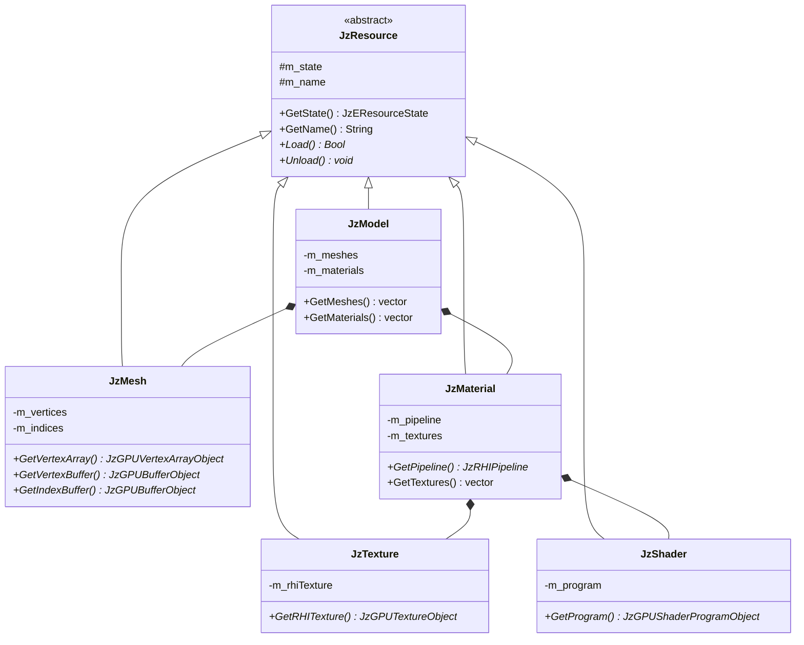
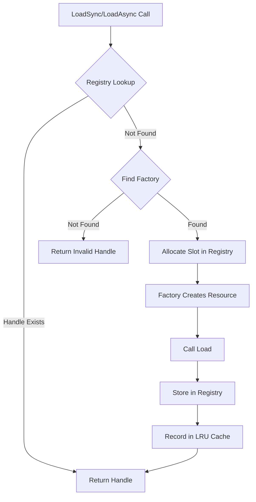
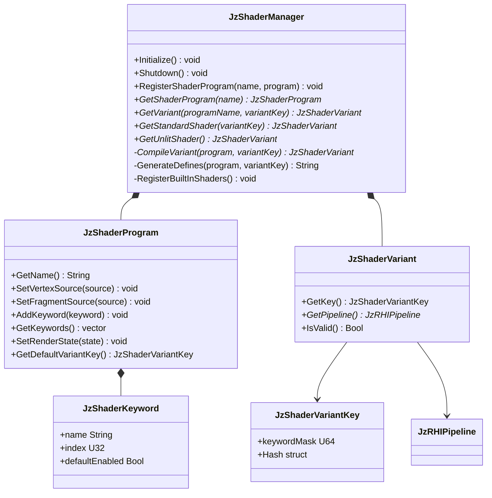

# JzRE Resource Layer Design

## Overview

The Resource Layer is a core component of the JzRE engine, responsible for managing the lifecycle of all game assets (textures, models, materials, shaders, etc.). The design is based on three core concepts: `JzResource`, `JzResourceFactory`, and `JzAssetManager`.

---

## Design Goals

- **Automation**: Automatic resource loading, unloading, and caching
- **Extensibility**: Easy support for new resource types without modifying core code
- **Efficiency**: Reference-counted memory management
- **Decoupling**: Resource management logic isolated from other engine parts

---

## Core Components

### JzResource (Resource Base Class)

Abstract base class for all resource types.

```cpp
enum class JzEResourceState {
    Unloaded,  // Not loaded
    Loading,   // Loading (reserved)
    Loaded,    // Loaded
    Error      // Error
};

class JzResource {
public:
    virtual ~JzResource() = default;

    JzEResourceState GetState() const { return m_state; }
    const String& GetName() const { return m_name; }

    virtual Bool Load() = 0;    // Load resource
    virtual void Unload() = 0;  // Unload resource

protected:
    JzEResourceState m_state = JzEResourceState::Unloaded;
    String m_name;
};
```

### JzResourceFactory (Resource Factory)

Abstract factory interface for creating concrete resource type instances.

```cpp
class JzResourceFactory {
public:
    virtual ~JzResourceFactory() = default;
    virtual JzResource* Create(const String& name) = 0;
};
```

### JzAssetManager (Asset Manager)

Central coordinator for asset management with generation-based handles.

```cpp
class JzAssetManager {
public:
    // Sync loading (blocking)
    template<typename T>
    JzAssetHandle<T> LoadSync(const String& path);

    // Async loading (non-blocking)
    template<typename T>
    JzAssetHandle<T> LoadAsync(const String& path,
                               JzAssetLoadCallback<T> callback,
                               I32 priority);

    // Access loaded asset
    template<typename T>
    T* Get(JzAssetHandle<T> handle);

    // Register resource factory
    template <typename T>
    void RegisterFactory(std::unique_ptr<JzResourceFactory> factory);

    // Search path management
    void AddSearchPath(const String& path);
    String FindFullPath(const String& relativePath);

    // Per-frame update (LRU eviction, async completion)
    void Update();
};
```

---

## Resource Types

### Implemented Resource Types

| Resource Type | Class Name   | Factory Class       | Purpose            |
| ------------- | ------------ | ------------------- | ------------------ |
| Texture       | `JzTexture`  | `JzTextureFactory`  | Image resources    |
| Mesh          | `JzMesh`     | `JzMeshFactory`     | Geometry data      |
| Material      | `JzMaterial` | `JzMaterialFactory` | Render materials   |
| Shader        | `JzShader`   | `JzShaderFactory`   | GPU programs       |
| Model         | `JzModel`    | `JzModelFactory`    | Complete 3D models |
| Font          | `JzFont`     | `JzFontFactory`     | Text rendering     |

### Resource Class Relationships



---

## Workflow

### 1. Asset Registration (Automatic via JzAssetSystem)

Factory registration is handled automatically by `JzAssetSystem::Initialize()`:

```cpp
// JzAssetSystem registers all factories with JzAssetManager
assetManager->RegisterFactory<JzModel>(std::make_unique<JzModelFactory>());
assetManager->RegisterFactory<JzMesh>(std::make_unique<JzMeshFactory>());
assetManager->RegisterFactory<JzTexture>(std::make_unique<JzTextureFactory>());
assetManager->RegisterFactory<JzMaterial>(std::make_unique<JzMaterialFactory>());
assetManager->RegisterFactory<JzShaderAsset>(std::make_unique<JzShaderAssetFactory>());
assetManager->RegisterFactory<JzFont>(std::make_unique<JzFontFactory>());

// Search paths are also added
assetManager->AddSearchPath(enginePath.string());
assetManager->AddSearchPath((enginePath / "resources").string());
assetManager->AddSearchPath((enginePath / "resources" / "models").string());
assetManager->AddSearchPath((enginePath / "resources" / "textures").string());
assetManager->AddSearchPath((enginePath / "resources" / "shaders").string());
```

### 2. Asset Loading

```cpp
// Sync loading (blocking)
auto textureHandle = assetManager.LoadSync<JzTexture>("textures/player.png");
auto* texture = assetManager.Get(textureHandle);

if (texture && texture->GetState() == JzEResourceState::Loaded) {
    // Use texture
    auto rhiTexture = texture->GetRHITexture();
}

// Async loading (non-blocking)
assetManager.LoadAsync<JzTexture>("textures/enemy.png",
    [](JzTextureHandle handle, Bool success) {
        if (success) {
            // Texture ready to use
        }
    });
```

### 3. Internal Loading Process



### 4. Asset Lifecycle

Assets are managed through generation-based handles and LRU eviction:

```cpp
// Load asset
auto textureHandle = assetManager.LoadSync<JzTexture>("textures/enemy.png");

// Use asset
auto* texture = assetManager.Get(textureHandle);

// Assets are automatically evicted when:
// 1. Memory budget is exceeded
// 2. Asset hasn't been accessed recently (LRU)
// 3. No active references exist
```

---

## Implementation Details

### LoadSync Template Implementation

```cpp
template <typename T>
JzAssetHandle<T> JzAssetManager::LoadSync(const String& path) {
    // 1. Check if already loaded
    auto& registry = GetRegistry<T>();
    if (auto existingHandle = registry.FindByPath(path)) {
        return existingHandle;
    }

    // 2. Find factory
    auto* factory = GetFactory<T>();
    if (!factory) {
        return JzAssetHandle<T>::Invalid();
    }

    // 3. Allocate slot and create resource
    auto handle = registry.Allocate(path);
    auto* resource = factory->Create(path);

    // 4. Load and store
    resource->Load();
    registry.Set(handle, resource);
    registry.SetLoadState(handle, JzEAssetLoadState::Loaded);

    // 5. Record in LRU cache
    m_lruCache.RecordAccess(handle.GetId(), resource->GetMemorySize());

    return handle;
}
```

### Factory Implementation Examples

```cpp
// JzTextureFactory.h
class JzTextureFactory : public JzResourceFactory {
public:
    JzResource* Create(const String& name) override {
        return new JzTexture(name);
    }
};

// JzShaderFactory.h (with parameters)
class JzShaderFactory : public JzResourceFactory {
public:
    JzResource* Create(const String& name) override {
        // Parse shader paths
        String vertPath = name + ".vert";
        String fragPath = name + ".frag";
        return new JzShader(vertPath, fragPath);
    }
};
```

---

## Caching Strategy

### LRU Cache with Memory Budget

Key advantages of the LRU caching system:

1. **Memory Budget**: Configurable maximum memory usage
2. **Generation-Based Handles**: Prevents use-after-free bugs
3. **Automatic Eviction**: Least recently used assets are evicted when over budget
4. **Reference Counting**: Assets with active references are never evicted

```cpp
void JzAssetManager::Update() {
    // Check if over memory budget
    if (m_lruCache.IsOverBudget()) {
        // Get eviction candidates (excluding assets with active refs)
        auto candidates = m_lruCache.GetEvictionCandidates(targetMemoryMB, activeRefs);

        for (auto& id : candidates) {
            // Unload and free the asset
            UnloadAsset(id);
        }
    }
}
```

---

## ECS Integration

Resources integrate with the ECS system through components:

```cpp
// Components hold resource references
struct JzMeshComponent {
    std::shared_ptr<JzResource> mesh;
};

struct JzMaterialComponent {
    std::shared_ptr<JzResource> material;
};

// Render system uses resources
void JzRenderSystem::Update(JzEntityManager& manager, F32 delta) {
    for (auto entity : manager.View<JzMeshComponent, JzMaterialComponent, JzTransformComponent>()) {
        auto& meshComp = manager.GetComponent<JzMeshComponent>(entity);
        auto& matComp = manager.GetComponent<JzMaterialComponent>(entity);

        auto mesh = std::static_pointer_cast<JzMesh>(meshComp.mesh);
        auto material = std::static_pointer_cast<JzMaterial>(matComp.material);

        if (mesh && material && mesh->GetState() == JzEResourceState::Loaded) {
            m_device->BindPipeline(material->GetPipeline());
            m_device->BindVertexArray(mesh->GetVertexArray());
            // ... draw
        }
    }
}
```

---

## Usage Examples

### Loading a Model

```cpp
auto& assetManager = JzServiceContainer::Get<JzAssetManager>();

// Load complete model (with meshes and materials)
auto modelHandle = assetManager.LoadSync<JzModel>("models/character.fbx");
auto* model = assetManager.Get(modelHandle);

if (model && model->GetState() == JzEResourceState::Loaded) {
    for (auto& mesh : model->GetMeshes()) {
        // Process each mesh
    }
}
```

### Using Textures in UI

```cpp
// Load icon texture
auto iconHandle = assetManager.LoadSync<JzTexture>("icons/button.png");
auto* iconTexture = assetManager.Get(iconHandle);

if (iconTexture) {
    auto myButton = std::make_unique<JzImageButton>(
        iconTexture->GetRHITexture(),
        JzVec2{24.0f, 24.0f}
    );
    myButton->ClickedEvent.AddListener([]() {
        // Handle click
    });
}
```

---

## ShaderManager

### Overview

`JzShaderManager` provides centralized shader program management with a variant system for cross-platform shader compilation. It enables different shader configurations (e.g., with/without shadows, skeletal animation) through keyword-based variants.

### Architecture



### Key Components

| Component | Purpose |
|-----------|---------|
| `JzShaderManager` | Central manager for shader programs and variant caching |
| `JzShaderProgram` | Defines a shader with source code and keyword definitions |
| `JzShaderVariant` | A compiled variant holding the RHI pipeline |
| `JzShaderVariantKey` | Bitmask identifying which keywords are enabled |
| `JzShaderKeyword` | Definition of a variant keyword (name, index, default) |

### Variant System

Variants are created by enabling/disabling keywords. Each keyword maps to a preprocessor `#define`:

```cpp
// Define keywords in shader program
program->AddKeyword({"SKINNED", 0, false});      // Bit 0
program->AddKeyword({"SHADOWS", 1, false});      // Bit 1
program->AddKeyword({"NORMAL_MAPPING", 2, false}); // Bit 2

// Request a variant with SKINNED enabled
JzShaderVariantKeyBuilder builder;
builder.EnableKeyword(0);  // Enable SKINNED
auto variant = shaderManager.GetVariant("standard", builder.Build());
```

When compiling, keywords are prepended as defines:

```glsl
#define SKINNED 1
// ... rest of shader source
```

### Backend-Aware Compilation

`JzShaderRegistry` selects a compiler implementation from the active RHI device:

- `JzOpenGLShaderCompiler` for `JzERHIType::OpenGL`
- `JzVulkanShaderCompiler` for `JzERHIType::Vulkan`

Both compilers prepend backend macros so the same shader source can branch per API:

```glsl
#if JZ_BACKEND_VULKAN
// Vulkan-only path
#endif

#if JZ_BACKEND_OPENGL
// OpenGL-only path
#endif
```

At runtime, `JzShaderAsset` also injects both macros (`JZ_BACKEND_OPENGL` and `JZ_BACKEND_VULKAN`) for variant compilation, keeping shader authoring unified across backends.

### Vulkan Validation Path

For Vulkan, the compiler path uses:

- `shaderc` to compile GLSL into SPIR-V
- `spirv-reflect` to validate generated SPIR-V modules before pipeline creation

If pre-validation fails, a warning is logged and pipeline creation is still attempted so editor/runtime iteration can continue with diagnostic output.

### Shader File Loading

Shaders are loaded from external files in the `shaders/` directory (relative to the executable working directory). The ShaderManager provides methods to load shader programs from files:

```cpp
// Load shader from files
Bool LoadShaderProgram(const String& name,
                       const std::filesystem::path& vertexPath,
                       const std::filesystem::path& fragmentPath,
                       const std::filesystem::path& geometryPath = {});

// Built-in shaders are loaded from:
// - shaders/standard.vert, shaders/standard.frag
// - shaders/unlit.vert, shaders/unlit.frag
```

Shader files are stored in `resources/shaders/` in the source tree and copied to the build directory during CMake configuration.

Shared helper code can be placed under `resources/shaders/include/` (for example `JzShaderCommon.glsl`) and included by both runtime and editor shaders.

### Usage

```cpp
// Get ShaderManager from service container
auto& shaderManager = JzServiceContainer::Get<JzShaderManager>();

// Get default standard shader (no keywords enabled)
auto variant = shaderManager.GetStandardShader();

// Get variant with specific features
JzShaderVariantKeyBuilder builder;
builder.EnableKeyword(0);  // SKINNED
builder.EnableKeyword(1);  // SHADOWS
auto skinnedShadowVariant = shaderManager.GetVariant("standard", builder.Build());

// Use the pipeline
if (variant && variant->IsValid()) {
    device.BindPipeline(variant->GetPipeline());
}

// Load custom shader from files
auto shaderDir = std::filesystem::current_path() / "shaders";
shaderManager.LoadShaderProgram("custom", shaderDir / "custom.vert", shaderDir / "custom.frag");
```

### Built-in Shaders

The ShaderManager provides two built-in shaders:

| Shader | Description | Keywords |
|--------|-------------|----------|
| `standard` | Blinn-Phong lighting with material support | SKINNED, SHADOWS, NORMAL_MAPPING |
| `unlit` | Simple unlit shader with color uniform | None |

### Initialization

ShaderManager is initialized automatically by `JzRERuntime` after device creation:

```cpp
// In JzRERuntime constructor (automatic)
m_shaderManager = std::make_unique<JzShaderManager>();
m_shaderManager->Initialize();
JzServiceContainer::Provide<JzShaderManager>(*m_shaderManager);
```

---

## Hot Reload Support

The asset system now supports hot reloading for development workflows. This is integrated into `JzAssetSystem`:

### Shader Hot Reload

Shader hot reload is fully implemented:

```cpp
// JzAssetSystem monitors shader files and marks entities for reload
// Entities with modified shaders get JzShaderDirtyTag

// In your system, check for dirty shaders:
auto view = world.View<JzShaderAssetComponent, JzShaderDirtyTag>();
for (auto entity : view) {
    auto& shaderComp = world.GetComponent<JzShaderAssetComponent>(entity);
    // Shader has been reloaded - update pipeline, rebind uniforms, etc.
    world.GetRegistry().remove<JzShaderDirtyTag>(entity);
}
```

### Asset Dirty Tags

| Tag                 | Purpose                                    |
|---------------------|--------------------------------------------|
| `JzShaderDirtyTag`  | Shader source files modified, recompiled   |
| `JzTextureDirtyTag` | Texture file modified, reloaded            |
| `JzMaterialDirtyTag`| Material definition modified               |

## Asset Import/Export

The engine provides `JzAssetImporter` and `JzAssetExporter` services for moving assets into and out of a project.

### JzAssetImporter

Located in `src/Runtime/Function/include/JzRE/Runtime/Function/Asset/JzAssetImporter.h`.

Imports external files into the project's `Content/` directory:

- Detects file type via `JzFileSystemUtils::GetFileType()` and routes to the correct subdirectory (`Models/`, `Textures/`, `Shaders/`, `Materials/`, `Fonts/`, `Sounds/`)
- Creates target directories if they don't exist
- Supports overwrite control and manual subfolder override via `JzImportOptions`
- Marks the project as dirty after successful import

```cpp
auto& importer = JzServiceContainer::Get<JzAssetImporter>();
auto result = importer.ImportFile("C:/Downloads/character.fbx");
// Copies to: <ProjectRoot>/Content/Models/character.fbx
```

### JzAssetExporter

Located in `src/Runtime/Function/include/JzRE/Runtime/Function/Asset/JzAssetExporter.h`.

Exports project assets to an external directory:

- Optionally preserves the `Content/` subfolder structure at the destination
- Supports single-file and batch export
- Overwrite control via `JzExportOptions`

```cpp
auto& exporter = JzServiceContainer::Get<JzAssetExporter>();
auto result = exporter.ExportFile("Content/Models/character.fbx", "C:/Export/");
// Copies to: C:/Export/Models/character.fbx (with preserveSubfolders=true)
```

### Design Note

Import and export are file-copy operations, decoupled from `JzAssetManager`'s GPU resource lifecycle. After import, assets become discoverable by the asset manager through existing search paths. Loading into GPU memory happens separately when assets are actually used.

---

## Future Plans

> [!NOTE]
> The following features are planned for future versions.

### ~~Async Loading~~ ✅ Implemented

Async loading is now available via `JzAssetManager::LoadAsync()`.

### ~~Hot Reload~~ ✅ Implemented

Shader hot reload is integrated into `JzAssetSystem`. Texture and material hot reload are in progress.

### Resource Dependencies

Automatic loading of dependent resources (e.g., materials auto-loading referenced textures).

### Streaming

Chunked loading for large resources (large textures, terrain).
