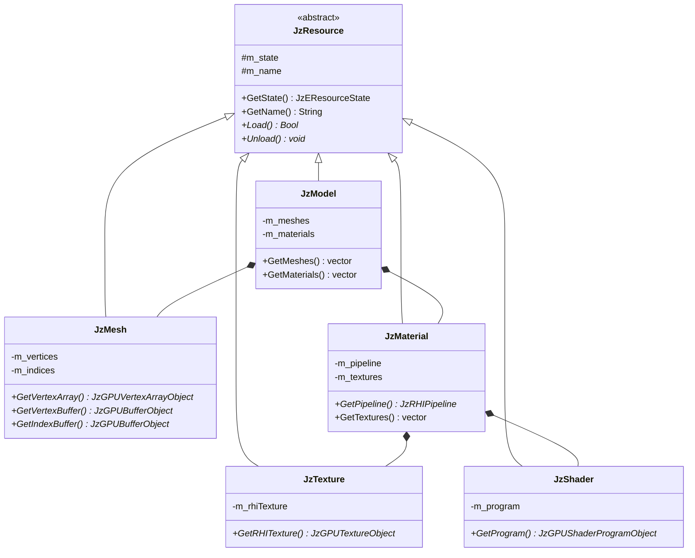
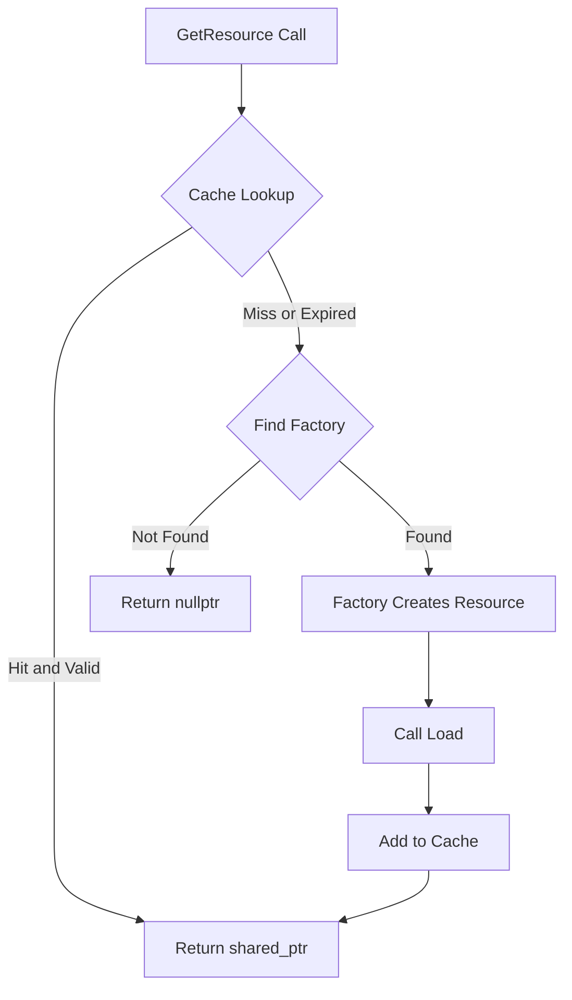
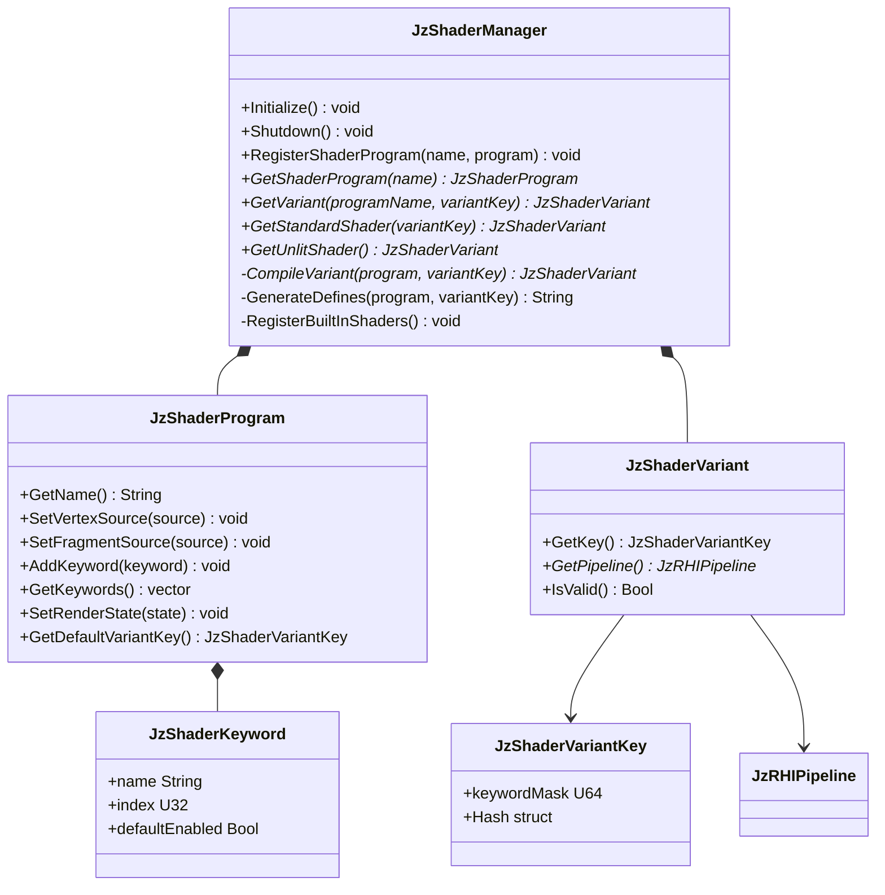

# JzRE Resource Layer Design

## Overview

The Resource Layer is a core component of the JzRE engine, responsible for managing the lifecycle of all game assets (textures, models, materials, shaders, etc.). The design is based on three core concepts: `JzResource`, `JzResourceFactory`, and `JzResourceManager`.

---

## Design Goals

- **Automation**: Automatic resource loading, unloading, and caching
- **Extensibility**: Easy support for new resource types without modifying core code
- **Efficiency**: Reference-counted memory management
- **Decoupling**: Resource management logic isolated from other engine parts

---

## Core Components

### JzResource (Resource Base Class)

Abstract base class for all resource types.

```cpp
enum class JzEResourceState {
    Unloaded,  // Not loaded
    Loading,   // Loading (reserved)
    Loaded,    // Loaded
    Error      // Error
};

class JzResource {
public:
    virtual ~JzResource() = default;

    JzEResourceState GetState() const { return m_state; }
    const String& GetName() const { return m_name; }

    virtual Bool Load() = 0;    // Load resource
    virtual void Unload() = 0;  // Unload resource

protected:
    JzEResourceState m_state = JzEResourceState::Unloaded;
    String m_name;
};
```

### JzResourceFactory (Resource Factory)

Abstract factory interface for creating concrete resource type instances.

```cpp
class JzResourceFactory {
public:
    virtual ~JzResourceFactory() = default;
    virtual JzResource* Create(const String& name) = 0;
};
```

### JzResourceManager (Resource Manager)

Central coordinator for resource management, the sole entry point for obtaining resources.

```cpp
class JzResourceManager {
public:
    // Register resource factory
    template <typename T>
    void RegisterFactory(std::unique_ptr<JzResourceFactory> factory);

    // Get resource (auto-loads)
    template <typename T>
    std::shared_ptr<T> GetResource(const String& name);

    // Clean up unused resources
    void UnloadUnusedResources();

    // Search path management
    void AddSearchPath(const String& path);
    String FindFullPath(const String& relativePath);

private:
    std::unordered_map<std::type_index, std::unique_ptr<JzResourceFactory>> m_factories;
    std::unordered_map<String, std::weak_ptr<JzResource>> m_resourceCache;
    std::vector<String> m_searchPaths;
    std::mutex m_cacheMutex;
};
```

---

## Resource Types

### Implemented Resource Types

| Resource Type | Class Name   | Factory Class       | Purpose            |
| ------------- | ------------ | ------------------- | ------------------ |
| Texture       | `JzTexture`  | `JzTextureFactory`  | Image resources    |
| Mesh          | `JzMesh`     | `JzMeshFactory`     | Geometry data      |
| Material      | `JzMaterial` | `JzMaterialFactory` | Render materials   |
| Shader        | `JzShader`   | `JzShaderFactory`   | GPU programs       |
| Model         | `JzModel`    | `JzModelFactory`    | Complete 3D models |
| Font          | `JzFont`     | `JzFontFactory`     | Text rendering     |

### Resource Class Relationships



---

## Workflow

### 1. Resource Registration (Automatic via JzAssetManager)

Factory registration is handled automatically by `JzRERuntime` constructor with `JzAssetManager`:

```cpp
// JzRERuntime constructor registers all factories with JzAssetManager
m_assetManager->RegisterFactory<JzModel>(std::make_unique<JzModelFactory>());
m_assetManager->RegisterFactory<JzMesh>(std::make_unique<JzMeshFactory>());
m_assetManager->RegisterFactory<JzTexture>(std::make_unique<JzTextureFactory>());
m_assetManager->RegisterFactory<JzMaterial>(std::make_unique<JzMaterialFactory>());
m_assetManager->RegisterFactory<JzShader>(std::make_unique<JzShaderFactory>());
m_assetManager->RegisterFactory<JzFont>(std::make_unique<JzFontFactory>());

// Search paths are also added
m_assetManager->AddSearchPath(enginePath.string());
m_assetManager->AddSearchPath((enginePath / "resources").string());
m_assetManager->AddSearchPath((enginePath / "resources" / "models").string());
m_assetManager->AddSearchPath((enginePath / "resources" / "textures").string());
m_assetManager->AddSearchPath((enginePath / "resources" / "shaders").string());
```

### 2. Resource Loading

```cpp
// Request texture resource (manager auto-handles caching and loading)
auto texture = resourceManager.GetResource<JzTexture>("textures/player.png");

// Check resource state
if (texture && texture->GetState() == JzEResourceState::Loaded) {
    // Use texture
    auto rhiTexture = texture->GetRHITexture();
}
```

### 3. Internal Loading Process



### 4. Resource Unloading

Resource unloading is handled automatically through reference counting:

```cpp
// When the last shared_ptr is destroyed, resource is automatically unloaded
{
    auto texture = resourceManager.GetResource<JzTexture>("textures/enemy.png");
    // Use texture...
} // texture goes out of scope, if no other references, resource is destroyed

// Periodically clean up expired cache entries
resourceManager.UnloadUnusedResources();
```

---

## Implementation Details

### GetResource Template Implementation

```cpp
template <typename T>
std::shared_ptr<T> JzResourceManager::GetResource(const String& name) {
    std::lock_guard<std::mutex> lock(m_cacheMutex);

    // 1. Cache lookup
    auto it = m_resourceCache.find(name);
    if (it != m_resourceCache.end()) {
        if (auto sharedRes = it->second.lock()) {
            return std::static_pointer_cast<T>(sharedRes);
        }
    }

    // 2. Cache miss: create new resource
    auto factory_it = m_factories.find(std::type_index(typeid(T)));
    if (factory_it == m_factories.end()) {
        // Error: no factory registered for this type
        return nullptr;
    }

    JzResource* newRawRes = factory_it->second->Create(name);
    std::shared_ptr<T> newRes = std::shared_ptr<T>(static_cast<T*>(newRawRes));

    // 3. Load and cache
    newRes->Load();
    m_resourceCache[name] = newRes;

    return newRes;
}
```

### Factory Implementation Examples

```cpp
// JzTextureFactory.h
class JzTextureFactory : public JzResourceFactory {
public:
    JzResource* Create(const String& name) override {
        return new JzTexture(name);
    }
};

// JzShaderFactory.h (with parameters)
class JzShaderFactory : public JzResourceFactory {
public:
    JzResource* Create(const String& name) override {
        // Parse shader paths
        String vertPath = name + ".vert";
        String fragPath = name + ".frag";
        return new JzShader(vertPath, fragPath);
    }
};
```

---

## Caching Strategy

### weak_ptr Automatic Cleanup

Key advantages of using `std::weak_ptr` as cache values:

1. **Automatic Memory Reclamation**: Resources are automatically freed when all `shared_ptr`s are destroyed
2. **No Dangling References**: Cache doesn't prevent resource reclamation
3. **On-Demand Reload**: Expired resources can be transparently reloaded

```cpp
void JzResourceManager::UnloadUnusedResources() {
    std::lock_guard<std::mutex> lock(m_cacheMutex);

    for (auto it = m_resourceCache.begin(); it != m_resourceCache.end(); ) {
        if (it->second.expired()) {
            it = m_resourceCache.erase(it);
        } else {
            ++it;
        }
    }
}
```

---

## ECS Integration

Resources integrate with the ECS system through components:

```cpp
// Components hold resource references
struct JzMeshComponent {
    std::shared_ptr<JzResource> mesh;
};

struct JzMaterialComponent {
    std::shared_ptr<JzResource> material;
};

// Render system uses resources
void JzRenderSystem::Update(JzEntityManager& manager, F32 delta) {
    for (auto entity : manager.View<JzMeshComponent, JzMaterialComponent, JzTransformComponent>()) {
        auto& meshComp = manager.GetComponent<JzMeshComponent>(entity);
        auto& matComp = manager.GetComponent<JzMaterialComponent>(entity);

        auto mesh = std::static_pointer_cast<JzMesh>(meshComp.mesh);
        auto material = std::static_pointer_cast<JzMaterial>(matComp.material);

        if (mesh && material && mesh->GetState() == JzEResourceState::Loaded) {
            m_device->BindPipeline(material->GetPipeline());
            m_device->BindVertexArray(mesh->GetVertexArray());
            // ... draw
        }
    }
}
```

---

## Usage Examples

### Loading a Model

```cpp
auto& resMgr = JzServiceContainer::Get<JzResourceManager>();

// Load complete model (with meshes and materials)
auto model = resMgr.GetResource<JzModel>("models/character.fbx");

if (model && model->GetState() == JzEResourceState::Loaded) {
    for (auto& mesh : model->GetMeshes()) {
        // Process each mesh
    }
}
```

### Using Textures in UI

```cpp
// Load icon texture
auto iconTexture = resourceManager.GetResource<JzTexture>("icons/button.png");

if (iconTexture) {
    auto myButton = std::make_unique<JzImageButton>(
        iconTexture->GetRHITexture(),
        JzVec2{24.0f, 24.0f}
    );
    myButton->ClickedEvent.AddListener([]() {
        // Handle click
    });
}
```

---

## ShaderManager

### Overview

`JzShaderManager` provides centralized shader program management with a variant system for cross-platform shader compilation. It enables different shader configurations (e.g., with/without shadows, skeletal animation) through keyword-based variants.

### Architecture



### Key Components

| Component | Purpose |
|-----------|---------|
| `JzShaderManager` | Central manager for shader programs and variant caching |
| `JzShaderProgram` | Defines a shader with source code and keyword definitions |
| `JzShaderVariant` | A compiled variant holding the RHI pipeline |
| `JzShaderVariantKey` | Bitmask identifying which keywords are enabled |
| `JzShaderKeyword` | Definition of a variant keyword (name, index, default) |

### Variant System

Variants are created by enabling/disabling keywords. Each keyword maps to a preprocessor `#define`:

```cpp
// Define keywords in shader program
program->AddKeyword({"SKINNED", 0, false});      // Bit 0
program->AddKeyword({"SHADOWS", 1, false});      // Bit 1
program->AddKeyword({"NORMAL_MAPPING", 2, false}); // Bit 2

// Request a variant with SKINNED enabled
JzShaderVariantKeyBuilder builder;
builder.EnableKeyword(0);  // Enable SKINNED
auto variant = shaderManager.GetVariant("standard", builder.Build());
```

When compiling, keywords are prepended as defines:

```glsl
#define SKINNED 1
// ... rest of shader source
```

### Shader File Loading

Shaders are loaded from external files in the `shaders/` directory (relative to the executable working directory). The ShaderManager provides methods to load shader programs from files:

```cpp
// Load shader from files
Bool LoadShaderProgram(const String& name,
                       const std::filesystem::path& vertexPath,
                       const std::filesystem::path& fragmentPath,
                       const std::filesystem::path& geometryPath = {});

// Built-in shaders are loaded from:
// - shaders/standard.vert, shaders/standard.frag
// - shaders/unlit.vert, shaders/unlit.frag
```

Shader files are stored in `resources/shaders/` in the source tree and copied to the build directory during CMake configuration.

### Usage

```cpp
// Get ShaderManager from service container
auto& shaderManager = JzServiceContainer::Get<JzShaderManager>();

// Get default standard shader (no keywords enabled)
auto variant = shaderManager.GetStandardShader();

// Get variant with specific features
JzShaderVariantKeyBuilder builder;
builder.EnableKeyword(0);  // SKINNED
builder.EnableKeyword(1);  // SHADOWS
auto skinnedShadowVariant = shaderManager.GetVariant("standard", builder.Build());

// Use the pipeline
if (variant && variant->IsValid()) {
    device.BindPipeline(variant->GetPipeline());
}

// Load custom shader from files
auto shaderDir = std::filesystem::current_path() / "shaders";
shaderManager.LoadShaderProgram("custom", shaderDir / "custom.vert", shaderDir / "custom.frag");
```

### Built-in Shaders

The ShaderManager provides two built-in shaders:

| Shader | Description | Keywords |
|--------|-------------|----------|
| `standard` | Blinn-Phong lighting with material support | SKINNED, SHADOWS, NORMAL_MAPPING |
| `unlit` | Simple unlit shader with color uniform | None |

### Initialization

ShaderManager is initialized automatically by `JzRERuntime` after device creation:

```cpp
// In JzRERuntime constructor (automatic)
m_shaderManager = std::make_unique<JzShaderManager>();
m_shaderManager->Initialize();
JzServiceContainer::Provide<JzShaderManager>(*m_shaderManager);
```

---

## Future Plans

> [!NOTE]
> The following features are planned for future versions and are not currently implemented.

### Async Loading (Low Priority)

```cpp
// Future API design reference
template<typename T>
std::future<std::shared_ptr<T>> GetResourceAsync(const String& name);
```

### Resource Dependencies

Automatic loading of dependent resources (e.g., materials auto-loading referenced textures).

### Hot Reload

Automatic resource reloading when files change in editor mode.

### Streaming

Chunked loading for large resources (large textures, terrain).
