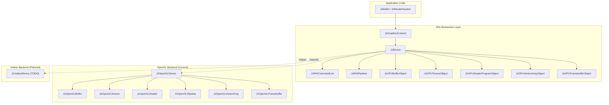

# JzRE RHI (Render Hardware Interface) Design

## Overview

JzRE RHI (Render Hardware Interface) is the engine's graphics API abstraction layer, designed to provide a unified cross-platform rendering interface.

---

## Design Goals

1. **Cross-Platform Support**: Unified interface supporting OpenGL, Vulkan, and other graphics APIs
2. **Command Buffering**: Support for deferred rendering command execution
3. **Modern Design**: C++20 standard, smart pointer management
4. **Extensibility**: Modular backends for easy addition of new APIs

---

## Architecture Overview



---

## Integration Notes

`JzRenderSystem` can register multiple view targets and render to them through `JzDevice`. Each view has:

- a visibility mask for entity filtering (`EditorOnly`, `PreviewOnly`, `Untagged`)
- a feature mask for optional helper passes (`Skybox`, `Axis`, `Grid`, `Gizmo`)
- an owned `JzRenderTarget` bound to the same view record (`JzRenderView`)

The helper passes use the same RHI API path (`CreatePipeline`, `BindPipeline`, `BindVertexArray`, `Draw`) and are selected per target, so SceneView can render editor skybox/axis while GameView and runtime outputs stay clean.

Current editor helper implementation reuses the line-color pipeline for both axis and ground grid rendering, with dedicated VAOs/VBs for each helper geometry.
`JzREEditor::OnStart()` constructs helper resources and registers pass descriptors
through `JzRenderSystem::RegisterHelperPass()`. The runtime render loop then executes
all feature-matched helper passes via one shared flow (`BindPipeline` -> `BindVertexArray`
-> `setupPass` -> `Draw`).

Render output lookup no longer depends on a separate output cache map in `JzRenderSystem`.
Editor panels query outputs by `ViewHandle`, while view output names are generated internally
from view names and resolved from registered view records (with RenderGraph output fallback
for non-view graph exports).

---

## Core Components

### JzGraphicsContext (Context Abstraction)

Owns the device and bridges the window context with the RHI layer. It is responsible for
context switching and presentation, while the device focuses on GPU resources and draw calls.

```cpp
class JzGraphicsContext {
public:
    void Initialize(JzIWindowBackend& windowBackend, JzERHIType rhiType);
    void Shutdown();

    JzDevice& GetDevice();
    Bool IsInitialized() const;
    void MakeCurrentContext(U32 threadIndex = 0);
    void BeginFrame();
    void EndFrame();
    void Present();
};
```

### JzDevice (Device Abstraction)

The core RHI interface providing resource creation and rendering operations.

```cpp
class JzDevice {
public:
    JzDevice(JzERHIType rhiType);
    virtual ~JzDevice() = default;

    // Device Information
    JzERHIType GetRHIType() const;
    virtual String GetDeviceName() const = 0;
    virtual String GetVendorName() const = 0;
    virtual String GetDriverVersion() const = 0;

    // Resource Creation
    virtual std::shared_ptr<JzRHIPipeline> CreatePipeline(const JzPipelineDesc&) = 0;
    virtual std::shared_ptr<JzRHICommandList> CreateCommandList(const String&) = 0;
    virtual std::shared_ptr<JzGPUBufferObject> CreateBuffer(const JzGPUBufferObjectDesc&) = 0;
    virtual std::shared_ptr<JzGPUTextureObject> CreateTexture(const JzGPUTextureObjectDesc&) = 0;
    virtual std::shared_ptr<JzGPUShaderProgramObject> CreateShader(const JzShaderProgramDesc&) = 0;
    virtual std::shared_ptr<JzGPUFramebufferObject> CreateFramebuffer(const String&) = 0;
    virtual std::shared_ptr<JzGPUVertexArrayObject> CreateVertexArray(const String&) = 0;

    // Frame Management
    virtual void BeginFrame() = 0;
    virtual void EndFrame() = 0;

    // Immediate Mode Rendering
    virtual void Clear(const JzClearParams&) = 0;
    virtual void Draw(const JzDrawParams&) = 0;
    virtual void DrawIndexed(const JzDrawIndexedParams&) = 0;
    virtual void BindPipeline(std::shared_ptr<JzRHIPipeline>) = 0;
    virtual void BindVertexArray(std::shared_ptr<JzGPUVertexArrayObject>) = 0;
    virtual void BindTexture(std::shared_ptr<JzGPUTextureObject>, U32 slot) = 0;

    // Command List Execution
    virtual void ExecuteCommandList(std::shared_ptr<JzRHICommandList>) = 0;

    // Resource Barriers
    virtual void ResourceBarrier(const std::vector<JzRHIResourceBarrier>&) = 0;

    // Multi-threading Support
    virtual Bool SupportsMultithreading() const = 0;
};
```

### JzRHICommandList (Command List)

Supports deferred recording and execution of rendering commands.

```cpp
class JzRHICommandList {
public:
    void Begin();   // Start recording
    void End();     // End recording
    void Reset();   // Reset commands
    void Execute(); // Execute commands

    // Record Commands
    void Clear(const JzClearParams&);
    void Draw(const JzDrawParams&);
    void DrawIndexed(const JzDrawIndexedParams&);
    void BindPipeline(std::shared_ptr<JzRHIPipeline>);
    void BindVertexArray(std::shared_ptr<JzGPUVertexArrayObject>);
    void BindTexture(std::shared_ptr<JzGPUTextureObject>, U32 slot);
    void SetViewport(const JzViewport&);
    void SetScissor(const JzScissorRect&);
    void BeginRenderPass(std::shared_ptr<JzGPUFramebufferObject>);
    void EndRenderPass();

private:
    std::vector<std::unique_ptr<JzRHICommand>> m_commands;
    std::atomic<Bool> m_isRecording{false};
    mutable std::mutex m_commandMutex;
};
```

### JzRHICommand (Command Base Class)

Abstract base class for all rendering commands.

```cpp
enum class JzRHIECommandType : U8 {
    Clear, Draw, DrawIndexed,
    BindPipeline, BindVertexArray, BindTexture,
    SetUniform, SetViewport, SetScissor,
    BeginRenderPass, EndRenderPass,
    CopyTexture, UpdateBuffer, ImGuiRender
};

class JzRHICommand {
public:
    JzRHICommand(JzRHIECommandType type);
    virtual ~JzRHICommand() = default;
    virtual void Execute() = 0;
    JzRHIECommandType GetType() const;
};
```

---

## GPU Resource Objects

### Buffer (JzGPUBufferObject)

```cpp
enum class JzEBufferType : U8 {
    Vertex, Index, Uniform, Storage
};

enum class JzEBufferUsage : U8 {
    StaticDraw, DynamicDraw, StreamDraw
};

struct JzGPUBufferObjectDesc {
    JzEBufferType type;
    JzEBufferUsage usage;
    Size size;
    const void* data;
    String debugName;
};
```

### Texture (JzGPUTextureObject)

```cpp
enum class JzETextureFormat : U8 {
    R8, RG8, RGB8, RGBA8,
    R16F, RG16F, RGB16F, RGBA16F,
    R32F, RG32F, RGB32F, RGBA32F,
    Depth16, Depth24, Depth32F, Depth24Stencil8
};

struct JzGPUTextureObjectDesc {
    U32 width, height, depth;
    JzETextureFormat format;
    U32 mipLevels;
    U32 samples;
    const void* data;
    String debugName;
};
```

### Render Pipeline (JzRHIPipeline)

```cpp
struct JzPipelineDesc {
    std::shared_ptr<JzGPUShaderProgramObject> shader;
    JzRenderState renderState;
    std::vector<JzVertexInputDesc> vertexInputs;
    JzEPrimitiveType primitiveType;
    String debugName;
};
```

---

## OpenGL Backend Implementation

Currently completed OpenGL backend implementation:

| Abstract Class             | OpenGL Implementation | Status      |
| -------------------------- | --------------------- | ----------- |
| `JzDevice`                 | `JzOpenGLDevice`      | ✅ Complete |
| `JzGPUBufferObject`        | `JzOpenGLBuffer`      | ✅ Complete |
| `JzGPUTextureObject`       | `JzOpenGLTexture`     | ✅ Complete |
| `JzGPUShaderProgramObject` | `JzOpenGLShader`      | ✅ Complete |
| `JzRHIPipeline`            | `JzOpenGLPipeline`    | ✅ Complete |
| `JzGPUVertexArrayObject`   | `JzOpenGLVertexArray` | ✅ Complete |
| `JzGPUFramebufferObject`   | `JzOpenGLFramebuffer` | ✅ Complete |

### OpenGL Features

- **Version Requirement**: OpenGL 3.3+
- **Multi-threading**: Not supported (`SupportsMultithreading()` returns `false`)
- **Extensions**: Loaded via glad
- **Resource Barriers**: No-op (implicit state transitions)

---

## Usage

### Basic Initialization

```cpp
// Create graphics context and device
JzGraphicsContext context;
auto* backend = windowSystem.GetBackend();
context.Initialize(*backend, JzERHIType::OpenGL);
auto& device = context.GetDevice();

// Get device information
std::cout << "Device: " << device->GetDeviceName() << std::endl;
std::cout << "Vendor: " << device->GetVendorName() << std::endl;
std::cout << "Version: " << device->GetDriverVersion() << std::endl;
```

### Resource Creation

```cpp
// Create vertex buffer
JzGPUBufferObjectDesc vbDesc;
vbDesc.type = JzEBufferType::Vertex;
vbDesc.usage = JzEBufferUsage::StaticDraw;
vbDesc.size = sizeof(vertices);
vbDesc.data = vertices;
auto vertexBuffer = device->CreateBuffer(vbDesc);

// Create texture
JzGPUTextureObjectDesc texDesc;
texDesc.width = 512;
texDesc.height = 512;
texDesc.format = JzETextureFormat::RGBA8;
auto texture = device->CreateTexture(texDesc);
```

### Immediate Mode Rendering

```cpp
context.BeginFrame();

// Clear
JzClearParams clearParams;
clearParams.clearColor = true;
clearParams.colorR = 0.2f;
clearParams.colorG = 0.3f;
clearParams.colorB = 0.8f;
clearParams.colorA = 1.0f;
device.Clear(clearParams);

// Bind and draw
device.BindPipeline(pipeline);
device.BindVertexArray(vertexArray);
device.DrawIndexed(drawParams);

context.EndFrame();
context.Present();
```

### Command Buffer Mode

```cpp
// Record commands
auto cmdList = device->CreateCommandList("MainPass");
cmdList->Begin();
cmdList->Clear(clearParams);
cmdList->BindPipeline(pipeline);
cmdList->BindVertexArray(vertexArray);
cmdList->DrawIndexed(drawParams);
cmdList->End();

// Execute commands
device->ExecuteCommandList(cmdList);
```

---

## Vulkan Backend Planning

### Implementation Priority

Vulkan is the next implementation target after OpenGL, providing:

1. **Explicit Resource Management**: Finer GPU memory control
2. **Multi-threaded Command Recording**: Parallel render command generation
3. **Modern Rendering Features**: Support for compute shaders, ray tracing, etc.

### Classes to Implement

```cpp
class JzVulkanDevice : public JzDevice { ... };
class JzVulkanBuffer : public JzGPUBufferObject { ... };
class JzVulkanTexture : public JzGPUTextureObject { ... };
class JzVulkanShader : public JzGPUShaderProgramObject { ... };
class JzVulkanPipeline : public JzRHIPipeline { ... };
class JzVulkanVertexArray : public JzGPUVertexArrayObject { ... };
class JzVulkanFramebuffer : public JzGPUFramebufferObject { ... };
```

### Vulkan-Specific Components (Extensions)

```cpp
class JzVulkanSwapchain { ... };       // Swap chain management
class JzVulkanDescriptorSet { ... };   // Descriptor sets
class JzVulkanRenderPass { ... };      // Native render passes
class JzVulkanSemaphore { ... };       // Synchronization primitives
```

### Backend Feature Comparison

| Feature                          | OpenGL | Vulkan         |
| -------------------------------- | ------ | -------------- |
| Multi-threaded Command Recording | ❌     | ✅             |
| Explicit Memory Management       | ❌     | ✅             |
| Compute Shaders                  | ✅     | ✅             |
| Ray Tracing                      | ❌     | ✅ (Extension) |
| Cross-Platform                   | ✅     | ✅             |
| Learning Curve                   | Low    | High           |

---

## Performance Statistics

`JzRHIStats` is used for runtime performance monitoring:

```cpp
struct JzRHIStats {
    U32 drawCalls;    // Draw call count
    U32 triangles;    // Triangle count
    U32 vertices;     // Vertex count
    U32 buffers;      // Buffer count
    U32 textures;     // Texture count
    U32 shaders;      // Shader count
    U32 pipelines;    // Pipeline count
};

// Usage
auto& stats = device->GetStats();
std::cout << "Draw Calls: " << stats.drawCalls << std::endl;
```

---

## Hardware Capability Query

`JzRHICapabilities` is used to query hardware support:

```cpp
struct JzRHICapabilities {
    U32 maxTextureSize;
    U32 maxTexture3DSize;
    U32 maxColorAttachments;
    U32 maxVertexAttributes;
    U32 maxSamples;
    Bool supportsComputeShaders;
    Bool supportsGeometryShaders;
    Bool supportsTessellationShaders;
    Bool supportsMultithreadedRendering;
    U32 maxRenderThreads;
};

// Usage
auto& caps = device->GetCapabilities();
if (caps.supportsComputeShaders) {
    // Enable compute shader features
}
```

---

## Extension Guide

### Adding a New Graphics API Backend

1. Add new enum value to `JzERHIType`
2. Create backend directory (e.g., `Graphics/D3D12/`)
3. Implement all GPU object classes
4. Implement `JzDevice` derived class
5. Register creation logic in factory

### Adding New Render Commands

1. Add command type to `JzRHIECommandType`
2. Create new command class (inheriting from `JzRHICommand`)
3. Add recording method to `JzRHICommandList`
4. Implement `Execute()` logic in each backend
