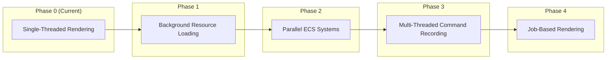
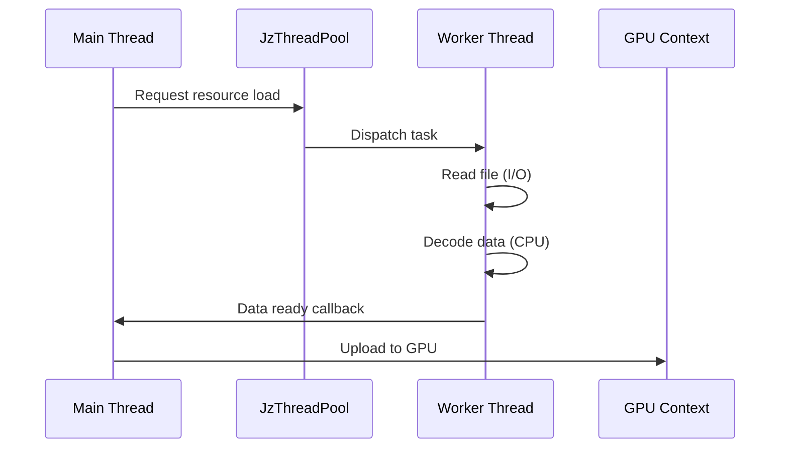
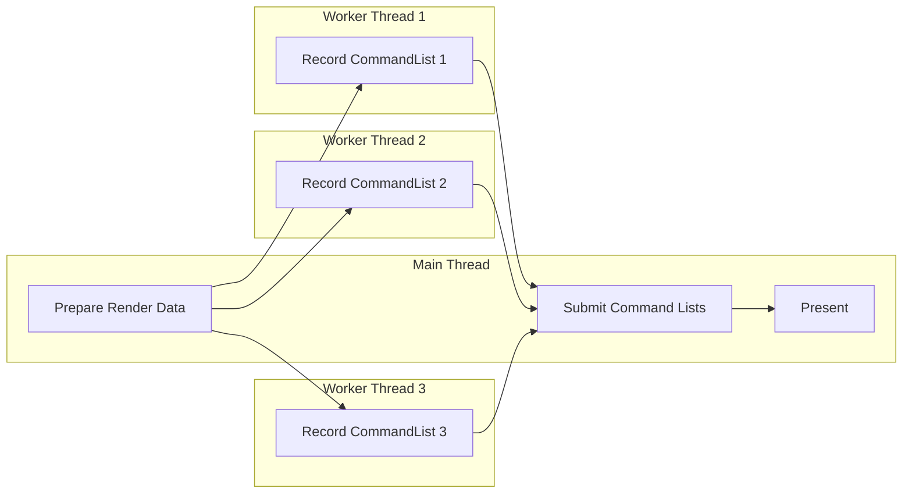
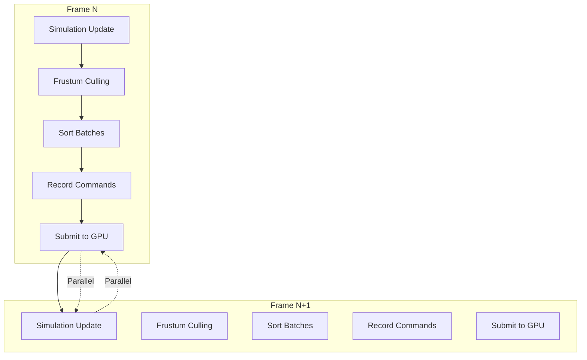

# JzRE Multi-Threading Roadmap

## Overview

This document describes the evolution plan from single-threaded to multi-threaded architecture for the JzRE engine. The engine currently implements main thread rendering + worker thread background processing architecture.

---

## Current State

### Implemented Architecture (EditorExample / JzREEditor)

**Last Updated**: 2026-01-10

```
┌─────────────────────────────────────────────────────────────────┐
│                    Main Thread                                  │
│                    Holds OpenGL Context                         │
│                                                                 │
│  ┌──────────┐  ┌────────────┐  ┌────────────┐  ┌─────────────┐  │
│  │PollEvents│─►│BeginFrame  │─►│RenderScene │─►│Editor.Update│  │
│  └──────────┘  └────────────┘  └────────────┘  └─────────────┘  │
│       │                                              │          │
│       │        ┌───────────────┐    ┌─────────────┐  │          │
│       └───────►│  SwapBuffers  │◄───│ ImGui Render│◄─┘          │
│                └───────────────┘    └─────────────┘             │
└─────────────────────────────────────────────────────────────────┘
                            │
                   Sync (mutex + condition_variable)
                            │
┌───────────────────────────▼─────────────────────────────────────┐
│               Worker Thread                                     │
│               Handles Non-GPU Tasks                             │
│                                                                 │
│  ┌──────────────────────────────────────────────────────────┐   │
│  │ Scene Culling / Animation Update / Physics / Resource    │   │
│  │ Preloading (TODO)                                        │   │
│  └──────────────────────────────────────────────────────────┘   │
└─────────────────────────────────────────────────────────────────┘
```

### Existing Threading Infrastructure

| Component    | File                 | Status         | Description                        |
| ------------ | -------------------- | -------------- | ---------------------------------- |
| Thread Pool  | `JzThreadPool.h`     | ✅ Implemented | General task parallel execution    |
| Command List | `JzRHICommandList.h` | ✅ Implemented | Thread-safe command recording      |
| Frame Sync   | `examples/EditorExample/Application/src/JzREEditor.cpp` | ✅ Implemented | Main/worker thread synchronization |

### EditorExample (JzREEditor) Thread Synchronization Implementation

```cpp
// Frame data structure
struct JzFrameData {
    F32     deltaTime = 0.0f;
    JzIVec2 frameSize = {0, 0};
};

// Synchronization variables
std::thread             m_renderThread;
std::atomic<Bool>       m_renderThreadRunning{false};
std::mutex              m_renderMutex;
std::condition_variable m_renderCondition;
std::condition_variable m_renderCompleteCondition;
std::atomic<Bool>       m_frameReady{false};
std::atomic<Bool>       m_renderComplete{true};
JzFrameData             m_frameData;
```

### Current Limitations

```cpp
// JzOpenGLDevice.cpp
Bool JzOpenGLDevice::SupportsMultithreading() const {
    return false;  // OpenGL doesn't support multi-threaded rendering
}
```

OpenGL limitations:

- Context bound to single thread
- Resources must be created/used in correct context
- Cannot generate render commands in parallel
- ImGui must be initialized and rendered in the thread owning the context

---

## Evolution Phases



---

## Phase 1: Background Resource Loading

**Goal**: Move I/O intensive operations to background threads, avoiding main thread blocking.

### Design



### Implementation Points

1. **File I/O in worker thread**: Read disk files
2. **CPU processing in worker thread**: Image decoding, mesh processing
3. **GPU upload in main thread**: OpenGL resource creation must be on main thread

```cpp
// Resource state tracks loading progress
enum class JzEResourceState {
    Unloaded,  // Not loaded
    Loading,   // Background loading
    Loaded,    // Loaded
    Error      // Load failed
};

// Using JzAssetManager's internal thread pool
void JzAssetManager::LoadAsyncInternal(const String& path) {
    if (!m_loadThreadPool) {
        return;
    }

    m_loadThreadPool->Submit([this, path]() {
        // Background: read file, decode
        auto data = ReadFile(path);
        auto decoded = DecodeData(data);

        // Callback main thread: GPU upload
        ScheduleMainThread([this, path, decoded]() {
            UploadToGPU(path, decoded);
        });
    });
}
```

### Dependencies

- Existing `JzThreadPool` (owned by `JzAssetManager`)
- Need to add main thread callback mechanism

---

## Phase 2: Parallel ECS Systems

**Goal**: Execute independent ECS system updates in parallel.

### System Dependency Analysis

```mermaid
graph TD
    subgraph "Parallelizable Group"
        MotionSystem[MotionSystem (planned)]
        CollisionSystem[JzCollisionDetectionSystem]
    end

    subgraph "Depends on Previous Group"
        SceneGraph[JzSceneGraphSystem]
    end

    subgraph "Depends on Scene Graph"
        Visibility[JzVisibilitySystem]
        Spatial[JzSpatialPartitionSystem]
    end

    subgraph "Execute Last"
        RenderSystem[JzRenderSystem]
    end

    MotionSystem --> SceneGraph
    CollisionSystem --> SceneGraph
    SceneGraph --> Visibility
    SceneGraph --> Spatial
    Visibility --> RenderSystem
    Spatial --> RenderSystem
```

### Implementation Points

1. **System grouping**: Divide execution groups by dependency
2. **Parallel within group**: Systems in same group can run in parallel
3. **Sync between groups**: Synchronization points between groups

```cpp
class JzSystemScheduler {
public:
    void AddSystem(std::shared_ptr<JzSystem> system, U32 group);
    void Update(JzEntityManager& manager, F32 delta);

private:
    // Systems sorted by group
    std::map<U32, std::vector<std::shared_ptr<JzSystem>>> m_systemGroups;
    JzThreadPool m_threadPool;
};

void JzSystemScheduler::Update(JzEntityManager& manager, F32 delta) {
    for (auto& [group, systems] : m_systemGroups) {
        // Parallel within group
        std::vector<std::future<void>> futures;
        for (auto& system : systems) {
            futures.push_back(m_threadPool.Submit([&]() {
                system->Update(manager, delta);
            }));
        }
        // Wait for current group to complete
        for (auto& f : futures) {
            f.wait();
        }
        // Then execute next group
    }
}
```

### Dependencies

- Existing `JzThreadPool`
- Need to add `JzSystemScheduler`
- Need to ensure thread-safe component access

---

## Phase 3: Multi-Threaded Command Recording

**Goal**: Generate render commands in parallel (Vulkan path enabled).

### Prerequisites

- ✅ `JzRHICommandList` already supports thread-safe recording
- ✅ Vulkan backend runtime path is available

### Design



### Implementation Points

```cpp
// Vulkan device will support multi-threading
Bool JzVulkanDevice::SupportsMultithreading() const {
    return true;
}

// Parallel command recording
void JzRenderer::RecordCommands(const std::vector<RenderBatch>& batches) {
    std::vector<std::future<std::shared_ptr<JzRHICommandList>>> futures;

    for (const auto& batch : batches) {
        futures.push_back(m_threadPool.Submit([this, &batch]() {
            auto cmdList = m_device->CreateCommandList();
            cmdList->Begin();
            RecordBatch(cmdList, batch);
            cmdList->End();
            return cmdList;
        }));
    }

    // Collect and submit
    for (auto& f : futures) {
        m_device->ExecuteCommandList(f.get());
    }
}
```

### Dependencies

- ✅ Command-list to backend submission path is implemented in `JzDevice` (`ExecuteCommandList`, `ExecuteCommandLists`)
- Render graph/task scheduler integration

---

## Phase 4: Job-Based Render Pipeline

**Goal**: Fully task-based rendering architecture, maximizing CPU utilization.

### Render Pipeline Design



### Core Components

```cpp
// Render task graph
class JzRenderGraph {
public:
    void AddPass(const String& name, RenderPassFunc func,
                 const std::vector<String>& dependencies);
    void Execute(JzDevice& device);

private:
    struct RenderPass {
        String name;
        RenderPassFunc func;
        std::vector<String> dependencies;
    };
    std::vector<RenderPass> m_passes;
};

// Usage
void JzRenderer::BuildRenderGraph() {
    m_graph.AddPass("ShadowPass", [this](auto& ctx) {
        RenderShadows(ctx);
    }, {});

    m_graph.AddPass("GBufferPass", [this](auto& ctx) {
        RenderGBuffer(ctx);
    }, {"ShadowPass"});

    m_graph.AddPass("LightingPass", [this](auto& ctx) {
        RenderLighting(ctx);
    }, {"GBufferPass"});

    m_graph.AddPass("PostProcess", [this](auto& ctx) {
        RenderPostProcess(ctx);
    }, {"LightingPass"});
}
```

---

## Data-Oriented Design Considerations

### Cache-Friendly Component Layout

```cpp
// Good: Same type components stored contiguously
template<typename T>
class JzComponentPool {
    std::vector<T> m_components;  // Contiguous memory
    std::unordered_map<JzEntity, Size> m_entityToIndex;
};

// Systems process by component type in batches
// Example movement system (pseudo-code)
void MotionSystem::Update(JzEntityManager& manager, F32 delta) {
    // Get component pools (contiguous memory)
    auto transformPool = manager.GetPool<JzTransformComponent>();
    auto velocityPool = manager.GetPool<JzVelocityComponent>();

    // Batch processing, cache friendly
    for (Size i = 0; i < transformPool->Size(); ++i) {
        auto& transform = transformPool->At(i);
        auto& velocity = velocityPool->At(i);
        transform.position += velocity.velocity * delta;
    }
}
```

### Avoiding False Sharing

```cpp
// Allocate independent work caches per thread
struct alignas(64) ThreadLocalData {  // Align to cache line
    std::vector<RenderCommand> commands;
    // ...
};

std::vector<ThreadLocalData> m_threadData;  // One per thread
```

---

## Synchronization Primitives

### Existing Implementation

```cpp
// JzRHICommandList uses mutex protection
class JzRHICommandList {
private:
    std::atomic<Bool> m_isRecording{false};
    mutable std::mutex m_commandMutex;
};

// JzThreadPool uses condition variables
class JzThreadPool {
private:
    std::mutex m_queueMutex;
    std::condition_variable m_condition;
};
```

### Future Additions Needed

- Read-write locks (for ECS component access)
- Lock-free queues (for high-frequency command passing)
- Fences/Semaphores (for GPU synchronization)

---

## Implementation Priority

| Phase                                     | Priority | Complexity | Dependencies |
| ----------------------------------------- | -------- | ---------- | ------------ |
| Phase 1: Background Resource Loading      | Low      | Low        | None         |
| Phase 2: Parallel ECS Systems             | Medium   | Medium     | Phase 1      |
| Phase 3: Multi-Threaded Command Recording | High     | High       | Vulkan       |
| Phase 4: Job-Based Rendering              | Highest  | Highest    | Phase 3      |

> [!NOTE]
> Phase 1 (Async Resource Loading) is currently low priority, can be adjusted based on actual needs.

---

## Summary

JzRE's multi-threading evolution follows a progressive approach:

1. **Existing Foundation**: `JzThreadPool` provides threading infrastructure
2. **OpenGL Limitation**: Current OpenGL backend doesn't support multi-threaded rendering
3. **Vulkan Enablement**: Vulkan backend is integrated and ready for multi-threaded command recording evolution
4. **Progressive Evolution**: Start from background I/O, gradually expand to full parallel rendering
