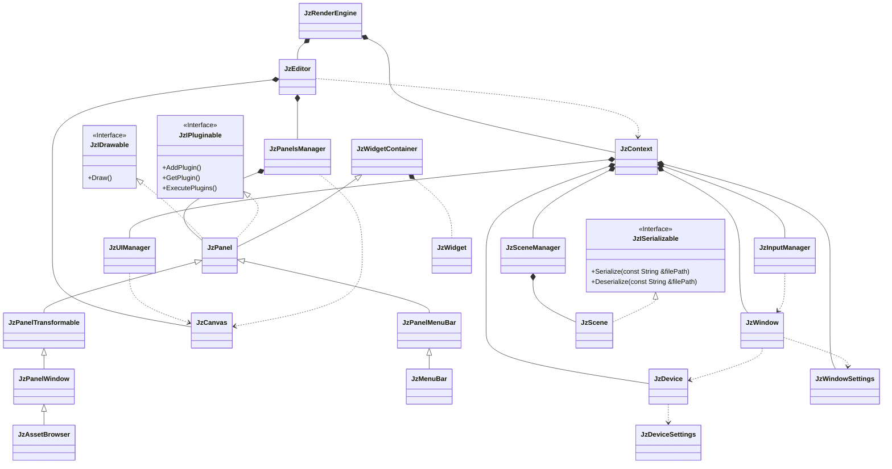
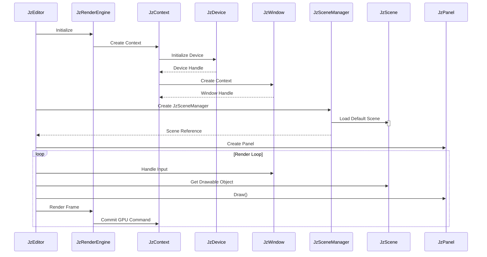

# JzRE Design

## Class Diagram

```mermaid
classDiagram
    direction TB

    %% Interfaces
    class JzISerializable {
        <<Interface>>
        +Serialize(const String &filePath)
        +Deserialize(const String &filePath)
    }
    
    class JzIDrawable {
        <<Interface>>
        +Draw()
    }

    class JzIPluginable{
        <<Interface>>
        +AddPlugin()
        +GetPlugin()
        +ExecutePlugins()
    }

    %% Core Engine Classes
    class JzRenderEngine {
    }
    
    class JzContext {
    }
    
    class JzDevice {
    }
    
    class JzWindow {
    }
    
    class JzInputManager {
    }

    %% Editor Related Classes
    class JzEditor {
    }
    
    class JzCanvas {
    }
    
    class JzPanelsManager {
    }

    %% UI Related Classes
    class JzUIManager {
    }
    
    class JzWidgetContainer {
    }
    
    class JzPanel {
    }

    class JzPanelMenuBar {
    }

    class JzMenuBar {
    }

    class JzPanelWindow { }

    class JzPanelTransformable { }

    class JzAssetBrowser { }
    
    class JzWidget {
    }

    %% Scene Related Classes
    class JzSceneManager {
    }
    
    class JzScene {
    }

    %% Settings Classes
    class JzWindowSettings {
    }
    
    class JzDeviceSettings {
    }

    %% Composition Relationships
    JzRenderEngine *-- JzContext
    JzRenderEngine *-- JzEditor

    JzContext *-- JzDevice
    JzContext *-- JzWindow
    JzContext *-- JzWindowSettings
    JzContext *-- JzInputManager
    JzContext *-- JzUIManager
    JzContext *-- JzSceneManager

    JzEditor *-- JzCanvas
    JzEditor *-- JzPanelsManager

    JzSceneManager *-- JzScene

    JzPanelsManager *-- JzPanel
    JzWidgetContainer *.. JzWidget

    %% Dependency Relationships
    JzEditor ..> JzContext
    JzDevice ..> JzDeviceSettings
    JzWindow ..> JzWindowSettings
    JzWindow ..> JzDevice
    JzInputManager ..> JzWindow
    JzUIManager ..> JzCanvas
    JzPanelsManager ..> JzCanvas

    %% Interface Implementations
    JzISerializable <|.. JzScene
    JzIDrawable <|.. JzPanel
    JzIPluginable <|.. JzPanel
    JzWidgetContainer <|-- JzPanel
    JzPanel <|-- JzPanelMenuBar
    JzPanelMenuBar <|-- JzMenuBar
    JzPanel <|-- JzPanelTransformable
    JzPanelTransformable <|-- JzPanelWindow
    JzPanelWindow <|-- JzAssetBrowser
```

## Sequence Diagram

```mermaid
sequenceDiagram
    participant Editor as JzEditor
    participant Engine as JzRenderEngine
    participant Context as JzContext
    participant Device as JzDevice
    participant Window as JzWindow
    participant SceneMgr as JzSceneManager
    participant Scene as JzScene
    participant Panel as JzPanel

    %% Initialization
    Editor->>Engine: Initialize
    Engine->>Context: Create Context
    
    %% Device Initialization
    Context->>Device: Initialize Device
    Device-->>Context: Device Handle
    Context->>Window: Create Context
    Window-->>Context: Window Handle

    %% Scene Initialization
    Editor->>SceneMgr: Create JzSceneManager
    SceneMgr->>Scene: Load Default Scene
    activate Scene
    deactivate Scene
    SceneMgr-->>Editor: Scene Reference

    %% UI Initialization
    Editor->>Panel: Create Panel
    
    %% 主循环
    loop Render Loop
        Editor->>Window: Handle Input
        Editor->>Scene: Get Drawable Object
        Editor->>Panel: Draw()
        Editor->>Engine: Render Frame
        Engine->>Context: Commit GPU Command
    end
```