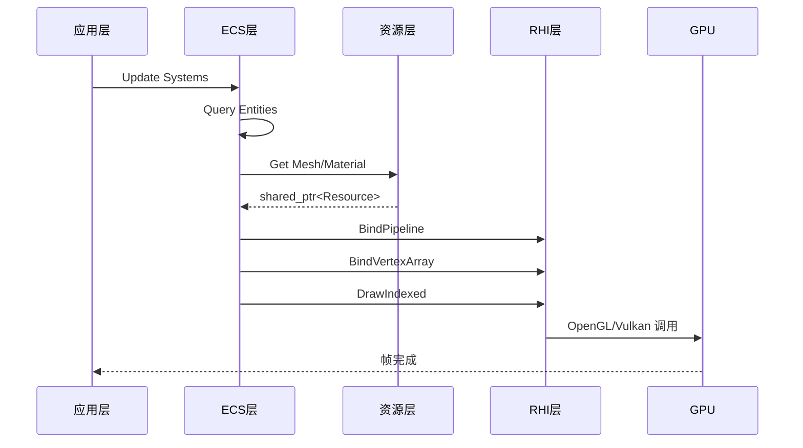

# JzRE 渲染流程集成

## 概述

本文档描述 JzRE 引擎中各层之间的渲染数据流，展示从 ECS 到 GPU 的完整路径。

---

## 渲染数据流

```
[主循环]
   |
   v
[RenderSystem::Update] -> 遍历实体 (Entity)
   |
   +---> [EntityManager] -> 获取组件 (Component)
           |
           +---> [MeshComponent] -----> 持有 std::shared_ptr<JzMesh>
           |
           +---> [MaterialComponent] -> 持有 std::shared_ptr<JzMaterial>
           |
           +---> [TransformComponent] -> (位置、旋转、缩放)
   |
   v
[JzMesh Resource] (CPU端)
   |
   +---> 顶点/索引数据 (CPU内存)
   |
   +---> 持有 std::shared_ptr<JzGPUBufferObject> (顶点缓冲)
   |
   +---> 持有 std::shared_ptr<JzGPUBufferObject> (索引缓冲)
   |
   v
[JzDevice] (RHI/GPU抽象层)
   |
   +---> BindPipeline(material->GetPipeline())
   |
   +---> BindVertexArray(mesh->GetVertexArray())
   |
   +---> DrawIndexed(...)
   |
   v
[GPU] -> 渲染出图像
```

---

## 代码示例

### 渲染系统更新

```cpp
void JzRenderSystem::Update(JzEntityManager& manager, F32 delta) {
    // 获取所有可渲染实体
    auto entities = manager.View<JzMeshComponent, JzMaterialComponent, JzTransformComponent>();
    
    for (auto entity : entities) {
        auto& meshComp = manager.GetComponent<JzMeshComponent>(entity);
        auto& matComp = manager.GetComponent<JzMaterialComponent>(entity);
        auto& transform = manager.GetComponent<JzTransformComponent>(entity);
        
        auto mesh = std::static_pointer_cast<JzMesh>(meshComp.mesh);
        auto material = std::static_pointer_cast<JzMaterial>(matComp.material);
        
        if (mesh && material && mesh->GetState() == JzEResourceState::Loaded) {
            // 设置变换矩阵
            JzMat4 modelMatrix = CalculateModelMatrix(transform);
            material->SetUniform("u_Model", modelMatrix);
            
            // 绑定并绘制
            m_device->BindPipeline(material->GetPipeline());
            m_device->BindVertexArray(mesh->GetVertexArray());
            
            JzDrawIndexedParams params;
            params.indexCount = mesh->GetIndexCount();
            params.primitiveType = JzEPrimitiveType::Triangles;
            m_device->DrawIndexed(params);
        }
    }
}
```

### UI 中使用资源

```cpp
// 1. 获取资源管理器
auto& resourceManager = JzServiceContainer::Get<JzResourceManager>();

// 2. 加载纹理资源
auto iconTexture = resourceManager.GetResource<JzTexture>("path/to/icon.png");

// 3. 创建图片按钮
if (iconTexture && iconTexture->GetState() == JzEResourceState::Loaded) {
    auto myImageButton = std::make_unique<JzImageButton>(
        iconTexture->GetRHITexture(), 
        JzVec2{24.0f, 24.0f}
    );

    // 4. 订阅点击事件
    myImageButton->ClickedEvent.AddListener([]() {
        // 处理按钮点击...
    });
}
```

---

## 层级交互图



---

## 关键类型关系

| 组件 | 持有资源 | 使用的 RHI 对象 |
|------|----------|-----------------|
| `JzMeshComponent` | `JzMesh` | `JzGPUBufferObject`, `JzGPUVertexArrayObject` |
| `JzMaterialComponent` | `JzMaterial` | `JzRHIPipeline`, `JzGPUTextureObject` |
| `JzCameraComponent` | - | Uniform 数据 |
