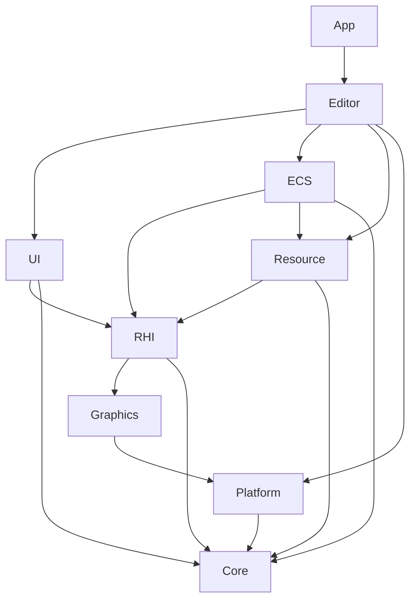

# JzRE 模块结构

## 概述

本文档描述 JzRE 引擎的模块化目录结构和 CMake 构建配置。

---

## 目录结构

```
JzRE/
├── src/
│   ├── Core/                # 核心工具与类型
│   │   ├── CMakeLists.txt
│   │   ├── include/JzRE/Core/
│   │   │   ├── JzLogger.h
│   │   │   ├── JzEvent.h
│   │   │   ├── JzMatrix.h
│   │   │   ├── JzVector.h
│   │   │   ├── JzRETypes.h
│   │   │   ├── JzThreadPool.h
│   │   │   ├── JzTaskQueue.h
│   │   │   └── JzServiceContainer.h
│   │   └── src/
│   │
│   ├── RHI/                 # 渲染硬件接口 (抽象层)
│   │   ├── CMakeLists.txt
│   │   ├── include/JzRE/RHI/
│   │   │   ├── JzDevice.h
│   │   │   ├── JzRHICommandList.h
│   │   │   ├── JzRHICommand.h
│   │   │   ├── JzRHIPipeline.h
│   │   │   └── JzGPU*Object.h
│   │   └── src/
│   │
│   ├── Graphics/            # 图形后端实现
│   │   ├── CMakeLists.txt
│   │   ├── OpenGL/          # OpenGL 实现
│   │   │   ├── JzOpenGLDevice.cpp
│   │   │   ├── JzOpenGLBuffer.cpp
│   │   │   ├── JzOpenGLTexture.cpp
│   │   │   └── ...
│   │   └── Vulkan/          # Vulkan 实现 (计划中)
│   │       └── ...
│   │
│   ├── Resource/            # 资源管理
│   │   ├── CMakeLists.txt
│   │   ├── include/JzRE/Resource/
│   │   │   ├── JzResourceManager.h
│   │   │   ├── JzResource.h
│   │   │   ├── JzTexture.h
│   │   │   ├── JzMesh.h
│   │   │   └── Jz*Factory.h
│   │   └── src/
│   │
│   ├── ECS/                 # 实体组件系统 (原有实现)
│   │   ├── CMakeLists.txt
│   │   ├── include/JzRE/ECS/
│   │   │   ├── JzEntityManager.h
│   │   │   ├── JzComponent.h
│   │   │   ├── JzSystem.h
│   │   │   └── Jz*System.h
│   │   └── src/
│   │
│   ├── EnttECS/             # 实体组件系统 (EnTT 实现)
│   │   ├── CMakeLists.txt
│   │   ├── include/JzRE/EnttECS/
│   │   │   ├── JzEnttWorld.h
│   │   │   ├── JzEnttEntity.h
│   │   │   ├── JzEnttSystem.h
│   │   │   ├── JzEnttComponents.h
│   │   │   └── Systems/
│   │   │       ├── JzEnttMoveSystem.h
│   │   │       ├── JzEnttSceneSystem.h
│   │   │       └── JzEnttRenderSystem.h
│   │   └── src/
│   │
│   ├── Platform/            # 平台抽象层
│   │   ├── CMakeLists.txt
│   │   ├── include/JzRE/Platform/
│   │   │   ├── JzFileDialog.h
│   │   │   └── JzMessageBox.h
│   │   ├── Windows/         # Windows 实现
│   │   ├── macOS/           # macOS 实现
│   │   └── Linux/           # Linux 实现
│   │
│   ├── UI/                  # UI 组件封装
│   │   ├── CMakeLists.txt
│   │   ├── include/JzRE/UI/
│   │   │   ├── JzPanel.h
│   │   │   ├── JzWidget.h
│   │   │   ├── JzButton.h
│   │   │   └── ...
│   │   └── src/
│   │
│   ├── Editor/              # 编辑器逻辑
│   │   ├── CMakeLists.txt
│   │   ├── include/JzRE/Editor/
│   │   │   ├── JzEditor.h
│   │   │   ├── JzWindow.h
│   │   │   └── ...
│   │   └── src/
│   │
│   ├── App/                 # 主程序入口
│   │   ├── CMakeLists.txt
│   │   ├── include/JzRE/App/
│   │   │   ├── JzREHub.h
│   │   │   └── JzREInstance.h
│   │   └── src/
│   │
│   └── CMakeLists.txt       # src 主 CMakeLists
│
├── tests/                   # 测试
├── docs/                    # 文档
├── resources/               # 资源文件
└── CMakeLists.txt           # 项目根 CMakeLists
```

---

## 模块依赖关系



---

## CMake 配置

### 根 CMakeLists.txt

```cmake
cmake_minimum_required(VERSION 3.20)
project(JzRE LANGUAGES CXX)

set(CMAKE_CXX_STANDARD 20)
set(CMAKE_CXX_STANDARD_REQUIRED ON)

# vcpkg 工具链
include(${CMAKE_SOURCE_DIR}/vcpkg/scripts/buildsystems/vcpkg.cmake)

add_subdirectory(src)

# 测试
enable_testing()
add_subdirectory(tests)
```

### src/CMakeLists.txt

```cmake
# 按依赖顺序添加模块
add_subdirectory(Core)
add_subdirectory(Platform)
add_subdirectory(RHI)
add_subdirectory(Graphics)
add_subdirectory(Resource)
add_subdirectory(ECS)
add_subdirectory(UI)
add_subdirectory(Editor)
add_subdirectory(App)
```

### 模块 CMakeLists.txt 示例

#### Core 模块

```cmake
# src/Core/CMakeLists.txt
add_library(JzCore STATIC)

file(GLOB_RECURSE CORE_SOURCES "src/*.cpp")
file(GLOB_RECURSE CORE_HEADERS "include/*.h")

target_sources(JzCore PRIVATE ${CORE_SOURCES} ${CORE_HEADERS})

target_include_directories(JzCore
    PUBLIC ${CMAKE_CURRENT_SOURCE_DIR}/include
)

# 外部依赖
find_package(JzLogger CONFIG REQUIRED)
find_package(JzVector CONFIG REQUIRED)
find_package(JzMatrix CONFIG REQUIRED)

target_link_libraries(JzCore 
    PUBLIC
        JzLogger::JzLogger
        JzVector::JzVector
        JzMatrix::JzMatrix
)
```

#### RHI 模块 (接口库)

```cmake
# src/RHI/CMakeLists.txt
add_library(JzRHI STATIC)

file(GLOB_RECURSE RHI_SOURCES "src/*.cpp")
file(GLOB_RECURSE RHI_HEADERS "include/*.h")

target_sources(JzRHI PRIVATE ${RHI_SOURCES} ${RHI_HEADERS})

target_include_directories(JzRHI
    PUBLIC ${CMAKE_CURRENT_SOURCE_DIR}/include
)

target_link_libraries(JzRHI 
    PUBLIC JzCore
)
```

#### Graphics 模块

```cmake
# src/Graphics/CMakeLists.txt
add_library(JzGraphics STATIC)

# OpenGL 后端
file(GLOB OPENGL_SOURCES "OpenGL/*.cpp")
target_sources(JzGraphics PRIVATE ${OPENGL_SOURCES})

# Vulkan 后端 (条件编译)
if(VULKAN_FOUND)
    file(GLOB VULKAN_SOURCES "Vulkan/*.cpp")
    target_sources(JzGraphics PRIVATE ${VULKAN_SOURCES})
    target_compile_definitions(JzGraphics PRIVATE HAS_VULKAN)
endif()

target_include_directories(JzGraphics
    PUBLIC ${CMAKE_CURRENT_SOURCE_DIR}/include
)

find_package(glad CONFIG REQUIRED)
find_package(glfw3 CONFIG REQUIRED)

target_link_libraries(JzGraphics
    PUBLIC JzRHI
    PRIVATE glad::glad glfw
)
```

#### App 模块 (可执行文件)

```cmake
# src/App/CMakeLists.txt
add_executable(JzRE)

file(GLOB_RECURSE APP_SOURCES "src/*.cpp")
target_sources(JzRE PRIVATE ${APP_SOURCES})

target_include_directories(JzRE
    PRIVATE ${CMAKE_CURRENT_SOURCE_DIR}/include
)

target_link_libraries(JzRE
    PRIVATE JzEditor
)
```

---

## 头文件组织

采用分离式组织，公开头文件与实现分离:

```
Module/
├── CMakeLists.txt
├── include/
│   └── JzRE/
│       └── Module/           # 命名空间路径
│           ├── JzPublicClass.h
│           └── JzPublicInterface.h
└── src/
    ├── JzPublicClass.cpp
    ├── JzInternalHelper.h    # 私有头文件
    └── JzInternalHelper.cpp
```

### 头文件引用规范

```cpp
// 跨模块引用: 使用完整路径
#include <JzRE/Core/JzLogger.h>
#include <JzRE/RHI/JzDevice.h>

// 模块内引用: 可使用相对路径
#include "JzInternalHelper.h"
```

---

## 跨平台代码组织

平台特定代码放在各平台子目录中:

```
Platform/
├── include/JzRE/Platform/
│   ├── JzFileDialog.h        # 统一接口声明
│   └── JzMessageBox.h
├── Windows/
│   ├── JzFileDialog.cpp      # Windows 实现
│   └── JzMessageBox.cpp
├── macOS/
│   ├── JzFileDialog.cpp      # macOS 实现
│   └── JzMessageBox.cpp
└── Linux/
    ├── JzFileDialog.cpp      # Linux 实现
    └── JzMessageBox.cpp
```

### CMake 条件编译

```cmake
# src/Platform/CMakeLists.txt
add_library(JzPlatform STATIC)

target_include_directories(JzPlatform
    PUBLIC ${CMAKE_CURRENT_SOURCE_DIR}/include
)

if(WIN32)
    file(GLOB PLATFORM_SOURCES "Windows/*.cpp")
elseif(APPLE)
    file(GLOB PLATFORM_SOURCES "macOS/*.cpp")
else()
    file(GLOB PLATFORM_SOURCES "Linux/*.cpp")
endif()

target_sources(JzPlatform PRIVATE ${PLATFORM_SOURCES})
target_link_libraries(JzPlatform PUBLIC JzCore)
```

---

## 构建命令

### 配置

```bash
# Windows (MSVC)
cmake --preset windows-msvc-static

# macOS (Clang)
cmake --preset macos-clang-static
```

### 构建

```bash
cmake --build build
```

### 运行

```bash
./build/JzRE/JzRE
```
