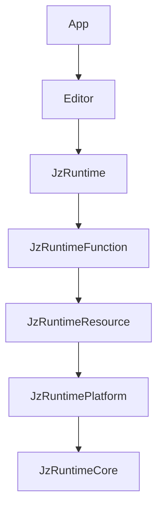

# JzRE Module Structure

## Overview

This document describes the modular directory structure and CMake build configuration for JzRE.

---

## Directory Structure

```
JzRE/
├── src/
│   ├── Runtime/                    # Game Engine Runtime
│   │   ├── CMakeLists.txt
│   │   ├── Core/                   # Layer 1: Core Utilities
│   │   │   ├── CMakeLists.txt
│   │   │   ├── include/JzRE/Runtime/Core/
│   │   │   │   ├── JzRETypes.h
│   │   │   │   ├── JzVector.h
│   │   │   │   ├── JzMatrix.h
│   │   │   │   ├── JzEvent.h
│   │   │   │   ├── JzThreadPool.h
│   │   │   │   └── JzLogger.h
│   │   │   └── src/
│   │   │
│   │   ├── Platform/               # Layer 2: Platform Abstraction
│   │   │   ├── CMakeLists.txt
│   │   │   ├── include/JzRE/Runtime/Platform/
│   │   │   │   ├── JzDevice.h
│   │   │   │   ├── JzRHI*.h
│   │   │   │   ├── JzGPU*Object.h
│   │   │   │   └── JzFileDialog.h
│   │   │   ├── src/
│   │   │   ├── OpenGL/             # OpenGL backend
│   │   │   ├── Vulkan/             # Vulkan backend (planned)
│   │   │   ├── Windows/
│   │   │   ├── macOS/
│   │   │   └── Linux/
│   │   │
│   │   ├── Resource/               # Layer 3: Resource Management
│   │   │   ├── CMakeLists.txt
│   │   │   ├── include/JzRE/Runtime/Resource/
│   │   │   │   ├── JzResourceManager.h
│   │   │   │   ├── JzTexture.h
│   │   │   │   ├── JzMesh.h
│   │   │   │   └── Jz*Factory.h
│   │   │   └── src/
│   │   │
│   │   └── Function/               # Layer 4: Functional Systems
│   │       ├── CMakeLists.txt
│   │       ├── include/JzRE/Runtime/Function/
│   │       │   ├── Rendering/
│   │       │   │   └── JzRHIRenderer.h
│   │       │   ├── Scene/
│   │       │   │   ├── JzScene.h
│   │       │   │   └── JzActor.h
│   │       │   ├── ECS/
│   │       │   │   └── JzEntityManager.h
│   │       │   ├── Input/
│   │       │   │   └── JzInputManager.h
│   │       │   └── Window/
│   │       │       └── JzWindow.h
│   │       └── src/
│   │
│   ├── Editor/                     # Editor Application
│   │   ├── CMakeLists.txt
│   │   ├── include/JzRE/Editor/
│   │   │   ├── JzEditor.h
│   │   │   ├── JzPanelsManager.h
│   │   │   └── UI/                 # ImGui wrappers
│   │   └── src/
│   │
│   ├── App/                        # Main Entry Points
│   │   ├── CMakeLists.txt
│   │   ├── include/JzRE/App/
│   │   │   ├── JzREHub.h
│   │   │   ├── JzREInstance.h
│   │   │   └── JzRERuntime.h
│   │   └── src/
│   │       └── main.cpp
│   │
│   └── CMakeLists.txt
│
├── tests/
├── examples/
├── docs/
├── resources/
└── CMakeLists.txt
```

---

## Module Dependencies



---

## CMake Configuration

### src/CMakeLists.txt

```cmake
# Runtime module (contains Platform, Core, Resource, Function layers)
add_subdirectory(Runtime)

# Editor module (depends on Runtime)
add_subdirectory(Editor)

# Application entry points
add_subdirectory(App)
```

### src/Runtime/CMakeLists.txt

```cmake
add_subdirectory(Core)
add_subdirectory(Platform)
add_subdirectory(Resource)
add_subdirectory(Function)

add_library(JzRuntime INTERFACE)
target_link_libraries(JzRuntime INTERFACE
    JzRuntimeCore
    JzRuntimePlatform
    JzRuntimeResource
    JzRuntimeFunction
)
```

---

## Header Include Convention

```cpp
// Cross-module: use full path
#include <JzRE/Runtime/Core/JzLogger.h>
#include <JzRE/Runtime/Platform/JzDevice.h>
#include <JzRE/Runtime/Function/Scene/JzScene.h>

// Within module: relative path allowed
#include "JzInternalHelper.h"
```

---

## Build Commands

### Configure

```bash
# macOS
cmake --preset macos-clang-static

# Windows
cmake --preset windows-msvc-static
```

### Build

```bash
cmake --build build
```

### Run

```bash
./build/JzRE/JzRE
```

### Test

```bash
cd build && ctest --output-on-failure
```

---

## Build Targets Summary

| Target | Type | Dependencies |
|--------|------|--------------|
| `JzRuntimeCore` | Static | spdlog |
| `JzRuntimePlatform` | Static | JzRuntimeCore, glad, glfw |
| `JzRuntimeResource` | Static | JzRuntimeCore, JzRuntimePlatform, assimp |
| `JzRuntimeFunction` | Static | JzRuntimeCore, JzRuntimePlatform, JzRuntimeResource |
| `JzRuntime` | Interface | All runtime layers |
| `JzEditor` | Static | JzRuntime, imgui |
| `JzREApp` | Static | JzEditor |
| `JzRE` | Executable | JzREApp |
