# JzRE 资源层设计

## 概述

资源层是 JzRE 引擎的核心组件，负责管理所有游戏资产（纹理、模型、材质、着色器等）的生命周期。设计基于三个核心概念：`JzResource`、`JzResourceFactory` 和 `JzResourceManager`。

---

## 设计目标

- **自动化**: 自动资源加载、卸载和缓存
- **可扩展**: 轻松支持新资源类型，无需修改核心代码
- **高效**: 引用计数内存管理
- **解耦**: 资源管理逻辑与引擎其他部分隔离

---

## 核心组件

### JzResource (资源基类)

所有资源类型的抽象基类。

```cpp
enum class JzEResourceState {
    Unloaded,  // 未加载
    Loading,   // 加载中 (预留)
    Loaded,    // 已加载
    Error      // 错误
};

class JzResource {
public:
    virtual ~JzResource() = default;

    JzEResourceState GetState() const { return m_state; }
    const String& GetName() const { return m_name; }

    virtual Bool Load() = 0;    // 加载资源
    virtual void Unload() = 0;  // 卸载资源

protected:
    JzEResourceState m_state = JzEResourceState::Unloaded;
    String m_name;
};
```

### JzResourceFactory (资源工厂)

用于创建具体资源类型实例的抽象工厂接口。

```cpp
class JzResourceFactory {
public:
    virtual ~JzResourceFactory() = default;
    virtual JzResource* Create(const String& name) = 0;
};
```

### JzResourceManager (资源管理器)

资源管理的中央协调器，是获取资源的唯一入口。

```cpp
class JzResourceManager {
public:
    // 注册资源工厂
    template <typename T>
    void RegisterFactory(std::unique_ptr<JzResourceFactory> factory);

    // 获取资源 (自动加载)
    template <typename T>
    std::shared_ptr<T> GetResource(const String& name);

    // 清理未使用资源
    void UnloadUnusedResources();

    // 搜索路径管理
    void AddSearchPath(const String& path);
    String FindFullPath(const String& relativePath);

private:
    std::unordered_map<std::type_index, std::unique_ptr<JzResourceFactory>> m_factories;
    std::unordered_map<String, std::weak_ptr<JzResource>> m_resourceCache;
    std::vector<String> m_searchPaths;
    std::mutex m_cacheMutex;
};
```

---

## 资源类型

### 已实现的资源类型

| 资源类型 | 类名 | 工厂类 | 用途 |
|----------|------|--------|------|
| 纹理 | `JzTexture` | `JzTextureFactory` | 图像资源 |
| 网格 | `JzMesh` | `JzMeshFactory` | 几何数据 |
| 材质 | `JzMaterial` | `JzMaterialFactory` | 渲染材质 |
| 着色器 | `JzShader` | `JzShaderFactory` | GPU 程序 |
| 模型 | `JzModel` | `JzModelFactory` | 完整3D模型 |
| 字体 | `JzFont` | `JzFontFactory` | 文字渲染 |

### 资源类关系

```mermaid
classDiagram
    class JzResource {
        <<abstract>>
        +GetState() JzEResourceState
        +GetName() String
        +Load()* Bool
        +Unload()* void
        #m_state
        #m_name
    }
    
    class JzTexture {
        +GetRHITexture() JzGPUTextureObject*
        -m_rhiTexture
    }
    
    class JzMesh {
        +GetVertexArray() JzGPUVertexArrayObject*
        +GetVertexBuffer() JzGPUBufferObject*
        +GetIndexBuffer() JzGPUBufferObject*
        -m_vertices
        -m_indices
    }
    
    class JzMaterial {
        +GetPipeline() JzRHIPipeline*
        +GetTextures() vector
        -m_pipeline
        -m_textures
    }
    
    class JzShader {
        +GetProgram() JzGPUShaderProgramObject*
        -m_program
    }
    
    class JzModel {
        +GetMeshes() vector
        +GetMaterials() vector
        -m_meshes
        -m_materials
    }
    
    JzResource <|-- JzTexture
    JzResource <|-- JzMesh
    JzResource <|-- JzMaterial
    JzResource <|-- JzShader
    JzResource <|-- JzModel
    
    JzModel *-- JzMesh
    JzModel *-- JzMaterial
    JzMaterial *-- JzTexture
    JzMaterial *-- JzShader
```



---

## 工作流程

### 1. 资源注册 (初始化阶段)

```cpp
// 在引擎初始化时注册所有工厂
auto& resourceManager = JzServiceContainer::Get<JzResourceManager>();

resourceManager.RegisterFactory<JzTexture>(std::make_unique<JzTextureFactory>());
resourceManager.RegisterFactory<JzMesh>(std::make_unique<JzMeshFactory>());
resourceManager.RegisterFactory<JzMaterial>(std::make_unique<JzMaterialFactory>());
resourceManager.RegisterFactory<JzShader>(std::make_unique<JzShaderFactory>());
resourceManager.RegisterFactory<JzModel>(std::make_unique<JzModelFactory>());

// 添加资源搜索路径
resourceManager.AddSearchPath("./resources");
resourceManager.AddSearchPath("./assets");
```

### 2. 资源加载

```cpp
// 请求纹理资源 (管理器自动处理缓存和加载)
auto texture = resourceManager.GetResource<JzTexture>("textures/player.png");

// 检查资源状态
if (texture && texture->GetState() == JzEResourceState::Loaded) {
    // 使用纹理
    auto rhiTexture = texture->GetRHITexture();
}
```

### 3. 内部加载流程


### 4. 资源卸载

资源卸载通过引用计数自动处理:

```cpp
// 当最后一个 shared_ptr 销毁时，资源自动卸载
{
    auto texture = resourceManager.GetResource<JzTexture>("textures/enemy.png");
    // 使用纹理...
} // texture 离开作用域，如果没有其他引用，资源将被销毁

// 定期清理已过期的缓存条目
resourceManager.UnloadUnusedResources();
```

---

## 实现细节

### GetResource 模板实现

```cpp
template <typename T>
std::shared_ptr<T> JzResourceManager::GetResource(const String& name) {
    std::lock_guard<std::mutex> lock(m_cacheMutex);

    // 1. 缓存查找
    auto it = m_resourceCache.find(name);
    if (it != m_resourceCache.end()) {
        if (auto sharedRes = it->second.lock()) {
            return std::static_pointer_cast<T>(sharedRes);
        }
    }

    // 2. 缓存未命中: 创建新资源
    auto factory_it = m_factories.find(std::type_index(typeid(T)));
    if (factory_it == m_factories.end()) {
        // 错误: 未注册此类型的工厂
        return nullptr;
    }

    JzResource* newRawRes = factory_it->second->Create(name);
    std::shared_ptr<T> newRes = std::shared_ptr<T>(static_cast<T*>(newRawRes));

    // 3. 加载并缓存
    newRes->Load();
    m_resourceCache[name] = newRes;

    return newRes;
}
```

### 工厂实现示例

```cpp
// JzTextureFactory.h
class JzTextureFactory : public JzResourceFactory {
public:
    JzResource* Create(const String& name) override {
        return new JzTexture(name);
    }
};

// JzShaderFactory.h (带参数)
class JzShaderFactory : public JzResourceFactory {
public:
    JzResource* Create(const String& name) override {
        // 解析着色器路径
        String vertPath = name + ".vert";
        String fragPath = name + ".frag";
        return new JzShader(vertPath, fragPath);
    }
};
```

---

## 缓存策略

### weak_ptr 自动清理

使用 `std::weak_ptr` 作为缓存值的关键优势:

1. **自动内存回收**: 当所有 `shared_ptr` 销毁后，资源自动释放
2. **无悬挂引用**: 缓存不会阻止资源被回收
3. **按需重新加载**: 过期资源可透明地重新加载

```cpp
void JzResourceManager::UnloadUnusedResources() {
    std::lock_guard<std::mutex> lock(m_cacheMutex);
    
    for (auto it = m_resourceCache.begin(); it != m_resourceCache.end(); ) {
        if (it->second.expired()) {
            it = m_resourceCache.erase(it);
        } else {
            ++it;
        }
    }
}
```

---

## ECS 集成

资源通过组件与 ECS 系统集成:

```cpp
// 组件持有资源引用
struct JzMeshComponent {
    std::shared_ptr<JzResource> mesh;
};

struct JzMaterialComponent {
    std::shared_ptr<JzResource> material;
};

// 渲染系统使用资源
void JzRenderSystem::Update(JzEntityManager& manager, F32 delta) {
    for (auto entity : manager.View<JzMeshComponent, JzMaterialComponent, JzTransformComponent>()) {
        auto& meshComp = manager.GetComponent<JzMeshComponent>(entity);
        auto& matComp = manager.GetComponent<JzMaterialComponent>(entity);
        
        auto mesh = std::static_pointer_cast<JzMesh>(meshComp.mesh);
        auto material = std::static_pointer_cast<JzMaterial>(matComp.material);
        
        if (mesh && material && mesh->GetState() == JzEResourceState::Loaded) {
            m_device->BindPipeline(material->GetPipeline());
            m_device->BindVertexArray(mesh->GetVertexArray());
            // ... 绘制
        }
    }
}
```

---

## 使用示例

### 加载模型

```cpp
auto& resMgr = JzServiceContainer::Get<JzResourceManager>();

// 加载完整模型 (含网格和材质)
auto model = resMgr.GetResource<JzModel>("models/character.fbx");

if (model && model->GetState() == JzEResourceState::Loaded) {
    for (auto& mesh : model->GetMeshes()) {
        // 处理每个网格
    }
}
```

### UI 中使用纹理

```cpp
// 加载图标纹理
auto iconTexture = resourceManager.GetResource<JzTexture>("icons/button.png");

if (iconTexture) {
    auto myButton = std::make_unique<JzImageButton>(
        iconTexture->GetRHITexture(), 
        JzVec2{24.0f, 24.0f}
    );
    myButton->ClickedEvent.AddListener([]() {
        // 处理点击
    });
}
```

---

## 未来规划

> [!NOTE]
> 以下功能为未来规划，当前版本暂不实现。

### 异步加载 (低优先级)

```cpp
// 未来 API 设计参考
template<typename T>
std::future<std::shared_ptr<T>> GetResourceAsync(const String& name);
```

### 资源依赖

自动加载依赖资源 (如材质自动加载其引用的纹理)。

### 热重载

编辑器模式下文件变更时自动重载资源。

### 流式加载

大型资源 (如大纹理、地形) 的分块加载。
