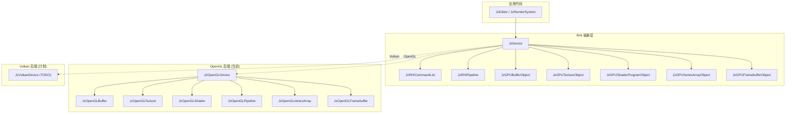

# JzRE RHI (渲染硬件接口) 设计

## 概述

JzRE RHI（Render Hardware Interface）是引擎的图形 API 抽象层，旨在提供跨平台的统一渲染接口。

---

## 设计目标

1. **跨平台支持**: 统一接口支持 OpenGL、Vulkan 等多种图形 API
2. **命令缓冲**: 支持延迟渲染命令执行
3. **现代化设计**: C++20 标准，智能指针管理
4. **易于扩展**: 模块化后端，便于添加新 API

---

## 架构概览



---

## 核心组件

### JzDevice (设备抽象)

RHI 的核心接口，提供资源创建和渲染操作。

```cpp
class JzDevice {
public:
    JzDevice(JzERHIType rhiType);
    virtual ~JzDevice() = default;

    // 设备信息
    JzERHIType GetRHIType() const;
    virtual String GetDeviceName() const = 0;
    virtual String GetVendorName() const = 0;
    virtual String GetDriverVersion() const = 0;

    // 资源创建
    virtual std::shared_ptr<JzGPUBufferObject> CreateBuffer(const JzGPUBufferObjectDesc&) = 0;
    virtual std::shared_ptr<JzGPUTextureObject> CreateTexture(const JzGPUTextureObjectDesc&) = 0;
    virtual std::shared_ptr<JzGPUShaderProgramObject> CreateShader(const JzShaderProgramDesc&) = 0;
    virtual std::shared_ptr<JzRHIPipeline> CreatePipeline(const JzPipelineDesc&) = 0;
    virtual std::shared_ptr<JzGPUFramebufferObject> CreateFramebuffer(const String&) = 0;
    virtual std::shared_ptr<JzGPUVertexArrayObject> CreateVertexArray(const String&) = 0;
    virtual std::shared_ptr<JzRHICommandList> CreateCommandList(const String&) = 0;

    // 帧管理
    virtual void BeginFrame() = 0;
    virtual void EndFrame() = 0;
    virtual void Present() = 0;

    // 立即模式渲染
    virtual void Clear(const JzClearParams&) = 0;
    virtual void Draw(const JzDrawParams&) = 0;
    virtual void DrawIndexed(const JzDrawIndexedParams&) = 0;
    virtual void BindPipeline(std::shared_ptr<JzRHIPipeline>) = 0;
    virtual void BindVertexArray(std::shared_ptr<JzGPUVertexArrayObject>) = 0;
    virtual void BindTexture(std::shared_ptr<JzGPUTextureObject>, U32 slot) = 0;

    // 命令列表执行
    virtual void ExecuteCommandList(std::shared_ptr<JzRHICommandList>) = 0;

    // 多线程支持
    virtual Bool SupportsMultithreading() const = 0;
    virtual void MakeContextCurrent(U32 threadIndex = 0) = 0;
};
```

### JzRHICommandList (命令列表)

支持延迟渲染命令的记录和执行。

```cpp
class JzRHICommandList {
public:
    void Begin();   // 开始记录
    void End();     // 结束记录
    void Reset();   // 重置命令
    void Execute(); // 执行命令

    // 记录命令
    void Clear(const JzClearParams&);
    void Draw(const JzDrawParams&);
    void DrawIndexed(const JzDrawIndexedParams&);
    void BindPipeline(std::shared_ptr<JzRHIPipeline>);
    void BindVertexArray(std::shared_ptr<JzGPUVertexArrayObject>);
    void BindTexture(std::shared_ptr<JzGPUTextureObject>, U32 slot);
    void SetViewport(const JzViewport&);
    void SetScissor(const JzScissorRect&);
    void BeginRenderPass(std::shared_ptr<JzGPUFramebufferObject>);
    void EndRenderPass();

private:
    std::vector<std::unique_ptr<JzRHICommand>> m_commands;
    std::atomic<Bool> m_isRecording{false};
    mutable std::mutex m_commandMutex;
};
```

### JzRHICommand (命令基类)

所有渲染命令的抽象基类。

```cpp
enum class JzRHIECommandType : U8 {
    Clear, Draw, DrawIndexed,
    BindPipeline, BindVertexArray, BindTexture,
    SetUniform, SetViewport, SetScissor,
    BeginRenderPass, EndRenderPass,
    CopyTexture, UpdateBuffer, ImGuiRender
};

class JzRHICommand {
public:
    JzRHICommand(JzRHIECommandType type);
    virtual ~JzRHICommand() = default;
    virtual void Execute() = 0;
    JzRHIECommandType GetType() const;
};
```

---

## GPU 资源对象

### 缓冲区 (JzGPUBufferObject)

```cpp
enum class JzEBufferType : U8 {
    Vertex, Index, Uniform, Storage
};

enum class JzEBufferUsage : U8 {
    StaticDraw, DynamicDraw, StreamDraw
};

struct JzGPUBufferObjectDesc {
    JzEBufferType type;
    JzEBufferUsage usage;
    Size size;
    const void* data;
    String debugName;
};
```

### 纹理 (JzGPUTextureObject)

```cpp
enum class JzETextureFormat : U8 {
    R8, RG8, RGB8, RGBA8,
    R16F, RG16F, RGB16F, RGBA16F,
    R32F, RG32F, RGB32F, RGBA32F,
    Depth16, Depth24, Depth32F, Depth24Stencil8
};

struct JzGPUTextureObjectDesc {
    U32 width, height, depth;
    JzETextureFormat format;
    U32 mipLevels;
    U32 samples;
    const void* data;
    String debugName;
};
```

### 渲染管线 (JzRHIPipeline)

```cpp
struct JzPipelineDesc {
    std::shared_ptr<JzGPUShaderProgramObject> shader;
    JzRenderState renderState;
    std::vector<JzVertexInputDesc> vertexInputs;
    JzEPrimitiveType primitiveType;
    String debugName;
};
```

---

## OpenGL 后端实现

当前已完成的 OpenGL 后端实现:

| 抽象类 | OpenGL 实现 | 状态 |
|--------|-------------|------|
| `JzDevice` | `JzOpenGLDevice` | ✅ 完成 |
| `JzGPUBufferObject` | `JzOpenGLBuffer` | ✅ 完成 |
| `JzGPUTextureObject` | `JzOpenGLTexture` | ✅ 完成 |
| `JzGPUShaderProgramObject` | `JzOpenGLShader` | ✅ 完成 |
| `JzRHIPipeline` | `JzOpenGLPipeline` | ✅ 完成 |
| `JzGPUVertexArrayObject` | `JzOpenGLVertexArray` | ✅ 完成 |
| `JzGPUFramebufferObject` | `JzOpenGLFramebuffer` | ✅ 完成 |

### OpenGL 特性

- **版本要求**: OpenGL 3.3+
- **多线程**: 不支持 (`SupportsMultithreading()` 返回 `false`)
- **扩展**: 通过 glad 加载

---

## 使用方式

### 基本初始化

```cpp
// 创建 OpenGL 设备
auto device = std::make_unique<JzOpenGLDevice>();

// 获取设备信息
std::cout << "Device: " << device->GetDeviceName() << std::endl;
std::cout << "Vendor: " << device->GetVendorName() << std::endl;
std::cout << "Version: " << device->GetDriverVersion() << std::endl;
```

### 资源创建

```cpp
// 创建顶点缓冲
JzGPUBufferObjectDesc vbDesc;
vbDesc.type = JzEBufferType::Vertex;
vbDesc.usage = JzEBufferUsage::StaticDraw;
vbDesc.size = sizeof(vertices);
vbDesc.data = vertices;
auto vertexBuffer = device->CreateBuffer(vbDesc);

// 创建纹理
JzGPUTextureObjectDesc texDesc;
texDesc.width = 512;
texDesc.height = 512;
texDesc.format = JzETextureFormat::RGBA8;
auto texture = device->CreateTexture(texDesc);
```

### 立即模式渲染

```cpp
device->BeginFrame();

// 清除
JzClearParams clearParams;
clearParams.clearColor = true;
clearParams.colorR = 0.2f;
clearParams.colorG = 0.3f;
clearParams.colorB = 0.8f;
clearParams.colorA = 1.0f;
device->Clear(clearParams);

// 绑定并绘制
device->BindPipeline(pipeline);
device->BindVertexArray(vertexArray);
device->DrawIndexed(drawParams);

device->EndFrame();
device->Present();
```

### 命令缓冲模式

```cpp
// 记录命令
auto cmdList = device->CreateCommandList("MainPass");
cmdList->Begin();
cmdList->Clear(clearParams);
cmdList->BindPipeline(pipeline);
cmdList->BindVertexArray(vertexArray);
cmdList->DrawIndexed(drawParams);
cmdList->End();

// 执行命令
device->ExecuteCommandList(cmdList);
```

---

## Vulkan 后端规划

### 实现优先级

Vulkan 是 OpenGL 之后的下一个实现目标，将提供:

1. **显式资源管理**: 更精细的 GPU 内存控制
2. **多线程命令录制**: 并行生成渲染命令
3. **现代渲染特性**: 支持计算着色器、光线追踪等

### 需实现的类

```cpp
class JzVulkanDevice : public JzDevice { ... };
class JzVulkanBuffer : public JzGPUBufferObject { ... };
class JzVulkanTexture : public JzGPUTextureObject { ... };
class JzVulkanShader : public JzGPUShaderProgramObject { ... };
class JzVulkanPipeline : public JzRHIPipeline { ... };
class JzVulkanVertexArray : public JzGPUVertexArrayObject { ... };
class JzVulkanFramebuffer : public JzGPUFramebufferObject { ... };
```

### Vulkan 特有组件 (扩展)

```cpp
class JzVulkanSwapchain { ... };       // 交换链管理
class JzVulkanDescriptorSet { ... };   // 描述符集
class JzVulkanRenderPass { ... };      // 原生渲染通道
class JzVulkanSemaphore { ... };       // 同步原语
```

### 后端特性对比

| 特性 | OpenGL | Vulkan |
|------|--------|--------|
| 多线程命令录制 | ❌ | ✅ |
| 显式内存管理 | ❌ | ✅ |
| 计算着色器 | ✅ | ✅ |
| 光线追踪 | ❌ | ✅ (扩展) |
| 跨平台 | ✅ | ✅ |
| 学习曲线 | 低 | 高 |

---

## 性能统计

`JzRHIStats` 用于运行时性能监控:

```cpp
struct JzRHIStats {
    U32 drawCalls;    // 绘制调用次数
    U32 triangles;    // 三角形数量
    U32 vertices;     // 顶点数量
    U32 buffers;      // 缓冲区数量
    U32 textures;     // 纹理数量
    U32 shaders;      // 着色器数量
    U32 pipelines;    // 管线数量
};

// 使用
auto& stats = device->GetStats();
std::cout << "Draw Calls: " << stats.drawCalls << std::endl;
```

---

## 硬件能力查询

`JzRHICapabilities` 用于查询硬件支持:

```cpp
struct JzRHICapabilities {
    U32 maxTextureSize;
    U32 maxTexture3DSize;
    U32 maxColorAttachments;
    U32 maxVertexAttributes;
    U32 maxSamples;
    Bool supportsComputeShaders;
    Bool supportsGeometryShaders;
    Bool supportsTessellationShaders;
    Bool supportsMultithreadedRendering;
    U32 maxRenderThreads;
};

// 使用
auto& caps = device->GetCapabilities();
if (caps.supportsComputeShaders) {
    // 启用计算着色器功能
}
```

---

## 扩展指南

### 添加新图形 API 后端

1. 在 `JzERHIType` 添加新枚举值
2. 创建后端目录 (如 `Graphics/D3D12/`)
3. 实现所有 GPU 对象类
4. 实现 `JzDevice` 派生类
5. 在工厂中注册创建逻辑

### 添加新渲染命令

1. 在 `JzRHIECommandType` 添加命令类型
2. 创建新的命令类 (继承 `JzRHICommand`)
3. 在 `JzRHICommandList` 添加记录方法
4. 在各后端实现 `Execute()` 逻辑
