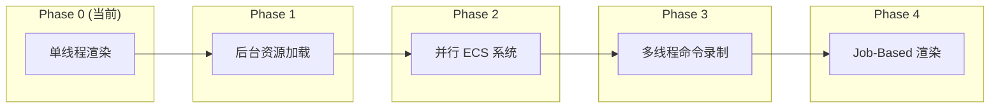
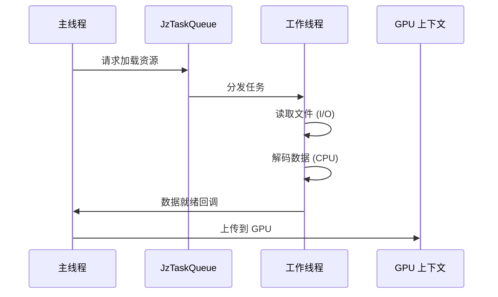
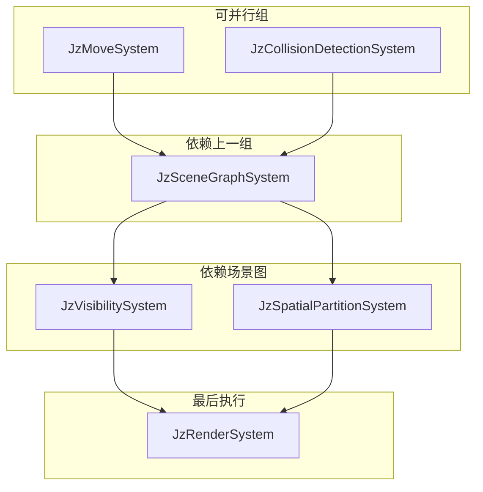
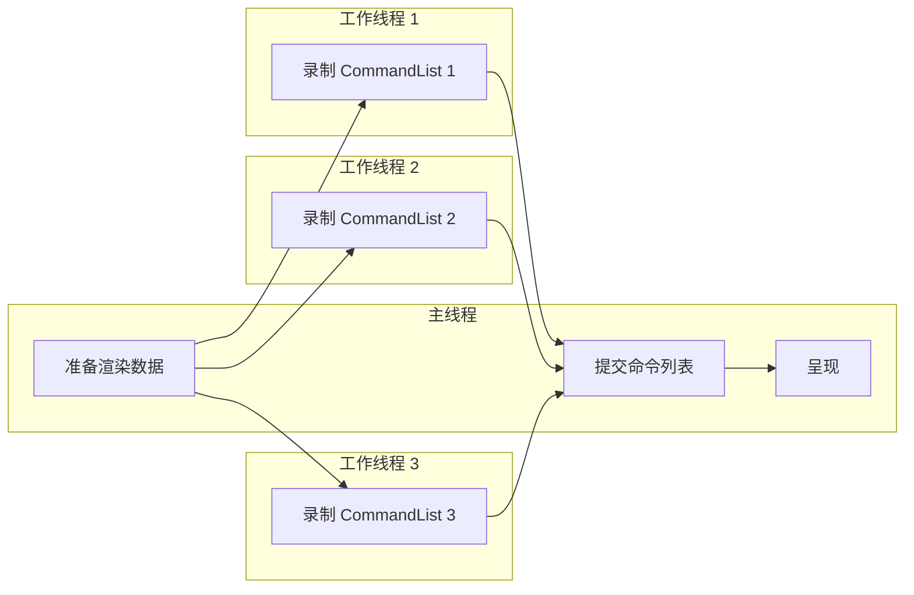
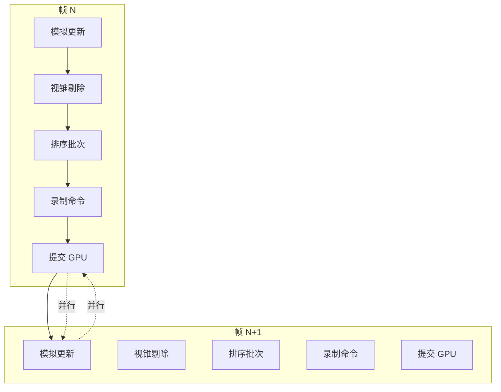

# JzRE 多线程演进路线

## 概述

本文档描述 JzRE 引擎从单线程架构向多线程架构演进的规划。当前引擎以单线程渲染为主，本文档规划了逐步引入多线程的路径。

---

## 当前状态

### 已有的线程基础设施

| 组件 | 文件 | 状态 | 描述 |
|------|------|------|------|
| 线程池 | `JzThreadPool.h` | ✅ 已实现 | 通用任务并行执行 |
| 任务队列 | `JzTaskQueue.h` | ✅ 已实现 | 优先级任务调度 |
| 命令列表 | `JzRHICommandList.h` | ✅ 已实现 | 线程安全的命令记录 |

### 当前限制

```cpp
// JzOpenGLDevice.cpp
Bool JzOpenGLDevice::SupportsMultithreading() const {
    return false;  // OpenGL 不支持多线程渲染
}
```

OpenGL 的限制:
- 上下文绑定单一线程
- 资源必须在正确的上下文中创建/使用
- 无法并行生成渲染命令

---

## 演进阶段



---

## Phase 1: 后台资源加载

**目标**: 将 I/O 密集操作移至后台线程，避免阻塞主线程。

### 设计



### 实现要点

1. **文件 I/O 在工作线程**: 读取磁盘文件
2. **CPU 处理在工作线程**: 图像解码、网格处理
3. **GPU 上传在主线程**: OpenGL 资源创建必须在主线程

```cpp
// 资源状态用于追踪加载进度
enum class JzEResourceState {
    Unloaded,  // 未加载
    Loading,   // 后台加载中
    Loaded,    // 已加载
    Error      // 加载失败
};

// 使用现有 JzTaskQueue
void JzResourceManager::LoadAsync(const String& name) {
    auto& taskQueue = JzServiceContainer::Get<JzTaskQueue>();
    
    taskQueue.Submit(JzETaskPriority::Normal, [this, name]() {
        // 后台: 读文件、解码
        auto data = ReadFile(name);
        auto decoded = DecodeData(data);
        
        // 回调主线程: GPU 上传
        ScheduleMainThread([this, name, decoded]() {
            UploadToGPU(name, decoded);
        });
    });
}
```

### 依赖

- 现有 `JzTaskQueue` 
- 需要添加主线程回调机制

---

## Phase 2: 并行 ECS 系统

**目标**: 并行执行独立的 ECS 系统更新。

### 系统依赖分析



### 实现要点

1. **系统分组**: 按依赖关系划分执行组
2. **组内并行**: 同一组内的系统可并行执行
3. **组间同步**: 组之间设置同步点

```cpp
class JzSystemScheduler {
public:
    void AddSystem(std::shared_ptr<JzSystem> system, U32 group);
    void Update(JzEntityManager& manager, F32 delta);
    
private:
    // 按组排序的系统列表
    std::map<U32, std::vector<std::shared_ptr<JzSystem>>> m_systemGroups;
    JzThreadPool m_threadPool;
};

void JzSystemScheduler::Update(JzEntityManager& manager, F32 delta) {
    for (auto& [group, systems] : m_systemGroups) {
        // 组内并行
        std::vector<std::future<void>> futures;
        for (auto& system : systems) {
            futures.push_back(m_threadPool.Submit([&]() {
                system->Update(manager, delta);
            }));
        }
        // 等待当前组完成
        for (auto& f : futures) {
            f.wait();
        }
        // 然后执行下一组
    }
}
```

### 依赖

- 现有 `JzThreadPool`
- 需要添加 `JzSystemScheduler`
- 需要确保组件访问线程安全

---

## Phase 3: 多线程命令录制

**目标**: 并行生成渲染命令 (需要 Vulkan 后端)。

### 前提条件

- ✅ `JzRHICommandList` 已支持线程安全录制
- ❌ 需要 Vulkan 后端实现

### 设计



### 实现要点

```cpp
// Vulkan 设备将支持多线程
Bool JzVulkanDevice::SupportsMultithreading() const {
    return true;
}

// 并行命令录制
void JzRenderer::RecordCommands(const std::vector<RenderBatch>& batches) {
    std::vector<std::future<std::shared_ptr<JzRHICommandList>>> futures;
    
    for (const auto& batch : batches) {
        futures.push_back(m_threadPool.Submit([this, &batch]() {
            auto cmdList = m_device->CreateCommandList();
            cmdList->Begin();
            RecordBatch(cmdList, batch);
            cmdList->End();
            return cmdList;
        }));
    }
    
    // 收集并提交
    for (auto& f : futures) {
        m_device->ExecuteCommandList(f.get());
    }
}
```

### 依赖

- Vulkan 后端实现
- 或 D3D12 后端实现

---

## Phase 4: Job-Based 渲染流水线

**目标**: 完全基于任务的渲染架构，最大化 CPU 利用率。

### 渲染流水线设计



### 核心组件

```cpp
// 渲染任务图
class JzRenderGraph {
public:
    void AddPass(const String& name, RenderPassFunc func, 
                 const std::vector<String>& dependencies);
    void Execute(JzDevice& device);
    
private:
    struct RenderPass {
        String name;
        RenderPassFunc func;
        std::vector<String> dependencies;
    };
    std::vector<RenderPass> m_passes;
};

// 使用
void JzRenderer::BuildRenderGraph() {
    m_graph.AddPass("ShadowPass", [this](auto& ctx) {
        RenderShadows(ctx);
    }, {});
    
    m_graph.AddPass("GBufferPass", [this](auto& ctx) {
        RenderGBuffer(ctx);
    }, {"ShadowPass"});
    
    m_graph.AddPass("LightingPass", [this](auto& ctx) {
        RenderLighting(ctx);
    }, {"GBufferPass"});
    
    m_graph.AddPass("PostProcess", [this](auto& ctx) {
        RenderPostProcess(ctx);
    }, {"LightingPass"});
}
```

---

## 数据导向设计考量

### 缓存友好的组件布局

```cpp
// 好: 相同类型组件连续存储
template<typename T>
class JzComponentPool {
    std::vector<T> m_components;  // 连续内存
    std::unordered_map<JzEntity, Size> m_entityToIndex;
};

// 系统按组件类型批量处理
void JzMoveSystem::Update(JzEntityManager& manager, F32 delta) {
    // 获取组件池 (连续内存)
    auto transformPool = manager.GetPool<JzTransformComponent>();
    auto velocityPool = manager.GetPool<JzVelocityComponent>();
    
    // 批量处理，缓存友好
    for (Size i = 0; i < transformPool->Size(); ++i) {
        auto& transform = transformPool->At(i);
        auto& velocity = velocityPool->At(i);
        transform.position += velocity.velocity * delta;
    }
}
```

### 避免伪共享

```cpp
// 为每个线程分配独立的工作缓存
struct alignas(64) ThreadLocalData {  // 对齐到缓存行
    std::vector<RenderCommand> commands;
    // ...
};

std::vector<ThreadLocalData> m_threadData;  // 每线程一份
```

---

## 同步原语

### 现有实现

```cpp
// JzRHICommandList 使用 mutex 保护
class JzRHICommandList {
private:
    std::atomic<Bool> m_isRecording{false};
    mutable std::mutex m_commandMutex;
};

// JzTaskQueue 使用条件变量
class JzTaskQueue {
private:
    std::mutex m_queueMutex;
    std::condition_variable m_condition;
    std::atomic<Bool> m_stop{false};
};
```

### 后续需要添加

- 读写锁 (用于 ECS 组件访问)
- 无锁队列 (用于高频命令传递)
- 栅栏/信号量 (用于 GPU 同步)

---

## 实施优先级

| 阶段 | 优先级 | 复杂度 | 依赖 |
|------|--------|--------|------|
| Phase 1: 后台资源加载 | 低 | 低 | 无 |
| Phase 2: 并行 ECS 系统 | 中 | 中 | Phase 1 |
| Phase 3: 多线程命令录制 | 高 | 高 | Vulkan |
| Phase 4: Job-Based 渲染 | 最高 | 最高 | Phase 3 |

> [!NOTE]
> Phase 1 (异步资源加载) 当前优先级为低，可根据实际需求调整。

---

## 总结

JzRE 的多线程演进遵循渐进式原则:

1. **现有基础**: `JzThreadPool` 和 `JzTaskQueue` 提供了线程基础设施
2. **OpenGL 限制**: 当前 OpenGL 后端不支持多线程渲染
3. **Vulkan 启用**: Vulkan 后端将启用真正的多线程命令录制
4. **逐步演进**: 从后台 I/O 开始，逐步扩展到完整的并行渲染
